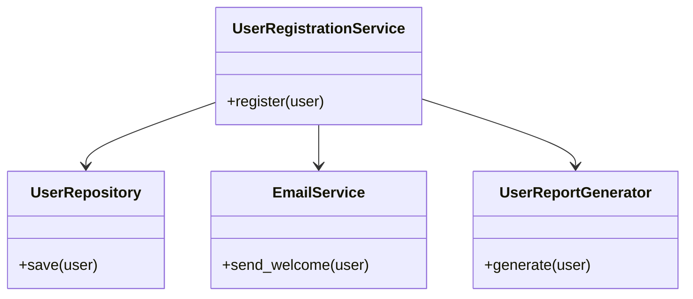
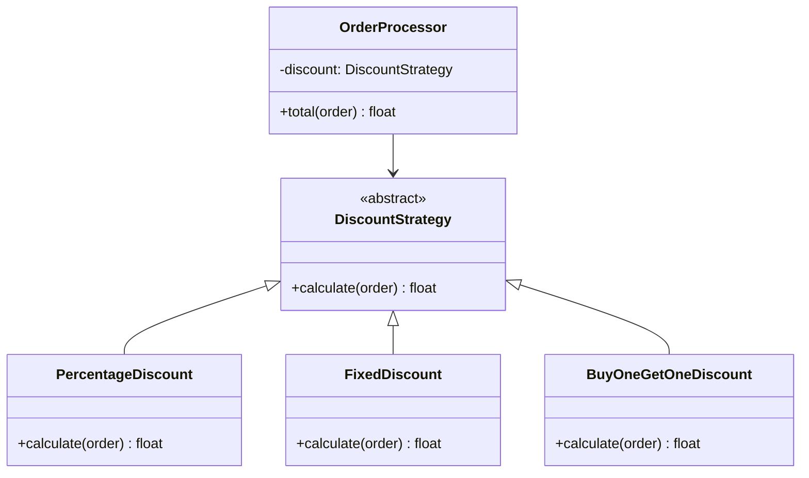
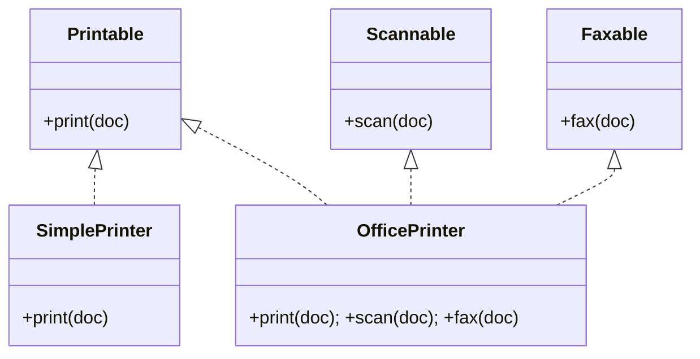
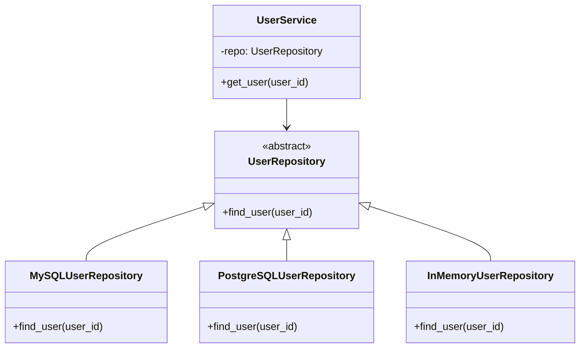

# SOLID Principles

> Five design principles that make software easier to understand, extend, and maintain.

SOLID is an acronym coined by Robert C. Martin (Uncle Bob). Each letter is a principle. Together they guide you toward code where classes are small, focused, and composable — rather than large, tangled, and fragile.

---

## S — Single Responsibility Principle (SRP)

### The Problem

A class that does too many things breaks for too many reasons.

```python
# BAD: This class handles user data, sends emails, AND generates reports.
# A bug in the email library breaks user saving. A report format change
# forces you to touch user logic.
class UserManager:
    def save_user(self, user):
        # write to database
        ...

    def send_welcome_email(self, user):
        # connect to SMTP, format HTML, send
        ...

    def generate_user_report(self, user):
        # format CSV, calculate stats
        ...
```

If the marketing team changes the email template, you have to touch the same file that handles database writes. Every unrelated change is a risk.

### The Solution

**A class should have only one reason to change.** Split responsibilities into separate classes.

```python
# GOOD: Each class has a single, clear job.

class UserRepository:
    def save(self, user):
        # only responsibility: persist user to the database
        ...

class EmailService:
    def send_welcome(self, user):
        # only responsibility: send emails
        ...

class UserReportGenerator:
    def generate(self, user):
        # only responsibility: create reports
        ...

# The orchestrator uses all three but changes none of their internals.
class UserRegistrationService:
    def __init__(self, repo, email, reporter):
        self.repo = repo
        self.email = email
        self.reporter = reporter

    def register(self, user):
        self.repo.save(user)
        self.email.send_welcome(user)
        self.reporter.generate(user)
```

### Diagram



### Key Rule
Ask: *"What is this class's reason to change?"* If you can list more than one reason, split it.

---

## O — Open/Closed Principle (OCP)

### The Problem

Adding new behavior requires modifying existing, tested code.

```python
# BAD: Every new discount type requires editing this function.
# You risk breaking existing discount logic every time.
def calculate_discount(order, discount_type):
    if discount_type == "PERCENTAGE":
        return order.total * 0.1
    elif discount_type == "FIXED":
        return 10.0
    elif discount_type == "BOGO":        # new requirement → edit existing code
        return order.total * 0.5
    # ...adding more types keeps growing this function
```

### The Solution

**Open for extension, closed for modification.** Use abstractions so new behavior is added by writing new code, not changing old code.

```python
from abc import ABC, abstractmethod

class DiscountStrategy(ABC):
    @abstractmethod
    def calculate(self, order) -> float:
        ...

class PercentageDiscount(DiscountStrategy):
    def __init__(self, pct: float):
        self.pct = pct

    def calculate(self, order) -> float:
        return order.total * self.pct

class FixedDiscount(DiscountStrategy):
    def __init__(self, amount: float):
        self.amount = amount

    def calculate(self, order) -> float:
        return self.amount

class BuyOneGetOneDiscount(DiscountStrategy):   # new type → new file, zero edits elsewhere
    def calculate(self, order) -> float:
        return order.total * 0.5

class OrderProcessor:
    def __init__(self, discount: DiscountStrategy):
        self.discount = discount

    def total(self, order) -> float:
        return order.total - self.discount.calculate(order)
```

### Diagram



### Key Rule
When requirements change, you should be writing **new** classes, not editing old ones.

---

## L — Liskov Substitution Principle (LSP)

### The Problem

A subclass that "breaks" the contract of its parent makes polymorphism dangerous.

```python
class Rectangle:
    def set_width(self, w): self.width = w
    def set_height(self, h): self.height = h
    def area(self): return self.width * self.height

class Square(Rectangle):
    def set_width(self, w):
        self.width = w
        self.height = w      # Square forces both dimensions equal

    def set_height(self, h):
        self.width = h
        self.height = h

def print_area(shape: Rectangle):
    shape.set_width(5)
    shape.set_height(10)
    print(shape.area())     # Expected: 50. For Square: 100. BROKEN.
```

A `Square` is mathematically a `Rectangle`, but behaviorally it is not — it silently violates the contract that setting width and height are independent operations.

### The Solution

**Subtypes must be substitutable for their base types without altering correctness.** If a subclass can't honor the parent's contract, don't use inheritance — use composition or a different abstraction.

```python
from abc import ABC, abstractmethod

class Shape(ABC):
    @abstractmethod
    def area(self) -> float: ...

class Rectangle(Shape):
    def __init__(self, width: float, height: float):
        self.width = width
        self.height = height

    def area(self) -> float:
        return self.width * self.height

class Square(Shape):
    def __init__(self, side: float):
        self.side = side

    def area(self) -> float:
        return self.side ** 2

def print_area(shape: Shape):
    print(shape.area())     # Works correctly for both. No surprises.
```

### Key Rule
If you override a method and the behavior surprises callers of the parent class, you're violating LSP.

---

## I — Interface Segregation Principle (ISP)

### The Problem

A "fat" interface forces classes to implement methods they don't need.

```python
from abc import ABC, abstractmethod

# BAD: A Printer that can't fax is forced to implement fax().
class MultifunctionDevice(ABC):
    @abstractmethod
    def print(self, doc): ...

    @abstractmethod
    def scan(self, doc): ...

    @abstractmethod
    def fax(self, doc): ...     # Not all devices can fax!

class SimplePrinter(MultifunctionDevice):
    def print(self, doc): ...
    def scan(self, doc): ...
    def fax(self, doc):
        raise NotImplementedError("This printer cannot fax")  # Forced stub
```

### The Solution

**Clients should not be forced to depend on methods they don't use.** Split fat interfaces into focused, role-specific ones.

```python
from abc import ABC, abstractmethod

class Printable(ABC):
    @abstractmethod
    def print(self, doc): ...

class Scannable(ABC):
    @abstractmethod
    def scan(self, doc): ...

class Faxable(ABC):
    @abstractmethod
    def fax(self, doc): ...

class SimplePrinter(Printable):             # Only implements what it supports
    def print(self, doc): ...

class OfficePrinter(Printable, Scannable, Faxable):  # Full device
    def print(self, doc): ...
    def scan(self, doc): ...
    def fax(self, doc): ...
```

### Diagram



### Key Rule
If a class has stub implementations that raise `NotImplementedError`, an interface is too fat.

---

## D — Dependency Inversion Principle (DIP)

### The Problem

High-level modules depend directly on low-level modules. Swapping implementations is painful.

```python
# BAD: UserService is hardwired to MySQLDatabase.
# Want to switch to PostgreSQL? Edit UserService.
# Want to test without a database? Impossible without a real MySQL instance.

class MySQLDatabase:
    def find_user(self, user_id):
        # raw SQL query to MySQL
        ...

class UserService:
    def __init__(self):
        self.db = MySQLDatabase()   # concrete dependency baked in

    def get_user(self, user_id):
        return self.db.find_user(user_id)
```

### The Solution

**Both high-level and low-level modules should depend on abstractions.** Inject dependencies through an interface.

```python
from abc import ABC, abstractmethod

class UserRepository(ABC):          # The abstraction both sides depend on
    @abstractmethod
    def find_user(self, user_id): ...

class MySQLUserRepository(UserRepository):   # Low-level detail
    def find_user(self, user_id):
        # MySQL query
        ...

class PostgreSQLUserRepository(UserRepository):  # Easy to swap
    def find_user(self, user_id):
        # PostgreSQL query
        ...

class InMemoryUserRepository(UserRepository):    # For tests
    def __init__(self):
        self._store = {}

    def find_user(self, user_id):
        return self._store.get(user_id)

class UserService:                  # High-level module
    def __init__(self, repo: UserRepository):   # Depends on abstraction
        self.repo = repo

    def get_user(self, user_id):
        return self.repo.find_user(user_id)

# Wiring (done at the top of your app / in a DI container):
service = UserService(MySQLUserRepository())
# Or in tests:
service = UserService(InMemoryUserRepository())
```

### Diagram



### Key Rule
If your class constructs its own dependencies with `self.x = ConcreteClass()`, it violates DIP.

---

## Summary Table

| Principle | One-Line Rule | Violation Signal |
|-----------|---------------|-----------------|
| **SRP** | One class, one reason to change | Class has methods in totally different domains |
| **OCP** | Extend by adding, not editing | Every new feature requires editing existing classes |
| **LSP** | Subtypes behave like their parents | Overridden methods throw `NotImplementedError` or surprise callers |
| **ISP** | Small, focused interfaces | Classes stub out interface methods they don't need |
| **DIP** | Depend on abstractions, not concretions | `self.x = ConcreteClass()` inside a class |

## Key Takeaways

- SOLID is not about writing more code — it's about writing code that changes safely.
- SRP and DIP are the highest-leverage principles; master them first.
- Apply SOLID progressively: you don't need abstract factories for a 50-line script.
- Violations accumulate as **technical debt** — the system becomes harder to change with every shortcut.
- When in doubt: if a test requires you to change unrelated production code, a SOLID principle is being violated.
