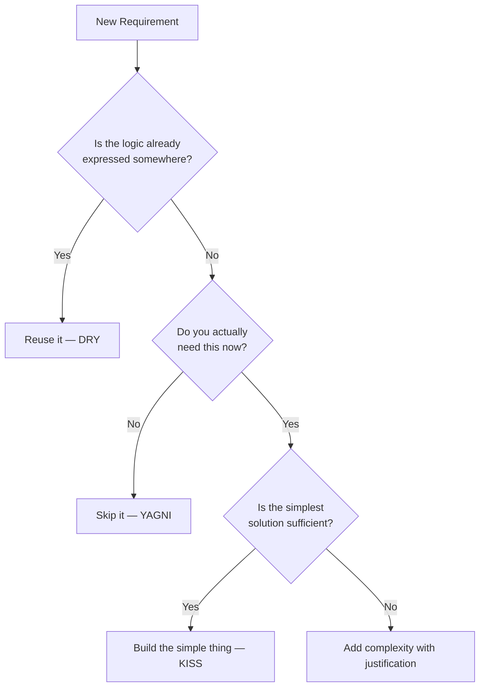

# DRY, KISS, YAGNI

> Three principles that fight the most common sources of unnecessary complexity.

These are heuristics, not laws. Each one has a failure mode when taken to an extreme. Understanding *why* each principle exists helps you apply them with judgment.

---

## DRY — Don't Repeat Yourself

### The Problem

The same knowledge is expressed in more than one place. When it needs to change, you change it in one place and miss the others.

```python
# BAD: Tax calculation appears in three places.
# A tax law change requires hunting down every copy.

def checkout_total(items):
    subtotal = sum(item.price for item in items)
    tax = subtotal * 0.08          # ← magic number
    return subtotal + tax

def invoice_total(items):
    subtotal = sum(item.price for item in items)
    tax = subtotal * 0.08          # ← same magic number, different file
    return subtotal + tax

def receipt_total(items):
    subtotal = sum(item.price for item in items)
    tax = subtotal * 0.08          # ← and again
    return subtotal + tax
```

When the tax rate changes to 9%, you update one place and miss two others. The system is now inconsistent.

### The Solution

**Every piece of knowledge should have a single, authoritative representation.**

```python
TAX_RATE = 0.08   # one place, one definition

def calculate_tax(subtotal: float) -> float:
    return subtotal * TAX_RATE

def subtotal(items) -> float:
    return sum(item.price for item in items)

# All three consumers use the same function
def checkout_total(items):  return subtotal(items) + calculate_tax(subtotal(items))
def invoice_total(items):   return subtotal(items) + calculate_tax(subtotal(items))
def receipt_total(items):   return subtotal(items) + calculate_tax(subtotal(items))
```

Now changing `TAX_RATE` fixes every calculation at once.

### DRY ≠ "Never Write Similar Code"

DRY is about **knowledge duplication**, not **code similarity**. Two pieces of code that look alike but represent different concepts should *not* be merged.

```python
# These look similar but represent DIFFERENT knowledge.
# Don't merge them — they will diverge for different reasons.

def validate_user_email(email: str) -> bool:
    return "@" in email and "." in email

def validate_billing_email(email: str) -> bool:
    return "@" in email and "." in email
```

If `validate_billing_email` later needs to reject free-tier domains and `validate_user_email` does not, merging them was a mistake.

**Rule:** Ask *"if this logic changes, should all copies change?"* If yes, extract. If they could diverge, keep them separate.

---

## KISS — Keep It Simple, Stupid

### The Problem

A solution that is more complex than the problem it solves.

```python
# BAD: A "flexible, extensible, configurable" function
# to check if a number is even.

from typing import Callable, Optional

class EvenCheckerStrategy:
    def __init__(self, modulus: int, comparator: Callable = None):
        self.modulus = modulus
        self.comparator = comparator or (lambda x: x == 0)

    def check(self, n: int) -> bool:
        return self.comparator(n % self.modulus)

class EvenCheckerFactory:
    @staticmethod
    def create(strategy: Optional[EvenCheckerStrategy] = None):
        if strategy is None:
            strategy = EvenCheckerStrategy(modulus=2)
        return strategy

def is_even(n: int, factory: EvenCheckerFactory = None) -> bool:
    checker = (factory or EvenCheckerFactory()).create()
    return checker.check(n)
```

This is absurd. The requirement is: "check if a number is even."

```python
# GOOD
def is_even(n: int) -> bool:
    return n % 2 == 0
```

### KISS in Architecture

Over-engineering at the system level looks like this:

| Scenario | Over-engineered | Simple |
|----------|----------------|--------|
| 2 developers, internal tool | Microservices on Kubernetes | Monolith on a single server |
| 100 req/day | Redis cluster, CDN, sharding | SQLite or Postgres, no cache |
| MVP with unknown requirements | Event sourcing + CQRS | Simple CRUD REST API |

### The Guiding Question

*"What is the simplest thing that could possibly work?"*

Start there. Add complexity only when the simple solution demonstrably fails.

### KISS vs. Clean Code

KISS does not mean "write ugly code." Simple code can still be clean, named well, and tested. KISS is about resisting premature abstraction and over-engineering.

---

## YAGNI — You Aren't Gonna Need It

### The Problem

Building features "just in case" they're needed later.

```python
# BAD: Building a plugin system for a script that exports to CSV.
# "What if someone wants to export to XML someday? Or JSON? Or Excel?"

from abc import ABC, abstractmethod

class ExportPlugin(ABC):
    @abstractmethod
    def export(self, data): ...

class PluginRegistry:
    def __init__(self):
        self._plugins = {}

    def register(self, name, plugin: ExportPlugin):
        self._plugins[name] = plugin

    def get(self, name) -> ExportPlugin:
        return self._plugins[name]

class CSVExportPlugin(ExportPlugin):
    def export(self, data): ...

# 80 lines of infrastructure for one use case that never changes.
```

The requirement was: **export to CSV**. The plugin system took 3x longer to build, adds 4x the surface area for bugs, and nobody ever needed XML.

### The Solution

Build what is asked for. Refactor when the need actually arises.

```python
# GOOD: The simplest correct solution.

import csv
import io

def export_to_csv(data: list[dict]) -> str:
    output = io.StringIO()
    if data:
        writer = csv.DictWriter(output, fieldnames=data[0].keys())
        writer.writeheader()
        writer.writerows(data)
    return output.getvalue()
```

When XML is actually needed, *then* introduce an abstraction.

### YAGNI vs. Good Design

YAGNI does not mean "ignore the future." It means **don't build speculative features**. You can still:

- Write clean, well-named code (easy to extend when the time comes)
- Leave clear seams and boundaries (makes future refactoring cheap)
- Document known future requirements (so the next developer can plan)

The difference:

| Allowed | Violates YAGNI |
|---------|----------------|
| Making code easy to extend | Actually writing the extension now |
| Clean abstractions at real boundaries | Adding abstraction layers "just in case" |
| Documenting future requirements | Implementing future requirements |

---

## The Anti-Pattern: WET Code

WET = "Write Everything Twice" (or "Waste Everyone's Time").

WET code is what happens when DRY is ignored:

```python
# WET: User validation duplicated across 4 endpoints.
# Fix a validation bug in one → the others still have it.

@app.route("/register")
def register():
    if len(request.form["username"]) < 3:
        return "Username too short", 400
    if not re.match(r"[^@]+@[^@]+\.[^@]+", request.form["email"]):
        return "Invalid email", 400
    # ...

@app.route("/update-profile")
def update_profile():
    if len(request.form["username"]) < 3:      # duplicate
        return "Username too short", 400
    if not re.match(r"[^@]+@[^@]+\.[^@]+", request.form["email"]):  # duplicate
        return "Invalid email", 400
    # ...
```

```python
# DRY fix: Validation lives in one place.

def validate_user_input(username: str, email: str) -> list[str]:
    errors = []
    if len(username) < 3:
        errors.append("Username too short")
    if not re.match(r"[^@]+@[^@]+\.[^@]+", email):
        errors.append("Invalid email")
    return errors

@app.route("/register")
def register():
    errors = validate_user_input(request.form["username"], request.form["email"])
    if errors:
        return {"errors": errors}, 400
    # ...
```

---

## Interaction Between the Three Principles



## Key Takeaways

- **DRY** eliminates inconsistency caused by knowledge duplication — but don't merge code that *looks* alike if it represents different concepts.
- **KISS** fights complexity for its own sake — start with the simplest solution and complicate only when necessary.
- **YAGNI** prevents wasted effort on features that never get used — build for today's requirements, refactor when tomorrow's requirements arrive.
- All three principles have the same root goal: **reduce the cost of change**.
- Taken to extremes, each principle becomes harmful — DRY can produce wrong abstractions, KISS can produce under-designed systems, YAGNI can produce short-sighted code.
