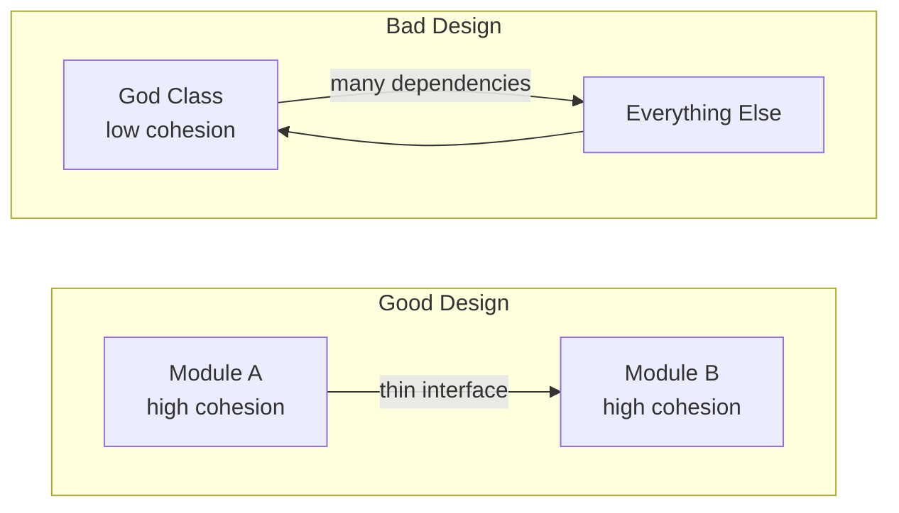
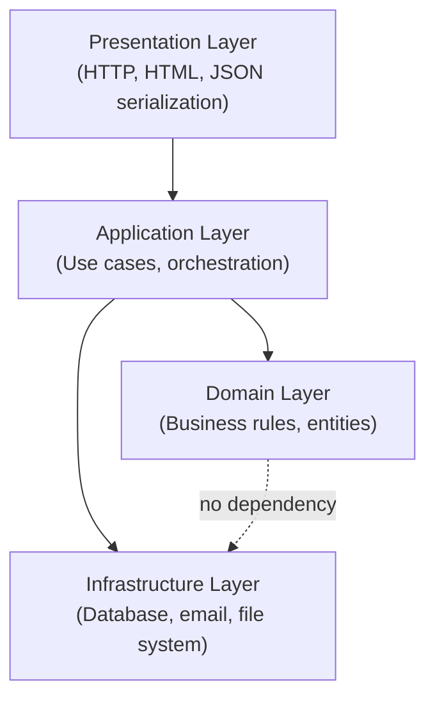

# Separation of Concerns

> Each part of the system should own exactly one concern — and that concern completely.

---

## The Problem

Imagine a single function that fetches data from the database, validates it, formats it as HTML, sends an email notification, and logs everything. This is called a **God function** (or God class when it's a class). It has multiple "concerns" tangled together.

```python
# BAD: One function doing everything.
# Changing the email template forces testing the database query.
# Changing the HTML format risks breaking the email.
# Adding a new notification channel requires editing business logic.

def process_order(order_id: int):
    # Concern 1: Data access
    conn = psycopg2.connect("host=localhost dbname=shop")
    cursor = conn.cursor()
    cursor.execute("SELECT * FROM orders WHERE id = %s", (order_id,))
    order = cursor.fetchone()

    # Concern 2: Business logic
    if order["status"] != "PENDING":
        raise ValueError("Order already processed")
    total = order["subtotal"] * 1.08  # tax

    # Concern 3: Presentation / formatting
    html = f"<h1>Order #{order_id}</h1><p>Total: ${total:.2f}</p>"

    # Concern 4: Email notification
    smtp = smtplib.SMTP("smtp.gmail.com")
    smtp.sendmail("shop@example.com", order["email"], html)

    # Concern 5: Logging
    with open("orders.log", "a") as f:
        f.write(f"Processed order {order_id} at {datetime.now()}\n")

    # Concern 6: Data mutation
    cursor.execute("UPDATE orders SET status='PROCESSED' WHERE id=%s", (order_id,))
    conn.commit()
```

**What goes wrong:**
- To unit test the tax calculation, you need a real database and SMTP server.
- A change to the log format requires understanding the order processing code.
- You cannot reuse the email logic for a different kind of notification.
- A bug anywhere breaks the whole operation — you can't isolate the failure.

---

## The Solution

**Separate each concern into its own module or layer.** Each piece should be independently readable, testable, and changeable.

```python
# GOOD: Each concern is isolated.

# --- data_access/order_repository.py ---
class OrderRepository:
    def __init__(self, connection):
        self.conn = connection

    def find_by_id(self, order_id: int) -> dict:
        cursor = self.conn.cursor()
        cursor.execute("SELECT * FROM orders WHERE id = %s", (order_id,))
        return cursor.fetchone()

    def mark_processed(self, order_id: int):
        cursor = self.conn.cursor()
        cursor.execute("UPDATE orders SET status='PROCESSED' WHERE id=%s", (order_id,))
        self.conn.commit()


# --- domain/order_service.py ---
class OrderService:
    TAX_RATE = 0.08

    def __init__(self, repo: OrderRepository):
        self.repo = repo

    def process(self, order_id: int) -> dict:
        order = self.repo.find_by_id(order_id)
        if order["status"] != "PENDING":
            raise ValueError("Order already processed")
        order["total"] = order["subtotal"] * (1 + self.TAX_RATE)
        self.repo.mark_processed(order_id)
        return order


# --- notifications/email_notifier.py ---
class EmailNotifier:
    def __init__(self, smtp_client):
        self.smtp = smtp_client

    def notify_processed(self, order: dict):
        html = f"<h1>Order #{order['id']}</h1><p>Total: ${order['total']:.2f}</p>"
        self.smtp.sendmail("shop@example.com", order["email"], html)


# --- infrastructure/logger.py ---
import logging

order_logger = logging.getLogger("orders")

def log_order_processed(order_id: int):
    order_logger.info("Processed order %s", order_id)


# --- application/process_order_handler.py ---
class ProcessOrderHandler:
    def __init__(self, service, notifier, log_fn):
        self.service = service
        self.notifier = notifier
        self.log = log_fn

    def handle(self, order_id: int):
        order = self.service.process(order_id)
        self.notifier.notify_processed(order)
        self.log(order_id)
```

Now each piece can be tested and changed independently:
- Test `OrderService` with a fake repository — no database needed.
- Change the email template without touching business logic.
- Swap the logger for a cloud logging service with zero impact on orders.

---

## Cohesion and Coupling

These are the two metrics that measure how well you've separated concerns.

### Cohesion

**Cohesion** measures how related the things inside a module are to each other.

- **High cohesion** (good): Everything in the module belongs together.
- **Low cohesion** (bad): The module is a dumping ground for unrelated things.

```python
# LOW COHESION: This module contains unrelated things.
class Utils:
    def format_currency(self, amount): ...
    def send_email(self, to, body): ...
    def parse_csv(self, filepath): ...
    def calculate_shipping(self, weight): ...
    def validate_phone_number(self, number): ...
```

```python
# HIGH COHESION: Everything in this class is about currency.
class CurrencyFormatter:
    def format(self, amount: float, currency: str) -> str: ...
    def parse(self, text: str) -> float: ...
    def convert(self, amount: float, from_currency: str, to_currency: str) -> float: ...
```

### Coupling

**Coupling** measures how much one module depends on the internals of another.

- **Loose coupling** (good): Modules communicate through stable, minimal interfaces.
- **Tight coupling** (bad): Changing module A forces changes in modules B, C, and D.

```python
# TIGHT COUPLING: UserService knows the internal structure of the database result.
class UserService:
    def get_display_name(self, user_id):
        row = self.db.execute("SELECT first_name, last_name FROM users WHERE id=?", user_id)
        return f"{row[0]} {row[1]}"   # Depends on column order — fragile!
```

```python
# LOOSE COUPLING: UserService depends on a stable data class.
from dataclasses import dataclass

@dataclass
class User:
    id: int
    first_name: str
    last_name: str

class UserService:
    def get_display_name(self, user: User) -> str:
        return f"{user.first_name} {user.last_name}"
```

### The Ideal



---

## Layered View of Separation

A typical web application separates these concerns into layers:



Each layer:
- Knows only about the layer(s) directly below it
- Does not know how it is called from above
- The Domain layer knows nothing about infrastructure (database, HTTP, email)

---

## The God Class Anti-Pattern

A God class accumulates responsibilities over time, typically through "just add it here" shortcuts.

**Warning signs of a God class:**
- More than ~200 lines in a single class
- Methods that don't use `self` at all (they should be standalone functions)
- Class name includes words like `Manager`, `Handler`, `Utils`, `Helper`, `Service` and it has 20+ methods
- Changing any feature requires editing this one file

**How to break a God class:**
1. List every distinct responsibility the class has.
2. Create a new class per responsibility.
3. Move methods to their new classes.
4. Replace direct calls with dependency injection.

---

## When to Separate

Not every 20-line script needs perfect separation. Apply Separation of Concerns when:

| Situation | Action |
|-----------|--------|
| More than one developer touches the same code for unrelated reasons | Separate |
| You can't test X without setting up Y (unrelated infrastructure) | Separate |
| A bug in one area causes failures in a completely different area | Separate |
| Single-file script / small utility | Keep together |
| Prototype / throwaway code | Keep together |

---

## Key Takeaways

- Separation of Concerns is the foundation of every architecture pattern — Layered Architecture, Clean Architecture, Microservices are all applications of this idea at different scales.
- **High cohesion** + **loose coupling** is the goal.
- A God class is the most common violation — look for classes that change for multiple unrelated reasons.
- The right granularity is not "one function per file" — it's "one responsibility per unit."
- Proper separation makes testing dramatically easier because each concern can be isolated.
