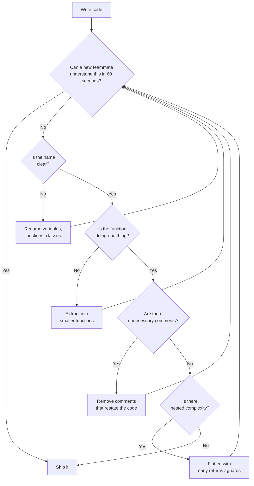

# Clean Code

> Code is read far more often than it is written. Clean code communicates its intent so clearly that it almost needs no explanation.

Clean code is not about aesthetics or personal style. It is a discipline that makes code less expensive to maintain, less risky to change, and faster to understand.

---

## The Problem

Code that requires significant effort to understand is expensive:

```python
# What does this do? You have to read every line to figure it out.
def p(d, t):
    r = []
    for x in d:
        if x[2] > t:
            r.append((x[0], x[1] * 0.9))
    return r
```

This code works. But every time a developer reads it, they spend time decoding it. Multiply that by hundreds of developers and thousands of reads over the lifetime of a product — it's a massive hidden cost.

---

## Meaningful Names

### Variables and Parameters

Names should reveal intent. They are not abbreviations — they are documentation.

```python
# BAD
d = 86400
t = time.time()
u = get_u(uid)
fl = []

# GOOD
SECONDS_PER_DAY = 86400
current_timestamp = time.time()
user = get_user(user_id)
failed_logins = []
```

### Functions

Function names should be verbs that say what they do. A function name is a promise to the caller.

```python
# BAD — ambiguous, could mean anything
def process(data): ...
def handle(x): ...
def do_stuff(): ...

# GOOD — names that tell you exactly what happens
def calculate_monthly_revenue(transactions: list) -> float: ...
def send_password_reset_email(user: User) -> None: ...
def validate_credit_card_number(card_number: str) -> bool: ...
```

### Classes

Classes should be nouns — they represent things or concepts.

```python
# BAD — process-oriented names for a class
class DataProcessor: ...
class UserHandler: ...
class Manager: ...

# GOOD — noun-based names that describe what the class IS
class Invoice: ...
class PaymentGateway: ...
class CustomerAccount: ...
```

### Boolean Variables and Functions

Use names that read as true/false statements.

```python
# BAD
active = True
check = is_valid(email)
if user.flag: ...

# GOOD
is_active = True
email_is_valid = is_valid_email(email)
if user.is_verified: ...
```

---

## Functions

### Do One Thing

A function that does one thing does it well and does it only.

```python
# BAD: This function does three things.
def save_user(user, send_email=True):
    db.execute("INSERT INTO users ...", user)   # 1. persist
    if send_email:
        smtp.send(user.email, "Welcome!")       # 2. notify
    audit_log.write(f"User {user.id} created")  # 3. log
```

```python
# GOOD: Three functions, each with one job.
def save_user(user: User) -> None:
    db.execute("INSERT INTO users ...", user)

def send_welcome_email(user: User) -> None:
    smtp.send(user.email, "Welcome!")

def log_user_creation(user: User) -> None:
    audit_log.write(f"User {user.id} created")
```

### Keep Functions Short

A function should fit on one screen (roughly 20–30 lines max). If it doesn't, it's doing too much.

### Limit Function Arguments

```python
# BAD: 7 arguments — impossible to remember the order.
def create_order(user_id, product_id, quantity, shipping_addr,
                 billing_addr, discount_code, gift_wrapping):
    ...

# GOOD: Group related parameters into a data class.
from dataclasses import dataclass

@dataclass
class OrderRequest:
    user_id: int
    product_id: int
    quantity: int
    shipping_address: str
    billing_address: str
    discount_code: str | None = None
    gift_wrapping: bool = False

def create_order(request: OrderRequest) -> Order:
    ...
```

### Avoid Flag Arguments

A boolean flag argument is a sign the function is doing two things.

```python
# BAD: What does True mean? You have to read the implementation.
render_page(is_test=True)

# GOOD: Two explicit functions with clear names.
render_test_page()
render_production_page()
```

---

## Comments

### When to Write a Comment

Comments should explain *why* — not *what*. The code already shows what it does. Comments add value only when the reason is non-obvious.

```python
# BAD: The comment restates the code.
# increment counter by 1
counter += 1

# BAD: The comment describes what the code does (the code already does that).
# loop through users and check if they are active
for user in users:
    if user.is_active:
        ...

# GOOD: The comment explains a non-obvious constraint.
# Stripe requires amounts in smallest currency unit (cents, not dollars).
amount_in_cents = int(price_in_dollars * 100)

# GOOD: The comment explains why a workaround exists.
# time.sleep(0.1) is required here because the third-party SDK has a
# known race condition on connection pool initialization (see issue #4721).
time.sleep(0.1)
smtp = EmailSDK.connect()
```

### Dead Code

Remove it. That's what version control is for.

```python
# BAD: Dead code creates noise and confusion.
def process_payment(amount):
    # result = old_payment_gateway.charge(amount)  ← what is this?
    result = new_payment_gateway.charge(amount)
    return result
```

### TODO Comments

Acceptable when tracking known debt — but must have context.

```python
# BAD: No context, will never get done.
# TODO: fix this

# GOOD: Actionable with context.
# TODO(abrar): Replace with Redis cache once the infrastructure ticket #892 is resolved.
```

---

## Formatting and Structure

### Vertical Spacing

Group related lines together. Separate unrelated groups with blank lines.

```python
# BAD: Everything runs together.
class Order:
    def __init__(self, items, customer):
        self.items = items
        self.customer = customer
        self._total = None
        self._tax = None
    def subtotal(self):
        return sum(item.price for item in self.items)
    def tax(self):
        return self.subtotal() * 0.08
    def total(self):
        return self.subtotal() + self.tax()
    def send_confirmation(self):
        email_service.send(self.customer.email, self.total())

# GOOD: Related methods are grouped, with space between groups.
class Order:
    def __init__(self, items: list, customer: Customer):
        self.items = items
        self.customer = customer

    def subtotal(self) -> float:
        return sum(item.price for item in self.items)

    def tax(self) -> float:
        return self.subtotal() * 0.08

    def total(self) -> float:
        return self.subtotal() + self.tax()

    def send_confirmation(self) -> None:
        email_service.send(self.customer.email, self.total())
```

### Consistent Indentation and Line Length

Pick a standard and enforce it with a linter (Black for Python, Prettier for JS). 88–120 characters per line is a reasonable maximum. Deeply nested code is a sign of complexity that should be refactored.

```python
# BAD: 4 levels of nesting.
def process_users(users):
    for user in users:
        if user.is_active:
            for order in user.orders:
                if order.status == "PENDING":
                    if order.total > 100:
                        apply_discount(order)

# GOOD: Early returns flatten the nesting.
def process_users(users):
    for user in users:
        if not user.is_active:
            continue
        for order in user.orders:
            _apply_discount_if_eligible(order)

def _apply_discount_if_eligible(order):
    if order.status != "PENDING":
        return
    if order.total <= 100:
        return
    apply_discount(order)
```

---

## Error Handling

### Use Exceptions, Not Return Codes

```python
# BAD: Callers can forget to check the return value.
def find_user(user_id: int) -> User | None:
    ...

user = find_user(42)
user.send_email()  # AttributeError if None — silent failure

# GOOD: Raise an explicit exception with a clear message.
def find_user(user_id: int) -> User:
    user = db.query(user_id)
    if user is None:
        raise UserNotFoundError(f"No user with id={user_id}")
    return user
```

### Don't Swallow Exceptions

```python
# BAD: The error disappears silently.
try:
    process_payment(amount)
except Exception:
    pass

# GOOD: At minimum, log it. Ideally handle it meaningfully.
try:
    process_payment(amount)
except PaymentGatewayError as e:
    logger.error("Payment failed for order %s: %s", order_id, e)
    raise OrderProcessingError("Payment could not be completed") from e
```

---

## Clean Code Checklist



---

## Key Takeaways

- **Names are the most impactful clean code improvement** — good names reduce the need for comments, documentation, and cognitive effort.
- **Functions should do one thing** — if you can't describe a function without using "and", it's doing too much.
- **Comments explain WHY, not WHAT** — code that needs comments to explain what it does is code that should be rewritten.
- **Formatting is not optional** — use a linter/formatter and never debate style in code reviews.
- **Clean code is not written in one pass** — write it, then refactor it. The first pass is for correctness; the second pass is for clarity.
