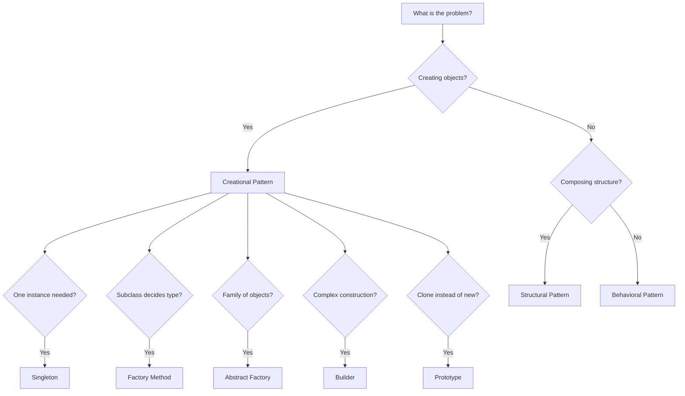

# 01 — Design Patterns

> Proven, reusable solutions to recurring software design problems.

Design patterns are not code you copy-paste. They are **templates for thinking** — named solutions to problems that experienced developers have solved many times before. Knowing their names lets your team communicate precisely: "Use the Strategy pattern here" is faster and clearer than a paragraph of description.

Patterns are organized into three families, based on what problem they solve.

---

## Creational Patterns

**Problem they solve:** Object creation logic is tangled into business logic, making it hard to change what gets created or how.

| # | Pattern | One-Line Intent |
|---|---------|-----------------|
| 1 | [Singleton](./creational/01-singleton.md) | Guarantee a class has only one instance |
| 2 | [Factory Method](./creational/02-factory-method.md) | Let subclasses decide which object to create |
| 3 | [Abstract Factory](./creational/03-abstract-factory.md) | Create families of related objects without specifying concrete classes |
| 4 | [Builder](./creational/04-builder.md) | Construct complex objects step by step |
| 5 | [Prototype](./creational/05-prototype.md) | Clone existing objects instead of constructing new ones |

---

## Structural Patterns

**Problem they solve:** Classes and objects need to be composed into larger structures, but the composition is rigid or the interfaces are incompatible.

| # | Pattern | One-Line Intent |
|---|---------|-----------------|
| 1 | [Adapter](./structural/01-adapter.md) | Make incompatible interfaces work together |
| 2 | [Bridge](./structural/02-bridge.md) | Decouple an abstraction from its implementation |
| 3 | [Composite](./structural/03-composite.md) | Treat individual objects and compositions uniformly |
| 4 | [Decorator](./structural/04-decorator.md) | Add responsibilities to objects dynamically |
| 5 | [Facade](./structural/05-facade.md) | Provide a simple interface to a complex subsystem |
| 6 | [Flyweight](./structural/06-flyweight.md) | Share fine-grained objects to reduce memory usage |
| 7 | [Proxy](./structural/07-proxy.md) | Provide a surrogate that controls access to another object |

---

## Behavioral Patterns

**Problem they solve:** Objects need to communicate and collaborate, but the coupling between them is too tight or the communication logic is too complex.

| # | Pattern | One-Line Intent |
|---|---------|-----------------|
| 1 | [Chain of Responsibility](./behavioral/01-chain-of-responsibility.md) | Pass requests along a chain of handlers |
| 2 | [Command](./behavioral/02-command.md) | Encapsulate a request as an object |
| 3 | [Iterator](./behavioral/03-iterator.md) | Sequentially access elements without exposing internals |
| 4 | [Mediator](./behavioral/04-mediator.md) | Define how objects interact through a central mediator |
| 5 | [Memento](./behavioral/05-memento.md) | Capture and restore an object's internal state |
| 6 | [Observer](./behavioral/06-observer.md) | Notify objects of changes in another object's state |
| 7 | [State](./behavioral/07-state.md) | Alter behavior when internal state changes |
| 8 | [Strategy](./behavioral/08-strategy.md) | Define a family of algorithms and make them interchangeable |
| 9 | [Template Method](./behavioral/09-template-method.md) | Define the skeleton of an algorithm, deferring steps to subclasses |
| 10 | [Visitor](./behavioral/10-visitor.md) | Add new operations to objects without changing them |

---

## How to Choose a Pattern

---

## Anti-Pattern Warning

**Pattern overuse** is as harmful as no patterns:
- Don't introduce a Factory for a class that never changes.
- Don't use Observer if two objects always interact together.
- Don't use Strategy if there's only ever one algorithm.

Apply patterns when you feel the **pain** they solve. If you don't feel the pain, you don't need the pattern.
