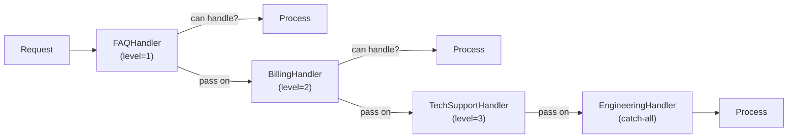

# Chain of Responsibility Pattern

> Pass a request along a chain of handlers. Each handler decides to process the request or pass it to the next handler in the chain.

**Type:** Behavioral  
**Complexity:** Medium  
**Popularity:** Medium

---

## Real-World Analogy

A support ticket system: a user submits a ticket. Level 1 support handles simple issues. If they can't resolve it, they escalate to Level 2. If Level 2 can't handle it, it goes to an engineer. Each level either handles it or passes it on.

---

## The Problem

A request must be processed by one of many possible handlers, but the sender shouldn't be hardwired to know which handler handles what.

```python
# BAD: One big function with explicit routing logic.
# Adding a new handler level requires modifying this function.

def handle_request(request):
    if request.type == "FAQ":
        faq_bot.answer(request)
    elif request.type == "BILLING":
        billing_team.process(request)
    elif request.type == "TECHNICAL":
        tech_support.resolve(request)
    elif request.type == "ESCALATION":
        engineering.investigate(request)
    else:
        raise ValueError("No handler found")
```

---

## The Solution

Each handler knows only about the next handler. They form a chain. Each handler either handles the request or passes it to the next.

```python
from abc import ABC, abstractmethod
from dataclasses import dataclass

@dataclass
class SupportRequest:
    level_required: int   # 1=FAQ, 2=Billing, 3=Tech, 4=Engineering
    description: str

# --- Abstract Handler ---
class SupportHandler(ABC):
    def __init__(self, successor: "SupportHandler | None" = None):
        self._successor = successor

    def set_next(self, handler: "SupportHandler") -> "SupportHandler":
        self._successor = handler
        return handler   # allows chaining: a.set_next(b).set_next(c)

    def handle(self, request: SupportRequest) -> str | None:
        if self._successor:
            return self._successor.handle(request)
        return None   # end of chain, no handler found

    @abstractmethod
    def can_handle(self, request: SupportRequest) -> bool: ...

    @abstractmethod
    def process(self, request: SupportRequest) -> str: ...

    def handle(self, request: SupportRequest) -> str | None:
        if self.can_handle(request):
            return self.process(request)
        if self._successor:
            return self._successor.handle(request)
        return f"No handler for request: {request.description}"


# --- Concrete Handlers ---
class FAQHandler(SupportHandler):
    def can_handle(self, request: SupportRequest) -> bool:
        return request.level_required == 1

    def process(self, request: SupportRequest) -> str:
        return f"[FAQ Bot] Answered: {request.description}"


class BillingHandler(SupportHandler):
    def can_handle(self, request: SupportRequest) -> bool:
        return request.level_required == 2

    def process(self, request: SupportRequest) -> str:
        return f"[Billing Team] Resolved: {request.description}"


class TechSupportHandler(SupportHandler):
    def can_handle(self, request: SupportRequest) -> bool:
        return request.level_required == 3

    def process(self, request: SupportRequest) -> str:
        return f"[Tech Support] Fixed: {request.description}"


class EngineeringHandler(SupportHandler):
    def can_handle(self, request: SupportRequest) -> bool:
        return True   # handles anything that reaches it

    def process(self, request: SupportRequest) -> str:
        return f"[Engineering] Investigated: {request.description}"


# --- Build the chain ---
faq       = FAQHandler()
billing   = BillingHandler()
tech      = TechSupportHandler()
eng       = EngineeringHandler()

faq.set_next(billing).set_next(tech).set_next(eng)

# --- Usage ---
requests = [
    SupportRequest(1, "How do I reset my password?"),
    SupportRequest(2, "Why was I charged twice?"),
    SupportRequest(3, "My API call returns 500"),
    SupportRequest(4, "Database corruption detected"),
]

for req in requests:
    print(faq.handle(req))

# [FAQ Bot] Answered: How do I reset my password?
# [Billing Team] Resolved: Why was I charged twice?
# [Tech Support] Fixed: My API call returns 500
# [Engineering] Investigated: Database corruption detected
```

---

## Middleware Chain (HTTP Middleware)

Chain of Responsibility is the pattern behind HTTP middleware:

```python
from typing import Callable

Request = dict
Response = dict
NextFn = Callable[[Request], Response]

def auth_middleware(request: Request, next_fn: NextFn) -> Response:
    if "token" not in request:
        return {"status": 401, "body": "Unauthorized"}
    return next_fn(request)

def logging_middleware(request: Request, next_fn: NextFn) -> Response:
    print(f"[LOG] {request.get('method')} {request.get('path')}")
    response = next_fn(request)
    print(f"[LOG] Response: {response.get('status')}")
    return response

def rate_limit_middleware(request: Request, next_fn: NextFn) -> Response:
    # check rate limit...
    return next_fn(request)

def handler(request: Request) -> Response:
    return {"status": 200, "body": "Hello"}

# Chain: logging → auth → rate_limit → handler
def build_chain(*middlewares, final_handler):
    def chain(request):
        def make_next(remaining):
            if not remaining:
                return final_handler
            mw = remaining[0]
            rest = remaining[1:]
            return lambda req: mw(req, make_next(rest))
        return make_next(list(middlewares))(request)
    return chain

pipeline = build_chain(logging_middleware, auth_middleware, rate_limit_middleware,
                       final_handler=handler)
```

---

## Diagram



---

## When to Use / When NOT to Use

**Use when:**
- More than one object may handle a request, and the handler isn't known upfront.
- You want to issue a request to one of several handlers without specifying which one.
- The set of handlers should be configurable at runtime.

**Don't use when:**
- Every request must be handled — ensure there's always a default/catch-all handler.
- The chain is very long and performance matters — every skipped handler is overhead.

---

## Key Takeaways

- Chain of Responsibility decouples senders from receivers.
- Each handler decides: handle it or pass it on — no sender needs to know about the chain structure.
- The pattern behind HTTP middleware, event bubbling in UIs, and logging frameworks.
- Always ensure there's a catch-all handler at the end — or explicitly handle the "no handler found" case.
