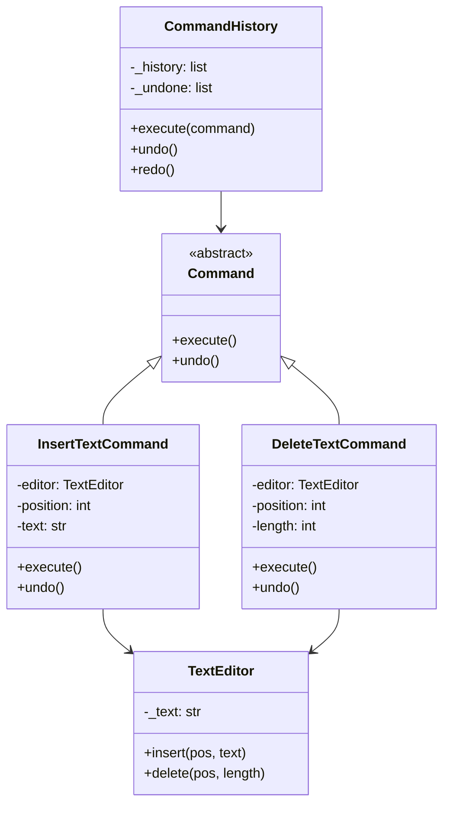

# Command Pattern

> Encapsulate a request as an object, allowing you to parameterize clients, queue requests, log them, and support undoable operations.

**Type:** Behavioral  
**Complexity:** Medium  
**Popularity:** High

---

## Real-World Analogy

A restaurant order: a waiter takes your order (a request), writes it on a ticket (encapsulates it as an object), and passes it to the kitchen (the executor). The ticket can be queued, re-prioritized, and the kitchen doesn't need to know anything about the waiter or the customer.

---

## The Problem

You need to parameterize operations, support undo/redo, queue operations, or log them — but the operation is hardcoded as a direct method call.

```python
# BAD: The button directly calls editor.copy().
# You can't undo it. You can't queue it. You can't log it.
# Adding a keyboard shortcut for the same action duplicates the logic.

class CopyButton:
    def __init__(self, editor):
        self.editor = editor

    def click(self):
        self.editor.copy()   # direct call — no undo, no queue, no logging

class CopyKeyboardShortcut:
    def __init__(self, editor):
        self.editor = editor

    def on_key_press(self):
        self.editor.copy()   # duplicated logic
```

---

## The Solution

Encapsulate the request (method call + its parameters) as a Command object. The invoker (button, shortcut) holds a command and calls `execute()`. The command stores everything needed to execute and undo the operation.

```python
from abc import ABC, abstractmethod
from dataclasses import dataclass, field

# --- Command interface ---
class Command(ABC):
    @abstractmethod
    def execute(self) -> None: ...

    @abstractmethod
    def undo(self) -> None: ...


# --- Receiver: the actual business logic ---
class TextEditor:
    def __init__(self):
        self._text = ""
        self._clipboard = ""

    @property
    def text(self) -> str:
        return self._text

    def insert(self, position: int, text: str) -> None:
        self._text = self._text[:position] + text + self._text[position:]

    def delete(self, position: int, length: int) -> None:
        self._text = self._text[:position] + self._text[position + length:]

    def copy_selection(self, start: int, end: int) -> None:
        self._clipboard = self._text[start:end]

    def paste(self, position: int) -> None:
        self.insert(position, self._clipboard)


# --- Concrete Commands ---
@dataclass
class InsertTextCommand(Command):
    editor: TextEditor
    position: int
    text: str

    def execute(self) -> None:
        self.editor.insert(self.position, self.text)

    def undo(self) -> None:
        self.editor.delete(self.position, len(self.text))


@dataclass
class DeleteTextCommand(Command):
    editor: TextEditor
    position: int
    length: int
    _deleted_text: str = field(default="", init=False)

    def execute(self) -> None:
        self._deleted_text = self.editor.text[self.position:self.position + self.length]
        self.editor.delete(self.position, self.length)

    def undo(self) -> None:
        self.editor.insert(self.position, self._deleted_text)


# --- Invoker: manages execution and undo history ---
class CommandHistory:
    def __init__(self):
        self._history: list[Command] = []
        self._undone: list[Command] = []

    def execute(self, command: Command) -> None:
        command.execute()
        self._history.append(command)
        self._undone.clear()    # new action clears redo stack

    def undo(self) -> None:
        if not self._history:
            return
        command = self._history.pop()
        command.undo()
        self._undone.append(command)

    def redo(self) -> None:
        if not self._undone:
            return
        command = self._undone.pop()
        command.execute()
        self._history.append(command)


# --- Usage ---
editor = TextEditor()
history = CommandHistory()

history.execute(InsertTextCommand(editor, 0, "Hello, World!"))
print(editor.text)   # Hello, World!

history.execute(DeleteTextCommand(editor, 7, 5))
print(editor.text)   # Hello, !

history.undo()
print(editor.text)   # Hello, World!  ← undo restored the deletion

history.undo()
print(editor.text)   #                ← undo removed the insertion

history.redo()
print(editor.text)   # Hello, World!  ← redo re-applied the insertion
```

---

## Macro Commands

```python
class MacroCommand(Command):
    """Executes multiple commands as one atomic unit."""
    def __init__(self, commands: list[Command]):
        self._commands = commands

    def execute(self) -> None:
        for cmd in self._commands:
            cmd.execute()

    def undo(self) -> None:
        for cmd in reversed(self._commands):
            cmd.undo()

# Bold = insert opening tag + insert closing tag
bold_macro = MacroCommand([
    InsertTextCommand(editor, start, "<b>"),
    InsertTextCommand(editor, end + 3, "</b>"),
])
history.execute(bold_macro)
```

---

## Queued / Scheduled Commands

```python
import queue
import threading

class CommandQueue:
    def __init__(self):
        self._queue: queue.Queue[Command] = queue.Queue()
        self._worker = threading.Thread(target=self._process, daemon=True)
        self._worker.start()

    def enqueue(self, command: Command) -> None:
        self._queue.put(command)

    def _process(self) -> None:
        while True:
            command = self._queue.get()
            command.execute()
            self._queue.task_done()
```

---

## Diagram



---

## When to Use / When NOT to Use

**Use when:**
- You need undo/redo functionality.
- You want to queue, schedule, or log operations.
- You want to implement transactional behavior (execute a set of operations, roll back on failure).
- Multiple UI elements trigger the same operation (button, keyboard shortcut, menu item).

**Don't use when:**
- Operations are simple and one-off — the overhead of Command objects isn't justified.
- Undo/redo, queuing, and logging are not requirements.

---

## Key Takeaways

- Command turns a method call into a first-class object that can be stored, queued, logged, and undone.
- The Invoker doesn't know what the command does — it just calls `execute()`.
- The Receiver contains the actual business logic — the command just calls the right method on it.
- Widely used in: text editors (undo/redo), task queues, transaction managers, GUI frameworks, game replay systems.
