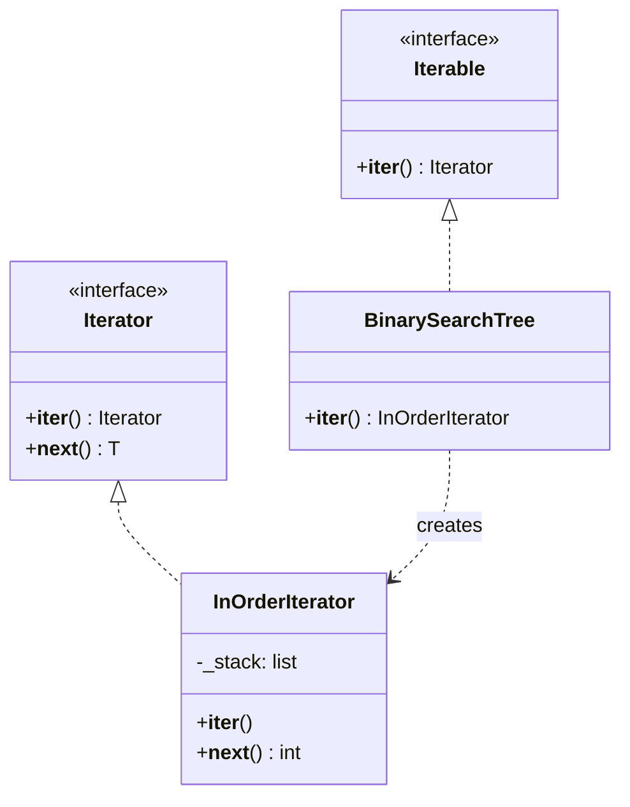

# Iterator Pattern

> Provide a way to sequentially access elements of a collection without exposing its internal representation.

**Type:** Behavioral  
**Complexity:** Low  
**Popularity:** High (built into most languages)

---

## Real-World Analogy

A TV remote: you press "next channel" repeatedly. You don't care if channels are stored in an array, a linked list, or fetched from a server. You just press next and get the next channel.

---

## The Problem

Traversal logic is embedded inside the collection, or worse, clients write custom traversal code for each collection type. Switching collection types (array to linked list, for example) breaks every traversal.

```python
# BAD: Client code knows the internals of each collection.
# Changing from a list to a tree requires rewriting the traversal everywhere.

class SongPlaylist:
    def __init__(self):
        self.songs = []   # internal list exposed

playlist = SongPlaylist()
playlist.songs.append("Song A")
playlist.songs.append("Song B")

# Client traverses by knowing it's a list
for i in range(len(playlist.songs)):
    print(playlist.songs[i])   # direct index access — tight coupling
```

---

## The Solution

Define an iterator interface with `__next__` and `__iter__`. The collection returns an iterator, and clients use a standard loop — they never see the internal structure.

```python
from typing import Iterator, Generic, TypeVar

T = TypeVar("T")

# --- Custom iterator for a read-only range ---
class CountdownIterator:
    def __init__(self, start: int):
        self._current = start

    def __iter__(self) -> "CountdownIterator":
        return self

    def __next__(self) -> int:
        if self._current < 0:
            raise StopIteration
        value = self._current
        self._current -= 1
        return value

for n in CountdownIterator(5):
    print(n)   # 5, 4, 3, 2, 1, 0


# --- Iterator over a custom tree (in-order traversal) ---
class TreeNode:
    def __init__(self, value: int, left=None, right=None):
        self.value = value
        self.left = left
        self.right = right

class InOrderIterator:
    def __init__(self, root: TreeNode | None):
        self._stack: list[TreeNode] = []
        self._push_left(root)

    def _push_left(self, node: TreeNode | None) -> None:
        while node:
            self._stack.append(node)
            node = node.left

    def __iter__(self) -> "InOrderIterator":
        return self

    def __next__(self) -> int:
        if not self._stack:
            raise StopIteration
        node = self._stack.pop()
        value = node.value
        self._push_left(node.right)
        return value

class BinarySearchTree:
    def __init__(self):
        self._root: TreeNode | None = None

    def insert(self, value: int) -> None:
        # standard BST insert ...
        pass

    def __iter__(self) -> InOrderIterator:
        return InOrderIterator(self._root)


# --- Client code: same loop, different underlying structure ---
bst = BinarySearchTree()
for value in bst:      # in-order, regardless of tree structure
    print(value)
```

---

## Python's Built-in Iterator Protocol

Python's `for x in obj` calls `iter(obj)` then repeatedly calls `next()`. Any object implementing `__iter__` and `__next__` is an iterator. Python's generator functions are the most ergonomic way to write iterators:

```python
class InfiniteCounter:
    def __init__(self, start: int = 0, step: int = 1):
        self._start = start
        self._step = step

    def __iter__(self):
        current = self._start
        while True:
            yield current         # generator — pauses here on each next()
            current += self._step

counter = InfiniteCounter(start=10, step=5)
import itertools
first_five = list(itertools.islice(counter, 5))
print(first_five)   # [10, 15, 20, 25, 30]
```

---

## Lazy Iterator (Pagination Example)

```python
import requests

class PaginatedAPIIterator:
    """Lazily fetches pages from an API as the caller iterates."""
    def __init__(self, base_url: str, page_size: int = 100):
        self._url = base_url
        self._page_size = page_size
        self._page = 1
        self._buffer: list = []
        self._exhausted = False

    def __iter__(self):
        return self

    def __next__(self):
        if not self._buffer:
            if self._exhausted:
                raise StopIteration
            response = requests.get(self._url, params={
                "page": self._page,
                "per_page": self._page_size
            }).json()
            self._buffer = response.get("items", [])
            self._page += 1
            if len(self._buffer) < self._page_size:
                self._exhausted = True
            if not self._buffer:
                raise StopIteration
        return self._buffer.pop(0)

for user in PaginatedAPIIterator("https://api.example.com/users"):
    process(user)   # Fetches one page at a time, transparently
```

---

## Diagram



---

## When to Use / When NOT to Use

**Use when:**
- You want to hide the internal structure of a collection (array, tree, graph, paginated API).
- You want multiple independent traversals of the same collection.
- You want a lazy sequence that generates values on demand.

**Don't use when:**
- The collection is a plain list and you just need `for x in my_list` — no custom iterator needed.

---

## Key Takeaways

- Iterator separates traversal logic from collection structure.
- Python's `for` loop, list comprehensions, `zip`, `map`, and `filter` all use the iterator protocol.
- Generators (`yield`) are the simplest way to write iterators in Python.
- Lazy iterators are memory-efficient for large datasets — they produce one element at a time.
