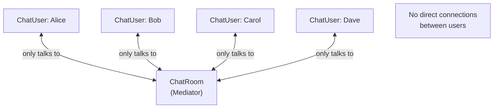

# Mediator Pattern

> Define an object that encapsulates how a set of objects interact, promoting loose coupling by keeping objects from referring to each other explicitly.

**Type:** Behavioral  
**Complexity:** Medium  
**Popularity:** Medium

---

## Real-World Analogy

Air traffic control: planes don't communicate directly with each other — they all communicate through the control tower (mediator). The tower knows about all flights and coordinates landings, takeoffs, and routes. Planes are loosely coupled — they only need to know about the tower.

---

## The Problem

Objects need to communicate with each other. Without a mediator, each object holds direct references to all the others. With N objects, you have up to N×(N-1) connections. Any change to one object ripples through all its peers.

```python
# BAD: A chat room where every user directly references every other user.
# Adding a new user requires updating every existing user.

class User:
    def __init__(self, name):
        self.name = name
        self.peers: list["User"] = []    # direct references to all others

    def send(self, message: str) -> None:
        for peer in self.peers:          # each user broadcasts to all others
            peer.receive(self.name, message)

    def receive(self, sender: str, message: str) -> None:
        print(f"{self.name} received from {sender}: {message}")

alice = User("Alice")
bob   = User("Bob")
carol = User("Carol")

# Wiring: O(N²) connections
alice.peers = [bob, carol]
bob.peers   = [alice, carol]
carol.peers = [alice, bob]
```

Adding a 4th user requires updating every existing user's `peers` list.

---

## The Solution

Route all communication through a Mediator. Each object knows only about the mediator — not about each other.

```python
from abc import ABC, abstractmethod

# --- Mediator interface ---
class ChatMediator(ABC):
    @abstractmethod
    def send_message(self, sender: "ChatUser", message: str) -> None: ...

    @abstractmethod
    def add_user(self, user: "ChatUser") -> None: ...


# --- Colleague: participants know only about the mediator ---
class ChatUser:
    def __init__(self, name: str, mediator: ChatMediator):
        self.name = name
        self._mediator = mediator
        self._mediator.add_user(self)

    def send(self, message: str) -> None:
        print(f"[{self.name}] sends: {message}")
        self._mediator.send_message(self, message)

    def receive(self, sender_name: str, message: str) -> None:
        print(f"  [{self.name}] received from [{sender_name}]: {message}")


# --- Concrete Mediator ---
class ChatRoom(ChatMediator):
    def __init__(self):
        self._users: list[ChatUser] = []

    def add_user(self, user: ChatUser) -> None:
        self._users.append(user)

    def send_message(self, sender: ChatUser, message: str) -> None:
        for user in self._users:
            if user is not sender:
                user.receive(sender.name, message)


# --- Usage ---
room = ChatRoom()
alice = ChatUser("Alice", room)
bob   = ChatUser("Bob",   room)
carol = ChatUser("Carol", room)

alice.send("Hello everyone!")
# [Alice] sends: Hello everyone!
#   [Bob] received from [Alice]: Hello everyone!
#   [Carol] received from [Alice]: Hello everyone!

# Adding a 4th user requires zero changes to Alice, Bob, or Carol:
dave = ChatUser("Dave", room)
```

---

## Advanced: Form Component Coordination

Mediator is common in UI: when one form component changes, it should update others.

```python
class FormMediator:
    def __init__(self):
        self.username_field = None
        self.submit_button = None
        self.error_label = None

    def notify(self, sender_name: str, event: str) -> None:
        if sender_name == "username_field" and event == "changed":
            username = self.username_field.value
            if len(username) < 3:
                self.error_label.show("Username too short")
                self.submit_button.disable()
            else:
                self.error_label.hide()
                self.submit_button.enable()

class UsernameField:
    def __init__(self, mediator: FormMediator):
        self.value = ""
        self._mediator = mediator
        mediator.username_field = self

    def set_value(self, text: str) -> None:
        self.value = text
        self._mediator.notify("username_field", "changed")
```

---

## Diagram



---

## Mediator vs. Observer

| | Mediator | Observer |
|-|----------|----------|
| **Communication** | Many-to-many through a central object | One-to-many (subject notifies subscribers) |
| **Coupling** | Components know about the mediator | Subscribers know about the subject |
| **Use case** | Coordinating interaction between peers | Event propagation from a single source |

---

## When to Use / When NOT to Use

**Use when:**
- Many objects communicate in complex, hard-to-understand ways.
- Reusing a component is hard because it references too many other components.
- You can't change individual components but need to change their interaction.

**Don't use when:**
- There are only 2–3 objects — direct references are simpler.
- The mediator itself becomes too complex (the "God Object" anti-pattern).

---

## Key Takeaways

- Mediator reduces N×(N-1) direct connections to N connections (each to the mediator only).
- Each component sends events/messages to the mediator; the mediator decides who handles them.
- The risk: the mediator can become a bloated God Object if not kept focused.
- Common in: chat systems, air traffic control simulations, UI form coordination, event buses.
