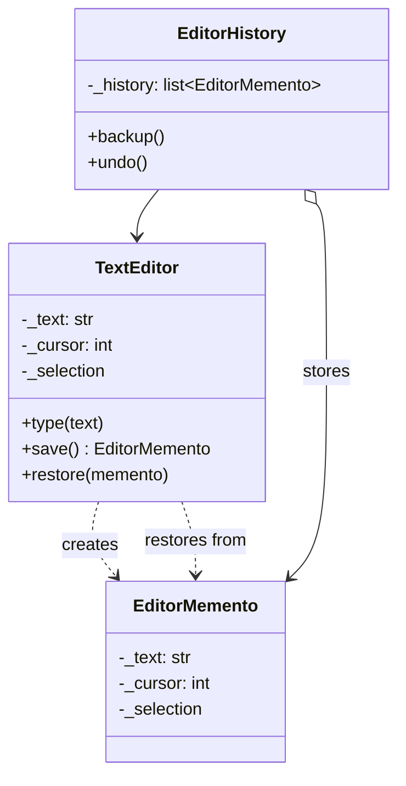

# Memento Pattern

> Without violating encapsulation, capture and externalize an object's internal state so the object can be restored to that state later.

**Type:** Behavioral  
**Complexity:** Medium  
**Popularity:** Medium

---

## Real-World Analogy

Saving a game: the game state (position, health, inventory) is captured as a save file (memento). You can restore from the save file at any time without needing to know the game's internal implementation.

---

## The Problem

You need to save and restore an object's state, but the state is private. Making it public to save it breaks encapsulation — other code could access and corrupt it.

```python
# BAD: To save/restore state, we expose all internals publicly.
class TextEditor:
    def __init__(self):
        self.text = ""          # public — anyone can corrupt it
        self.cursor = 0         # public
        self.selection = None   # public

    def save(self) -> dict:
        return {"text": self.text, "cursor": self.cursor, "selection": self.selection}

    def restore(self, state: dict) -> None:
        self.text = state["text"]
        self.cursor = state["cursor"]
        self.selection = state["selection"]

# Caller can now do this — no encapsulation:
editor = TextEditor()
state = editor.save()
state["text"] = "CORRUPTED"   # caller modifies saved state directly
editor.restore(state)
```

---

## The Solution

Three participants:
- **Originator** — the object whose state needs saving. Creates and restores from Mementos.
- **Memento** — a snapshot of the Originator's state. Opaque to everyone except the Originator.
- **Caretaker** — stores and manages Mementos but never looks inside them.

```python
from dataclasses import dataclass
from typing import Any

# --- Memento: opaque state holder ---
@dataclass(frozen=True)
class EditorMemento:
    """Immutable snapshot. Only TextEditor can interpret the contents."""
    _text: str
    _cursor: int
    _selection: tuple[int, int] | None

    # Caretaker has no way to read these fields
    # (Python doesn't enforce this, but naming convention signals intent)


# --- Originator ---
class TextEditor:
    def __init__(self):
        self._text = ""
        self._cursor = 0
        self._selection: tuple[int, int] | None = None

    def type(self, text: str) -> None:
        self._text = self._text[:self._cursor] + text + self._text[self._cursor:]
        self._cursor += len(text)

    def select(self, start: int, end: int) -> None:
        self._selection = (start, end)

    def delete_selection(self) -> None:
        if self._selection:
            start, end = self._selection
            self._text = self._text[:start] + self._text[end:]
            self._cursor = start
            self._selection = None

    @property
    def content(self) -> str:
        return self._text

    def save(self) -> EditorMemento:
        """Creates a memento with the current state."""
        return EditorMemento(self._text, self._cursor, self._selection)

    def restore(self, memento: EditorMemento) -> None:
        """Restores state from a memento."""
        self._text      = memento._text
        self._cursor    = memento._cursor
        self._selection = memento._selection


# --- Caretaker: manages history ---
class EditorHistory:
    def __init__(self, editor: TextEditor):
        self._editor = editor
        self._history: list[EditorMemento] = []

    def backup(self) -> None:
        self._history.append(self._editor.save())

    def undo(self) -> None:
        if not self._history:
            print("Nothing to undo")
            return
        self._editor.restore(self._history.pop())


# --- Usage ---
editor  = TextEditor()
history = EditorHistory(editor)

history.backup()            # snapshot 1: ""
editor.type("Hello")
print(editor.content)       # Hello

history.backup()            # snapshot 2: "Hello"
editor.type(", World!")
print(editor.content)       # Hello, World!

history.backup()            # snapshot 3: "Hello, World!"
editor.select(7, 13)
editor.delete_selection()
print(editor.content)       # Hello, !

history.undo()              # restore snapshot 3
print(editor.content)       # Hello, World!

history.undo()              # restore snapshot 2
print(editor.content)       # Hello

history.undo()              # restore snapshot 1
print(editor.content)       #  (empty)
```

---

## Snapshot with Serialization (for Persistence)

```python
import json
import copy

class ConfigMemento:
    def __init__(self, state: dict):
        self._state = copy.deepcopy(state)   # deep copy prevents aliasing

    def get_state(self) -> dict:
        return copy.deepcopy(self._state)    # defensive copy on retrieval

    def to_json(self) -> str:
        return json.dumps(self._state)

    @classmethod
    def from_json(cls, data: str) -> "ConfigMemento":
        return cls(json.loads(data))


class AppConfig:
    def __init__(self):
        self._settings = {"theme": "light", "font_size": 14, "language": "en"}

    def save(self) -> ConfigMemento:
        return ConfigMemento(self._settings)

    def restore(self, memento: ConfigMemento) -> None:
        self._settings = memento.get_state()

    def set(self, key: str, value: Any) -> None:
        self._settings[key] = value
```

---

## Diagram



---

## When to Use / When NOT to Use

**Use when:**
- You need undo/redo or rollback functionality.
- Directly exposing state for saving would break encapsulation.
- You need point-in-time snapshots (configuration management, game saves, transactions).

**Don't use when:**
- State is large and snapshots are expensive to store (consider delta/diff snapshots).
- The object has no encapsulation concerns — a simple copy would suffice.

---

## Key Takeaways

- Memento preserves encapsulation: the Caretaker stores snapshots without knowing what's in them.
- The Originator is the only one that can create and interpret a Memento.
- The Caretaker manages the stack but never peeks inside.
- Widely used in: text editors, game state saving, database transactions (savepoints), configuration rollback.
