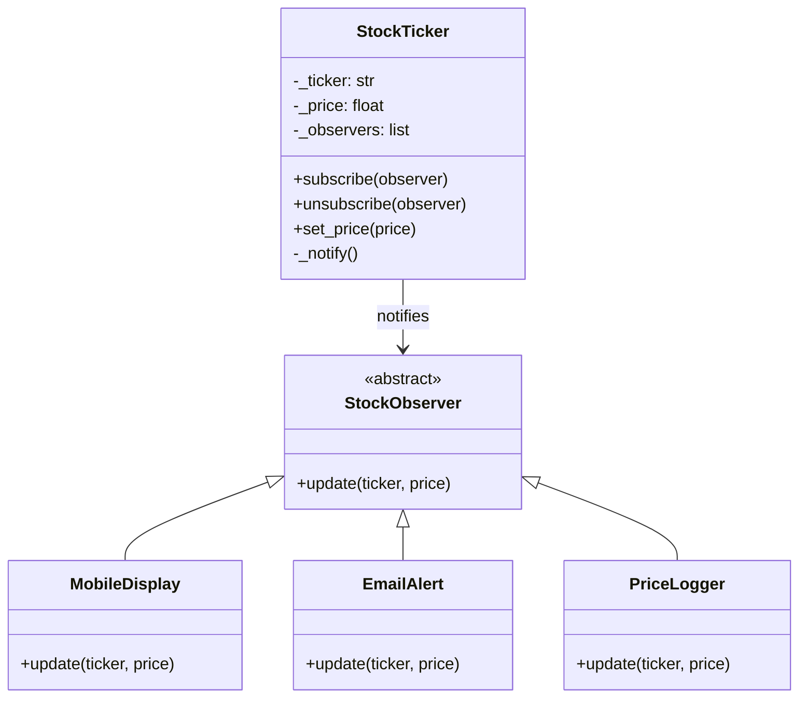

# Observer Pattern

> Define a one-to-many dependency so that when one object changes state, all its dependents are notified and updated automatically.

**Type:** Behavioral  
**Complexity:** Medium  
**Popularity:** Very High

---

## Real-World Analogy

A newspaper subscription: the publisher (subject) maintains a list of subscribers. When a new edition is published, every subscriber gets notified automatically. Subscribers can join or leave at any time without the publisher needing to change.

---

## The Problem

Multiple objects need to react when another object changes state, but you don't want them tightly coupled.

```python
# BAD: The stock ticker directly calls every dependent object.
# Adding a new display format requires editing StockTicker.

class StockTicker:
    def __init__(self):
        self.price = 0.0

    def set_price(self, price: float) -> None:
        self.price = price
        # Directly coupled to every consumer — tight coupling
        mobile_display.update(price)
        web_dashboard.update(price)
        email_alert.send_if_threshold(price)
        chart_renderer.redraw(price)
        # Adding a new consumer = editing this class
```

---

## The Solution

The subject (publisher) maintains a list of observers (subscribers). When state changes, it notifies all observers through a common interface.

```python
from abc import ABC, abstractmethod

# --- Observer interface ---
class StockObserver(ABC):
    @abstractmethod
    def update(self, ticker: str, price: float) -> None: ...


# --- Subject (Observable) ---
class StockTicker:
    def __init__(self, ticker: str):
        self._ticker = ticker
        self._price = 0.0
        self._observers: list[StockObserver] = []

    def subscribe(self, observer: StockObserver) -> None:
        self._observers.append(observer)

    def unsubscribe(self, observer: StockObserver) -> None:
        self._observers.remove(observer)

    def set_price(self, price: float) -> None:
        self._price = price
        self._notify()

    def _notify(self) -> None:
        for observer in self._observers:
            observer.update(self._ticker, self._price)


# --- Concrete Observers ---
class MobileDisplay(StockObserver):
    def update(self, ticker: str, price: float) -> None:
        print(f"[Mobile] {ticker}: ${price:.2f}")


class EmailAlert(StockObserver):
    def __init__(self, threshold: float):
        self._threshold = threshold

    def update(self, ticker: str, price: float) -> None:
        if price > self._threshold:
            print(f"[Email Alert] {ticker} exceeded ${self._threshold:.2f}! Now: ${price:.2f}")


class PriceLogger(StockObserver):
    def __init__(self):
        self._history: list[float] = []

    def update(self, ticker: str, price: float) -> None:
        self._history.append(price)
        print(f"[Logger] {ticker} price history: {self._history}")


# --- Usage ---
aapl = StockTicker("AAPL")
aapl.subscribe(MobileDisplay())
aapl.subscribe(EmailAlert(threshold=200.0))
logger = PriceLogger()
aapl.subscribe(logger)

aapl.set_price(195.50)
# [Mobile] AAPL: $195.50
# [Logger] AAPL price history: [195.5]

aapl.set_price(205.00)
# [Mobile] AAPL: $205.00
# [Email Alert] AAPL exceeded $200.00! Now: $205.00
# [Logger] AAPL price history: [195.5, 205.0]

aapl.unsubscribe(logger)
aapl.set_price(210.00)
# [Mobile] AAPL: $210.00  ← logger not notified
# [Email Alert] AAPL exceeded $200.00! Now: $210.00
```

---

## Python Event System

In Python, you can implement Observer with a simple event system:

```python
from collections import defaultdict
from typing import Callable

class EventBus:
    def __init__(self):
        self._listeners: dict[str, list[Callable]] = defaultdict(list)

    def subscribe(self, event: str, callback: Callable) -> None:
        self._listeners[event].append(callback)

    def publish(self, event: str, **data) -> None:
        for callback in self._listeners[event]:
            callback(**data)

# Usage
bus = EventBus()
bus.subscribe("user_registered", lambda email, **_: print(f"Send welcome to {email}"))
bus.subscribe("user_registered", lambda user_id, **_: print(f"Create profile for {user_id}"))

bus.publish("user_registered", email="alice@example.com", user_id=42)
# Send welcome to alice@example.com
# Create profile for 42
```

---

## Push vs. Pull Observer

**Push:** The subject sends data to observers in the `update()` call.

```python
def update(self, ticker: str, price: float) -> None:   # data pushed in
    ...
```

**Pull:** The subject sends a reference to itself; observers pull what they need.

```python
def update(self, subject: StockTicker) -> None:        # observer pulls data
    price = subject.price
    ...
```

Pull is more flexible (observers take only what they need), but creates a dependency on the subject's interface.

---

## Diagram



---

## When to Use / When NOT to Use

**Use when:**
- A change in one object requires changing others, and you don't know how many objects need to change.
- You want to achieve loose coupling between a subject and its dependents.
- Objects should be able to notify other objects without knowing who they are.

**Don't use when:**
- Notification order matters — observers are notified in an unspecified order.
- Observers have heavy side effects — a cascade of notifications can be hard to reason about.
- There are circular notification loops (observer modifying the subject triggers re-notification).

---

## Key Takeaways

- Observer achieves loose coupling: subject doesn't know anything about observers' concrete types.
- The event bus variation is widely used in applications for decoupled communication between modules.
- Common implementations: Python's `signal` library, JavaScript's `EventEmitter`, React's state change → re-render, Kafka topics (distributed observer).
- Watch out for **memory leaks**: if observers are not unsubscribed, the subject holds references that prevent garbage collection.
