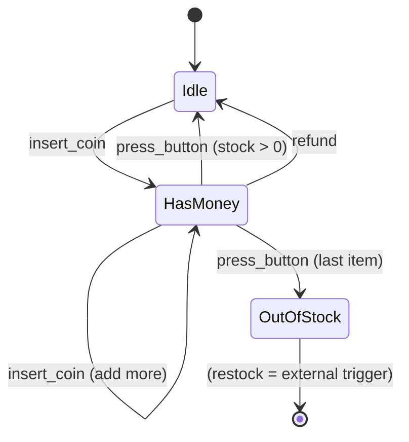
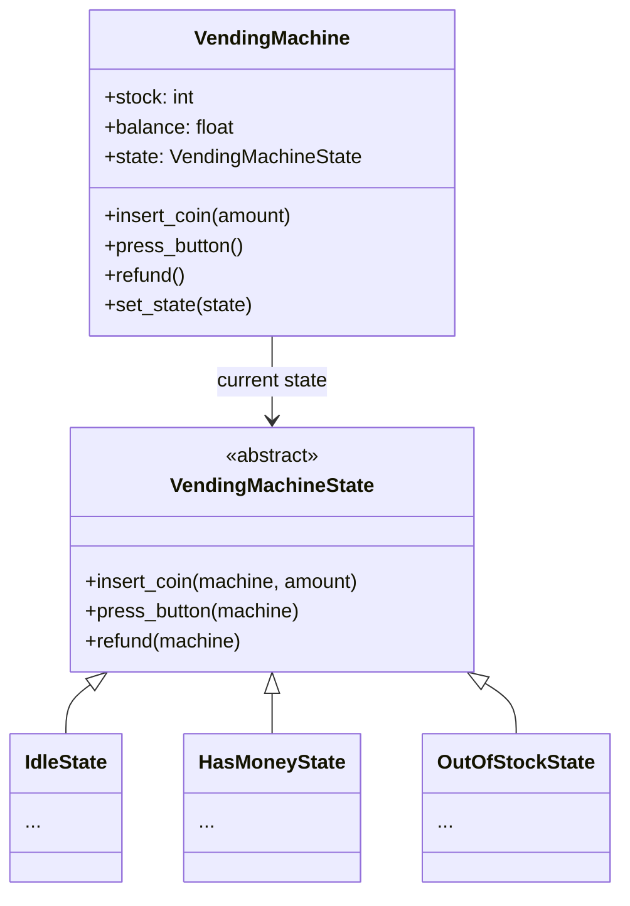

# State Pattern

> Allow an object to alter its behavior when its internal state changes. The object will appear to change its class.

**Type:** Behavioral  
**Complexity:** Medium  
**Popularity:** Medium

---

## Real-World Analogy

A vending machine behaves differently depending on its state. When it has no money inserted, pressing a button does nothing. When money is inserted, the same button dispenses a product. When it's out of stock, even inserting money does nothing. Same machine — different behavior based on state.

---

## The Problem

An object with multiple states is managed with `if/elif` chains. Every operation checks the current state. Adding a new state means touching every operation.

```python
# BAD: State is a string flag. Every method checks it.
# Adding a new state (e.g., "MAINTENANCE") requires editing every method.

class VendingMachine:
    def __init__(self):
        self._state = "IDLE"
        self._balance = 0.0

    def insert_coin(self, amount: float) -> None:
        if self._state == "IDLE":
            self._balance += amount
            self._state = "HAS_MONEY"
            print(f"Inserted ${amount:.2f}. Balance: ${self._balance:.2f}")
        elif self._state == "HAS_MONEY":
            self._balance += amount
            print(f"Added ${amount:.2f}. Balance: ${self._balance:.2f}")
        elif self._state == "OUT_OF_STOCK":
            print("Machine is out of stock. Returning coin.")
        # ...

    def press_button(self) -> None:
        if self._state == "IDLE":
            print("Please insert coins first.")
        elif self._state == "HAS_MONEY":
            print("Dispensing product!")
            self._balance = 0.0
            self._state = "IDLE"
        elif self._state == "OUT_OF_STOCK":
            print("Out of stock!")
        # Adding MAINTENANCE here = add elif to every method above too
```

---

## The Solution

Extract each state into its own class. Delegate all state-dependent behavior to the current state object. To change behavior, swap the state object.

```python
from abc import ABC, abstractmethod

# --- Abstract State ---
class VendingMachineState(ABC):
    @abstractmethod
    def insert_coin(self, machine: "VendingMachine", amount: float) -> None: ...

    @abstractmethod
    def press_button(self, machine: "VendingMachine") -> None: ...

    @abstractmethod
    def refund(self, machine: "VendingMachine") -> None: ...


# --- Concrete States ---
class IdleState(VendingMachineState):
    def insert_coin(self, machine: "VendingMachine", amount: float) -> None:
        machine.balance += amount
        print(f"Inserted ${amount:.2f}. Balance: ${machine.balance:.2f}")
        machine.set_state(HasMoneyState())

    def press_button(self, machine: "VendingMachine") -> None:
        print("Please insert coins first.")

    def refund(self, machine: "VendingMachine") -> None:
        print("No money to refund.")


class HasMoneyState(VendingMachineState):
    def insert_coin(self, machine: "VendingMachine", amount: float) -> None:
        machine.balance += amount
        print(f"Added ${amount:.2f}. Balance: ${machine.balance:.2f}")

    def press_button(self, machine: "VendingMachine") -> None:
        if machine.stock > 0:
            print(f"Dispensing product! Change: ${machine.balance - 1.50:.2f}")
            machine.stock -= 1
            machine.balance = 0.0
            machine.set_state(IdleState() if machine.stock > 0 else OutOfStockState())
        else:
            print("Out of stock! Refunding.")
            machine.set_state(OutOfStockState())
            machine.state.refund(machine)

    def refund(self, machine: "VendingMachine") -> None:
        print(f"Refunding ${machine.balance:.2f}")
        machine.balance = 0.0
        machine.set_state(IdleState())


class OutOfStockState(VendingMachineState):
    def insert_coin(self, machine: "VendingMachine", amount: float) -> None:
        print("Out of stock! Returning coin.")

    def press_button(self, machine: "VendingMachine") -> None:
        print("Out of stock. Please try another machine.")

    def refund(self, machine: "VendingMachine") -> None:
        if machine.balance > 0:
            print(f"Refunding ${machine.balance:.2f}")
            machine.balance = 0.0


# --- Context ---
class VendingMachine:
    def __init__(self, stock: int):
        self.stock = stock
        self.balance = 0.0
        self.state: VendingMachineState = IdleState()

    def set_state(self, state: VendingMachineState) -> None:
        print(f"  [State] {type(self.state).__name__} → {type(state).__name__}")
        self.state = state

    def insert_coin(self, amount: float) -> None:
        self.state.insert_coin(self, amount)

    def press_button(self) -> None:
        self.state.press_button(self)

    def refund(self) -> None:
        self.state.refund(self)


# --- Usage ---
machine = VendingMachine(stock=1)

machine.press_button()          # Please insert coins first.
machine.insert_coin(2.00)       # Inserted $2.00 | State: Idle → HasMoney
machine.press_button()          # Dispensing product! | State: HasMoney → OutOfStock
machine.insert_coin(1.00)       # Out of stock! Returning coin.
```

Adding a `MaintenanceState` = one new class, no changes to `IdleState`, `HasMoneyState`, or `OutOfStockState`.

---

## State Machine Diagram



---

## Class Diagram



---

## When to Use / When NOT to Use

**Use when:**
- An object has a finite number of states, and its behavior depends heavily on the current state.
- State-specific code is scattered across many `if/elif` branches.
- Transitions between states need to be made explicit and testable.

**Don't use when:**
- There are only 2 states and the logic is simple — a boolean flag and a single `if` is cleaner.
- States are not truly distinct behavioral modes.

---

## Key Takeaways

- State eliminates complex `if/elif` chains by encapsulating each state's behavior in its own class.
- The Context delegates every operation to its current state object.
- Transitions happen by the state (or context) swapping the current state object.
- Common uses: vending machines, TCP connection states, order lifecycle (pending/confirmed/shipped/delivered), UI component states (loading/loaded/error).
