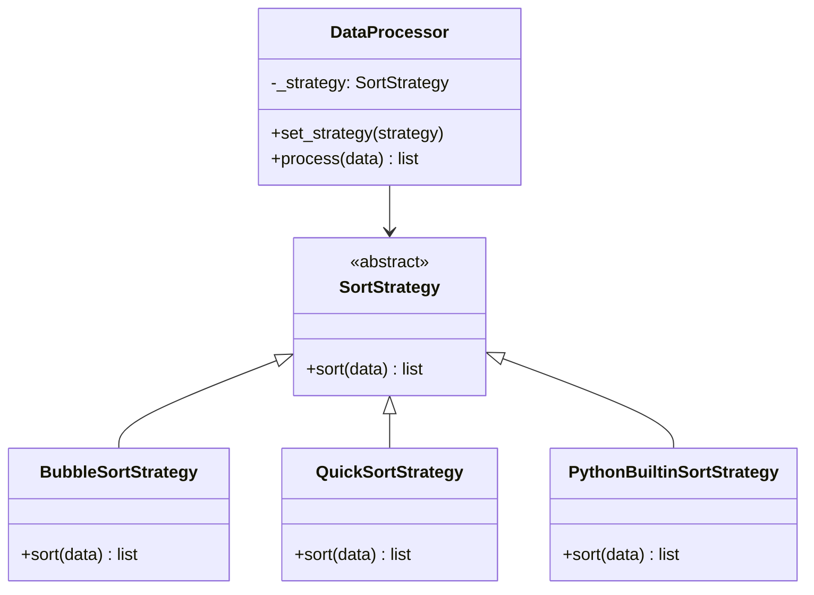

# Strategy Pattern

> Define a family of algorithms, encapsulate each one, and make them interchangeable. Strategy lets the algorithm vary independently from clients that use it.

**Type:** Behavioral  
**Complexity:** Low  
**Popularity:** Very High

---

## Real-World Analogy

Navigation apps offer multiple route strategies: fastest, shortest, avoid tolls, bicycle-friendly. The destination and the navigation interface are the same — only the algorithm for calculating the route changes. You pick the strategy; the app applies it.

---

## The Problem

A single class has multiple `if/elif` branches to select between algorithms. Adding a new algorithm requires editing the class.

```python
# BAD: Sorting algorithm selection hardcoded inside the class.
# Adding Merge Sort requires editing Sorter.

class Sorter:
    def sort(self, data: list, algorithm: str) -> list:
        if algorithm == "bubble":
            return self._bubble_sort(data)
        elif algorithm == "quick":
            return self._quick_sort(data)
        elif algorithm == "merge":
            return self._merge_sort(data)
        else:
            raise ValueError(f"Unknown algorithm: {algorithm}")

    def _bubble_sort(self, data): ...
    def _quick_sort(self, data): ...
    def _merge_sort(self, data): ...
```

The Sorter class grows with every new algorithm. It also can't be tested in isolation from the algorithm implementations.

---

## The Solution

Extract each algorithm into its own class with a common interface. The client holds a reference to the strategy and delegates the algorithm call.

```python
from abc import ABC, abstractmethod

# --- Strategy interface ---
class SortStrategy(ABC):
    @abstractmethod
    def sort(self, data: list) -> list: ...


# --- Concrete Strategies ---
class BubbleSortStrategy(SortStrategy):
    def sort(self, data: list) -> list:
        arr = data.copy()
        n = len(arr)
        for i in range(n):
            for j in range(0, n - i - 1):
                if arr[j] > arr[j + 1]:
                    arr[j], arr[j + 1] = arr[j + 1], arr[j]
        return arr


class QuickSortStrategy(SortStrategy):
    def sort(self, data: list) -> list:
        if len(data) <= 1:
            return data
        pivot = data[len(data) // 2]
        left   = [x for x in data if x < pivot]
        middle = [x for x in data if x == pivot]
        right  = [x for x in data if x > pivot]
        return self.sort(left) + middle + self.sort(right)


class PythonBuiltinSortStrategy(SortStrategy):
    def sort(self, data: list) -> list:
        return sorted(data)


# --- Context ---
class DataProcessor:
    def __init__(self, strategy: SortStrategy):
        self._strategy = strategy

    def set_strategy(self, strategy: SortStrategy) -> None:
        """Strategy can be swapped at runtime."""
        self._strategy = strategy

    def process(self, data: list) -> list:
        return self._strategy.sort(data)


# --- Usage ---
processor = DataProcessor(QuickSortStrategy())
result = processor.process([3, 1, 4, 1, 5, 9, 2, 6])
print(result)   # [1, 1, 2, 3, 4, 5, 6, 9]

# Switch strategy at runtime
processor.set_strategy(BubbleSortStrategy())
result = processor.process([5, 3, 1])
print(result)   # [1, 3, 5]
```

---

## Strategy for Payment Processing

```python
class PaymentStrategy(ABC):
    @abstractmethod
    def pay(self, amount: float) -> bool: ...


class CreditCardStrategy(PaymentStrategy):
    def __init__(self, card_number: str, cvv: str):
        self._card = card_number
        self._cvv = cvv

    def pay(self, amount: float) -> bool:
        print(f"Charging ${amount:.2f} to card ending {self._card[-4:]}")
        return True


class PayPalStrategy(PaymentStrategy):
    def __init__(self, email: str):
        self._email = email

    def pay(self, amount: float) -> bool:
        print(f"Processing ${amount:.2f} via PayPal ({self._email})")
        return True


class CryptoStrategy(PaymentStrategy):
    def __init__(self, wallet: str):
        self._wallet = wallet

    def pay(self, amount: float) -> bool:
        print(f"Sending ${amount:.2f} in BTC to {self._wallet[:8]}...")
        return True


class ShoppingCart:
    def __init__(self):
        self._items: list[dict] = []
        self._payment: PaymentStrategy | None = None

    def add_item(self, name: str, price: float) -> None:
        self._items.append({"name": name, "price": price})

    def set_payment_strategy(self, strategy: PaymentStrategy) -> None:
        self._payment = strategy

    def checkout(self) -> None:
        total = sum(item["price"] for item in self._items)
        if not self._payment:
            raise ValueError("No payment method selected")
        success = self._payment.pay(total)
        if success:
            print(f"Order completed! Total: ${total:.2f}")


cart = ShoppingCart()
cart.add_item("Laptop", 999.99)
cart.add_item("Mouse", 29.99)

cart.set_payment_strategy(CreditCardStrategy("4111111111111111", "123"))
cart.checkout()
# Charging $1029.98 to card ending 1111

cart.set_payment_strategy(PayPalStrategy("alice@example.com"))
cart.checkout()
# Processing $1029.98 via PayPal (alice@example.com)
```

---

## Python: Strategies as Functions

In Python, strategies don't need classes — functions work perfectly:

```python
from typing import Callable

def bubble_sort(data: list) -> list: ...
def quick_sort(data: list) -> list: ...

class DataProcessor:
    def __init__(self, sort_fn: Callable[[list], list]):
        self._sort = sort_fn

    def process(self, data: list) -> list:
        return self._sort(data)

processor = DataProcessor(sorted)    # Python's built-in as strategy
```

---

## Diagram



---

## Strategy vs. State

Both involve swapping behavior via an interface. The difference:

| | Strategy | State |
|-|----------|-------|
| **Swapped by** | Client explicitly | Context or State itself |
| **Awareness** | Strategies are unaware of each other | States may transition to other states |
| **Purpose** | Interchangeable algorithms | Context behavior changes with state |

---

## When to Use / When NOT to Use

**Use when:**
- You want to swap algorithms or behaviors at runtime.
- Multiple classes differ only in behavior (extract the behavior into strategies).
- You want to isolate algorithm implementation details from the code that uses it.

**Don't use when:**
- There's only one algorithm that never changes.
- The algorithm selection is a one-time, fixed decision at compile time.

---

## Key Takeaways

- Strategy turns `if/elif` algorithm selection into interchangeable objects.
- The client calls the same interface regardless of which strategy is active.
- In Python, a callable (function or lambda) can serve as a strategy without a class.
- One of the most used patterns in real codebases — payment systems, sorting, compression, auth methods, routing algorithms.
