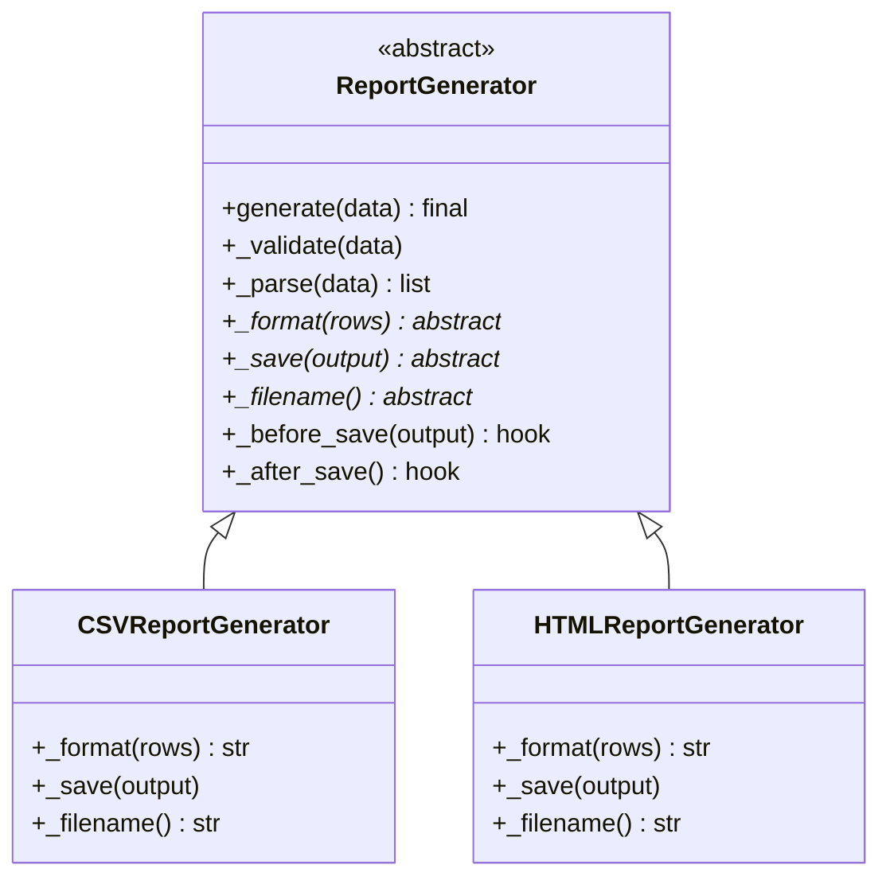

# Template Method Pattern

> Define the skeleton of an algorithm in a base class, deferring some steps to subclasses. Subclasses can redefine certain steps without changing the algorithm's overall structure.

**Type:** Behavioral  
**Complexity:** Low  
**Popularity:** High

---

## Real-World Analogy

A job application process at any company follows the same skeleton: submit application → phone screening → technical interview → offer decision. Each company customizes the technical interview step differently (coding test, system design, take-home project) — but the overall skeleton is the same.

---

## The Problem

Multiple classes share the same overall algorithm structure, but with different implementations for specific steps. Duplicating the algorithm skeleton in each subclass leads to code that is hard to maintain.

```python
# BAD: Both CSVReport and HTMLReport duplicate the entire report generation
# structure. If the structure changes (add a validation step), you edit both.

class CSVReport:
    def generate(self, data):
        # 1. Validate
        if not data:
            raise ValueError("No data")
        # 2. Parse
        rows = [row.split(",") for row in data]
        # 3. Format
        output = "\n".join(",".join(row) for row in rows)
        # 4. Save
        with open("report.csv", "w") as f:
            f.write(output)

class HTMLReport:
    def generate(self, data):
        # 1. Validate (duplicate)
        if not data:
            raise ValueError("No data")
        # 2. Parse (duplicate)
        rows = [row.split(",") for row in data]
        # 3. Format (different)
        output = "<table>" + "".join(f"<tr><td>{'</td><td>'.join(row)}</td></tr>" for row in rows) + "</table>"
        # 4. Save (duplicate)
        with open("report.html", "w") as f:
            f.write(output)
```

---

## The Solution

Define the algorithm skeleton in a base class. Steps that are the same go in the base class directly. Steps that differ are declared as abstract methods — subclasses fill them in.

```python
from abc import ABC, abstractmethod

class ReportGenerator(ABC):
    """Template class: defines the algorithm skeleton."""

    def generate(self, data: list[str]) -> None:
        """The Template Method — final: subclasses cannot override the structure."""
        self._validate(data)
        rows = self._parse(data)
        output = self._format(rows)
        self._save(output)
        print(f"Report saved: {self._filename()}")

    # --- Concrete steps (shared by all subclasses) ---
    def _validate(self, data: list[str]) -> None:
        if not data:
            raise ValueError("Cannot generate a report with no data")

    def _parse(self, data: list[str]) -> list[list[str]]:
        return [row.split(",") for row in data]

    # --- Abstract steps (must be provided by subclasses) ---
    @abstractmethod
    def _format(self, rows: list[list[str]]) -> str: ...

    @abstractmethod
    def _save(self, output: str) -> None: ...

    @abstractmethod
    def _filename(self) -> str: ...


class CSVReportGenerator(ReportGenerator):
    def _format(self, rows: list[list[str]]) -> str:
        return "\n".join(",".join(row) for row in rows)

    def _save(self, output: str) -> None:
        with open(self._filename(), "w") as f:
            f.write(output)

    def _filename(self) -> str:
        return "report.csv"


class HTMLReportGenerator(ReportGenerator):
    def _format(self, rows: list[list[str]]) -> str:
        rows_html = "".join(
            f"<tr><td>{'</td><td>'.join(row)}</td></tr>" for row in rows
        )
        return f"<table>{rows_html}</table>"

    def _save(self, output: str) -> None:
        with open(self._filename(), "w") as f:
            f.write(output)

    def _filename(self) -> str:
        return "report.html"


class EmailReportGenerator(ReportGenerator):
    def _format(self, rows: list[list[str]]) -> str:
        return "\n".join("  |  ".join(row) for row in rows)

    def _save(self, output: str) -> None:
        # Send as email body instead of saving to a file
        email_service.send("reports@company.com", "Daily Report", output)

    def _filename(self) -> str:
        return "email"


# --- Usage ---
data = ["Alice,30,Engineer", "Bob,25,Designer", "Carol,35,Manager"]

CSVReportGenerator().generate(data)    # generates report.csv
HTMLReportGenerator().generate(data)   # generates report.html
```

Now if you add a "send notification after save" step, you add it to `ReportGenerator.generate()` once.

---

## Hook Methods

A **hook** is an optional step in the template that subclasses *may* override (but don't have to). The base class provides a default no-op implementation.

```python
class ReportGenerator(ABC):
    def generate(self, data: list[str]) -> None:
        self._validate(data)
        rows = self._parse(data)
        output = self._format(rows)
        self._before_save(output)    # hook — optional
        self._save(output)
        self._after_save()           # hook — optional

    def _before_save(self, output: str) -> None:
        """Hook: subclasses can override to add pre-save logic."""
        pass

    def _after_save(self) -> None:
        """Hook: subclasses can override to add post-save logic."""
        pass


class AuditedCSVReport(CSVReportGenerator):
    def _after_save(self) -> None:
        audit_log.record("CSV report generated")
```

---

## Diagram



---

## Template Method vs. Strategy

| | Template Method | Strategy |
|-|----------------|---------|
| **Mechanism** | Inheritance — subclasses fill in steps | Composition — swap a strategy object |
| **Algorithm skeleton** | Fixed in the base class | Defined by each strategy |
| **Extension point** | Abstract / hook methods | Entire algorithm swappable |
| **Coupling** | Subclass is coupled to base class | Client loosely coupled to strategy |

Use Template Method when the algorithm skeleton is fixed and you're varying steps.  
Use Strategy when the entire algorithm can be swapped.

---

## When to Use / When NOT to Use

**Use when:**
- Multiple classes share the same algorithm structure but differ in specific steps.
- You want to control which parts of an algorithm subclasses can change (and which they can't).

**Don't use when:**
- You need to swap the entire algorithm — use Strategy.
- There are too many abstract steps — the base class becomes hard to understand.
- You want to avoid inheritance — use Strategy or Decorator instead.

---

## Key Takeaways

- Template Method defines the "what" (algorithm skeleton) and lets subclasses define the "how" (specific steps).
- The base class controls the algorithm flow — subclasses can only fill in designated steps.
- Hook methods let subclasses optionally extend behavior without being forced to.
- Widely used in frameworks: data migration scripts, report generators, test setUp/tearDown, HTTP request/response lifecycle.
