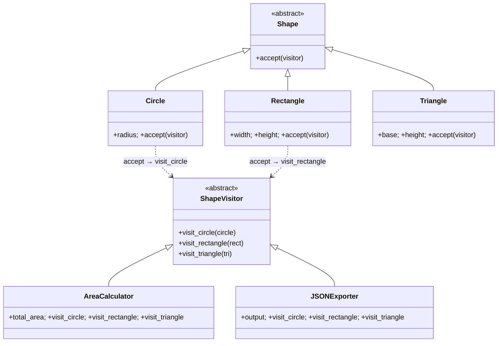

# Visitor Pattern

> Represent an operation to be performed on elements of an object structure. Visitor lets you define a new operation without changing the classes of the elements on which it operates.

**Type:** Behavioral  
**Complexity:** High  
**Popularity:** Low–Medium

---

## Real-World Analogy

A tax assessor visits your house, your car, and your business. Each asset type has different tax rules. The assessor (visitor) applies the appropriate calculation to each asset type. You don't change how the house or car work — you just let the assessor visit them.

---

## The Problem

You have a stable class hierarchy and need to add new operations to it. Adding a method to every class in the hierarchy is tedious and violates OCP.

```python
# BAD: Every new operation (export to JSON, export to XML, validate,
# calculate size) requires adding a method to EVERY shape class.

class Circle:
    def __init__(self, radius): self.radius = radius
    def area(self): return 3.14 * self.radius ** 2
    def export_to_json(self): ...    # new operation → edit Circle
    def export_to_xml(self): ...     # new operation → edit Circle again
    def validate(self): ...          # new operation → edit Circle again

class Rectangle:
    def __init__(self, w, h): self.w, self.h = w, h
    def area(self): return self.w * self.h
    def export_to_json(self): ...    # duplicate logic in every class
    def export_to_xml(self): ...
    def validate(self): ...
```

Every new operation touches every class. For a large hierarchy, this is a maintenance nightmare.

---

## The Solution

Move each operation into a **Visitor** class. Each visitor contains all the logic for one operation, with a separate method per element type. The elements just "accept" the visitor and pass themselves to it.

```python
from abc import ABC, abstractmethod
import math

# --- Element interface ---
class Shape(ABC):
    @abstractmethod
    def accept(self, visitor: "ShapeVisitor") -> None:
        """Accept a visitor — dispatch to the correct visitor method."""
        ...


# --- Concrete Elements ---
class Circle(Shape):
    def __init__(self, radius: float):
        self.radius = radius

    def accept(self, visitor: "ShapeVisitor") -> None:
        visitor.visit_circle(self)   # double dispatch


class Rectangle(Shape):
    def __init__(self, width: float, height: float):
        self.width = width
        self.height = height

    def accept(self, visitor: "ShapeVisitor") -> None:
        visitor.visit_rectangle(self)


class Triangle(Shape):
    def __init__(self, base: float, height: float):
        self.base = base
        self.height = height

    def accept(self, visitor: "ShapeVisitor") -> None:
        visitor.visit_triangle(self)


# --- Visitor interface ---
class ShapeVisitor(ABC):
    @abstractmethod
    def visit_circle(self, circle: Circle) -> None: ...

    @abstractmethod
    def visit_rectangle(self, rect: Rectangle) -> None: ...

    @abstractmethod
    def visit_triangle(self, tri: Triangle) -> None: ...


# --- Concrete Visitors (each is one new operation) ---
class AreaCalculator(ShapeVisitor):
    def __init__(self):
        self.total_area = 0.0

    def visit_circle(self, circle: Circle) -> None:
        self.total_area += math.pi * circle.radius ** 2

    def visit_rectangle(self, rect: Rectangle) -> None:
        self.total_area += rect.width * rect.height

    def visit_triangle(self, tri: Triangle) -> None:
        self.total_area += 0.5 * tri.base * tri.height


class JSONExporter(ShapeVisitor):
    def __init__(self):
        self.output: list[dict] = []

    def visit_circle(self, circle: Circle) -> None:
        self.output.append({"type": "circle", "radius": circle.radius})

    def visit_rectangle(self, rect: Rectangle) -> None:
        self.output.append({"type": "rectangle", "width": rect.width, "height": rect.height})

    def visit_triangle(self, tri: Triangle) -> None:
        self.output.append({"type": "triangle", "base": tri.base, "height": tri.height})


class SVGRenderer(ShapeVisitor):
    def __init__(self):
        self.svg_elements: list[str] = []

    def visit_circle(self, circle: Circle) -> None:
        r = circle.radius
        self.svg_elements.append(f'<circle cx="0" cy="0" r="{r}"/>')

    def visit_rectangle(self, rect: Rectangle) -> None:
        self.svg_elements.append(f'<rect width="{rect.width}" height="{rect.height}"/>')

    def visit_triangle(self, tri: Triangle) -> None:
        self.svg_elements.append(f'<!-- triangle base={tri.base} height={tri.height} -->')


# --- Usage ---
shapes: list[Shape] = [
    Circle(5),
    Rectangle(4, 6),
    Triangle(3, 8),
    Circle(2),
]

# Operation 1: Calculate total area
area_calc = AreaCalculator()
for shape in shapes:
    shape.accept(area_calc)
print(f"Total area: {area_calc.total_area:.2f}")
# Total area: 137.04

# Operation 2: Export to JSON
exporter = JSONExporter()
for shape in shapes:
    shape.accept(exporter)
import json
print(json.dumps(exporter.output, indent=2))

# Operation 3: Render SVG
renderer = SVGRenderer()
for shape in shapes:
    shape.accept(renderer)
print("\n".join(renderer.svg_elements))
```

Adding a new operation (`PerimeterCalculator`) = one new `ShapeVisitor` subclass. Zero changes to `Circle`, `Rectangle`, or `Triangle`.

---

## Double Dispatch Explained

Python (like most languages) dispatches a method call based on the type of the *receiver* only. Visitor needs dispatch on *two* types: the element type AND the visitor type. It achieves this in two steps:

1. `shape.accept(visitor)` → dispatches on `shape`'s type (calls `accept` on `Circle`, `Rectangle`, etc.)
2. `visitor.visit_circle(self)` inside `Circle.accept` → dispatches on `visitor`'s type

This two-step dispatch is why Visitor works without `isinstance` checks.

---

## Diagram



---

## When to Use / When NOT to Use

**Use when:**
- You need to perform many distinct operations on a stable class hierarchy.
- Adding operations directly to the classes would pollute them with unrelated logic.
- The element classes are stable (rarely change), but new operations are added frequently.

**Don't use when:**
- The class hierarchy changes frequently — every new element class requires updating every visitor.
- There are very few operations — the overhead of the Visitor structure isn't worth it.
- Elements don't have a meaningful hierarchy.

---

## Key Takeaways

- Visitor lets you add operations to an object structure without modifying the objects.
- The key mechanism is **double dispatch** via `accept()` + `visit_xxx()`.
- Adding a new operation = new Visitor class. Zero changes to elements.
- Adding a new element = new `visit_element` method on every Visitor (the trade-off).
- Best suited for compilers (AST traversal), document object models, shape/geometry systems.
