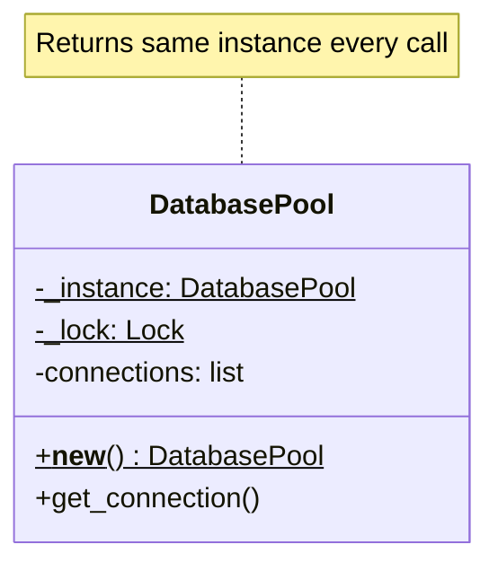

# Singleton Pattern

> Ensure a class has only one instance, and provide a global access point to it.

**Type:** Creational  
**Complexity:** Low  
**Popularity:** High (and commonly misused)

---

## Real-World Analogy

A country has only one government. Even if you call the government's phone number a thousand times, you're always reaching the same institution — not creating a new one each time.

---

## The Problem

Some resources should exist exactly once: a database connection pool, a configuration registry, a logger, a thread pool. If each part of your application creates its own instance, you get:

- Multiple connections consuming resources unnecessarily
- Inconsistent configuration (different parts of the app reading different config)
- Log output going to different places

```python
# BAD: Every call creates a new DatabasePool.
# 10 parts of the app = 10 connection pools = resource exhaustion.

class DatabasePool:
    def __init__(self):
        self.connections = []
        print("Creating new connection pool...")  # Expensive!

# Part A of the app
pool_a = DatabasePool()

# Part B of the app
pool_b = DatabasePool()

# pool_a is not pool_b — two separate pools consuming double the resources
```

---

## The Solution

The class itself controls its instantiation and returns the same instance every time.

```python
class DatabasePool:
    _instance = None

    def __new__(cls):
        if cls._instance is None:
            cls._instance = super().__new__(cls)
            cls._instance._init_pool()
        return cls._instance

    def _init_pool(self):
        self.connections = []
        print("Connection pool initialized once.")

    def get_connection(self):
        # return a connection from the pool
        ...

# Part A
pool_a = DatabasePool()

# Part B
pool_b = DatabasePool()

print(pool_a is pool_b)  # True — same object
```

### Thread-Safe Singleton

In multi-threaded applications, two threads could both pass the `if _instance is None` check simultaneously, creating two instances.

```python
import threading

class ThreadSafeSingleton:
    _instance = None
    _lock = threading.Lock()

    def __new__(cls):
        if cls._instance is None:
            with cls._lock:
                # Double-checked locking: check again after acquiring the lock.
                if cls._instance is None:
                    cls._instance = super().__new__(cls)
        return cls._instance
```

### Module-Level Singleton (Pythonic)

In Python, a module is imported once and cached. A module-level instance is the simplest singleton:

```python
# config.py
class AppConfig:
    def __init__(self):
        self.debug = False
        self.db_url = "postgresql://localhost/app"

config = AppConfig()   # Created once when the module is first imported

# Anywhere in the app:
from config import config
print(config.db_url)
```

---

## Diagram



---

## When to Use

| Use Singleton | Avoid Singleton |
|---------------|-----------------|
| Single shared resource (connection pool, config, logger) | General-purpose classes |
| The resource is expensive to create | When you want to swap implementations for testing |
| Global access is intentionally needed | When multiple independent instances are actually fine |

---

## The Singleton Trap: Global State

Singleton is often considered an anti-pattern because it introduces **hidden global state**. This makes testing painful:

```python
# Tests interfere with each other because they share the Singleton's state.
def test_feature_a():
    db = DatabasePool()
    db.some_state = "test_a"
    assert feature_a(db) == "expected_a"

def test_feature_b():
    db = DatabasePool()
    # db.some_state is still "test_a" from the previous test — unexpected!
    assert feature_b(db) == "expected_b"
```

**The fix:** Use Dependency Injection. Pass the instance to classes instead of letting them reach for the global.

```python
# Instead of having classes call DatabasePool() themselves:
def process_order(order_id: int, db: DatabasePool):
    conn = db.get_connection()
    ...

# In tests, pass a mock:
def test_process_order():
    mock_db = Mock(spec=DatabasePool)
    process_order(42, mock_db)
```

You can still use a Singleton at the application wiring level — just don't hardcode the reach for it inside every class.

---

## Key Takeaways

- Singleton solves the "create once, share everywhere" problem.
- Thread safety requires double-checked locking or initialization at module import time.
- In Python, a module-level instance is the most idiomatic singleton.
- Singletons carrying mutable state are global variables in disguise — they make tests fragile and code hard to reason about.
- Prefer Dependency Injection over calling `Instance()` inside every class.
