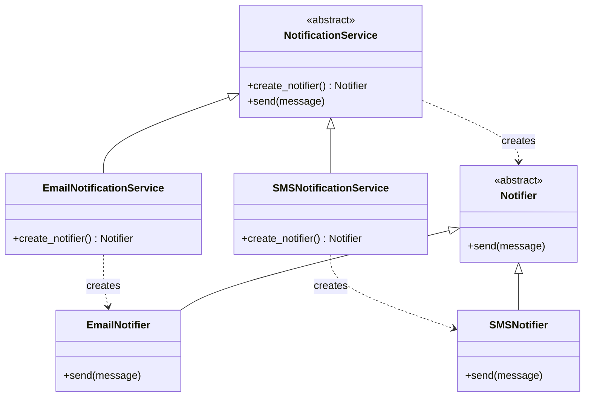

# Factory Method Pattern

> Define an interface for creating an object, but let subclasses decide which class to instantiate.

**Type:** Creational  
**Complexity:** Medium  
**Popularity:** High

---

## Real-World Analogy

A logistics company has a `deliver()` operation. Whether they deliver by truck, ship, or drone is a decision made by the specific regional office (subclass) — not by the central logistics framework.

---

## The Problem

Your code creates objects directly with `ClassName()`. The object creation is hardcoded, so adding a new type requires editing existing, tested code.

```python
# BAD: The Notification class is responsible for deciding which notifier to create.
# Adding SMS requires editing this class — violates OCP.

class NotificationService:
    def send(self, message: str, channel: str):
        if channel == "email":
            notifier = EmailNotifier()       # hardcoded creation
        elif channel == "sms":
            notifier = SMSNotifier()         # hardcoded creation
        elif channel == "push":
            notifier = PushNotifier()        # hardcoded creation
        else:
            raise ValueError(f"Unknown channel: {channel}")
        notifier.send(message)
```

Every new channel requires editing `NotificationService`. The creation logic grows without bound.

---

## The Solution

Move the object creation into a method that subclasses can override. The parent class defines *what* to do; subclasses define *what to create*.

```python
from abc import ABC, abstractmethod

# Product interface
class Notifier(ABC):
    @abstractmethod
    def send(self, message: str) -> None: ...

# Concrete Products
class EmailNotifier(Notifier):
    def send(self, message: str) -> None:
        print(f"[Email] {message}")

class SMSNotifier(Notifier):
    def send(self, message: str) -> None:
        print(f"[SMS] {message}")

class PushNotifier(Notifier):
    def send(self, message: str) -> None:
        print(f"[Push] {message}")


# Creator (abstract)
class NotificationService(ABC):
    @abstractmethod
    def create_notifier(self) -> Notifier:
        """The Factory Method — subclasses decide which Notifier to build."""
        ...

    def send(self, message: str) -> None:
        notifier = self.create_notifier()   # uses the factory method
        notifier.send(message)


# Concrete Creators
class EmailNotificationService(NotificationService):
    def create_notifier(self) -> Notifier:
        return EmailNotifier()

class SMSNotificationService(NotificationService):
    def create_notifier(self) -> Notifier:
        return SMSNotifier()

class PushNotificationService(NotificationService):
    def create_notifier(self) -> Notifier:
        return PushNotifier()


# Usage
service: NotificationService = EmailNotificationService()
service.send("Your order has shipped!")
# → [Email] Your order has shipped!
```

Adding a new channel (e.g., Slack) requires only:
1. A new `SlackNotifier(Notifier)` class
2. A new `SlackNotificationService(NotificationService)` class

Zero changes to existing code.

---

## A Simpler Variant: Static Factory

When inheritance is overkill, a static factory method on the class itself is often enough:

```python
class Notifier(ABC):
    @staticmethod
    def create(channel: str) -> "Notifier":
        creators = {
            "email": EmailNotifier,
            "sms": SMSNotifier,
            "push": PushNotifier,
        }
        if channel not in creators:
            raise ValueError(f"Unknown channel: {channel}")
        return creators[channel]()

# Usage
notifier = Notifier.create("email")
notifier.send("Hello!")
```

This is the most common form in Python codebases. It centralizes creation without requiring a full class hierarchy.

---

## Diagram



---

## Factory Method vs. Simple `if/elif`

| Approach | Best For |
|----------|----------|
| `if/elif` | 2–3 types that never change |
| Static factory dict | Multiple types, no subclass behavior differences |
| Factory Method (subclasses) | When different creators also need different behavior in `send()` |

---

## When to Use / When NOT to Use

**Use when:**
- You have a set of related objects that share an interface but have different implementations.
- You want to let clients choose implementations without knowing the concrete type.
- Adding new types should not require modifying existing code (OCP).

**Don't use when:**
- You only ever create one type of object — it's unnecessary abstraction.
- The types don't share a common interface or behavior.

---

## Key Takeaways

- Factory Method decouples the code that uses an object from the code that creates it.
- The core idea: **"Don't call `new` in business logic. Delegate creation."**
- The static factory (a dict of type → class) is the most practical Python idiom.
- It is the foundation for Abstract Factory, which extends this to families of objects.
