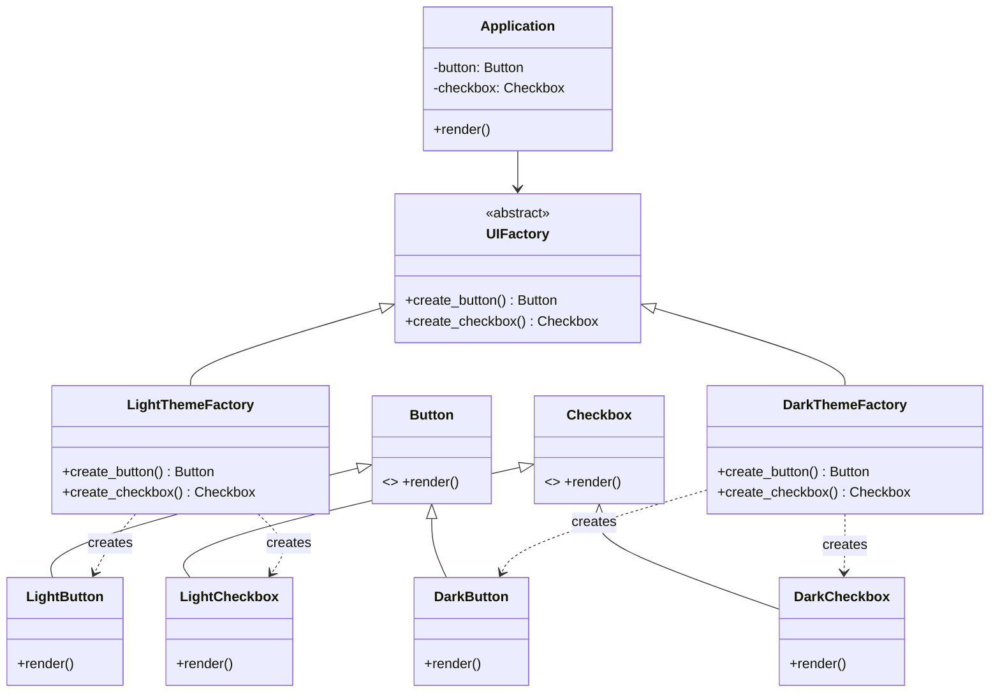

# Abstract Factory Pattern

> Provide an interface for creating families of related objects without specifying their concrete classes.

**Type:** Creational  
**Complexity:** High  
**Popularity:** Medium

---

## Real-World Analogy

A furniture company has two product lines: **Modern** and **Victorian**. Each line has a Chair, Sofa, and Table. The Abstract Factory ensures you never accidentally pair a Modern chair with a Victorian table — a factory for one style produces all objects in that style.

---

## The Problem

You need to create multiple related objects, and they must all belong to the same "family." Mixing objects from different families breaks consistency.

```python
# BAD: Object creation is scattered. Nothing prevents mixing styles.
# A developer can accidentally pair light_theme button with dark_theme checkbox.

class LightButton:
    def render(self): print("[ Light Button ]")

class DarkButton:
    def render(self): print("[■ Dark Button ■]")

class LightCheckbox:
    def render(self): print("( ) Light Checkbox")

class DarkCheckbox:
    def render(self): print("[x] Dark Checkbox")

# Nothing stops this inconsistency:
button = LightButton()
checkbox = DarkCheckbox()    # Mixed! The UI looks broken.
button.render()
checkbox.render()
```

---

## The Solution

Create a factory interface that produces an entire family of objects. Each concrete factory produces one consistent family.

```python
from abc import ABC, abstractmethod

# --- Abstract Products ---
class Button(ABC):
    @abstractmethod
    def render(self) -> None: ...

class Checkbox(ABC):
    @abstractmethod
    def render(self) -> None: ...


# --- Concrete Products: Light Theme ---
class LightButton(Button):
    def render(self) -> None:
        print("[ Light Button ]")

class LightCheckbox(Checkbox):
    def render(self) -> None:
        print("( ) Light Checkbox")


# --- Concrete Products: Dark Theme ---
class DarkButton(Button):
    def render(self) -> None:
        print("[■ Dark Button ■]")

class DarkCheckbox(Checkbox):
    def render(self) -> None:
        print("[x] Dark Checkbox")


# --- Abstract Factory ---
class UIFactory(ABC):
    @abstractmethod
    def create_button(self) -> Button: ...

    @abstractmethod
    def create_checkbox(self) -> Checkbox: ...


# --- Concrete Factories ---
class LightThemeFactory(UIFactory):
    def create_button(self) -> Button:
        return LightButton()

    def create_checkbox(self) -> Checkbox:
        return LightCheckbox()


class DarkThemeFactory(UIFactory):
    def create_button(self) -> Button:
        return DarkButton()

    def create_checkbox(self) -> Checkbox:
        return DarkCheckbox()


# --- Client code: doesn't know which theme it's using ---
class Application:
    def __init__(self, factory: UIFactory):
        self.button = factory.create_button()
        self.checkbox = factory.create_checkbox()

    def render(self) -> None:
        self.button.render()
        self.checkbox.render()


# Wiring (at startup, based on config or environment)
theme = "dark"
factory = DarkThemeFactory() if theme == "dark" else LightThemeFactory()
app = Application(factory)
app.render()
# → [■ Dark Button ■]
# → [x] Dark Checkbox
```

Now it's impossible to mix families — `Application` gets all its widgets from the same factory.

---

## Adding a New Family

Adding a "High Contrast" theme requires:
1. New `HighContrastButton(Button)` and `HighContrastCheckbox(Checkbox)` classes.
2. New `HighContrastThemeFactory(UIFactory)` class.

Zero changes to `Application` or any existing factory.

---

## Diagram



---

## Abstract Factory vs. Factory Method

| | Factory Method | Abstract Factory |
|-|----------------|------------------|
| **Creates** | One product | A family of related products |
| **Implemented via** | Subclass overrides one method | A factory object with multiple methods |
| **Use when** | You need flexibility in one product type | You need consistency across a family of products |

---

## When to Use / When NOT to Use

**Use when:**
- Your system must be independent of how its products are created.
- You need to enforce consistency between related products (all from the same family).
- You want to swap an entire product family at once.

**Don't use when:**
- You only have one product type — Factory Method is enough.
- The families are unlikely to need swapping — the abstraction adds overhead for no benefit.

---

## Key Takeaways

- Abstract Factory solves the "mix-and-match" problem by ensuring all created objects belong to one consistent family.
- The client code only talks to the abstract factory — it never instantiates concrete products.
- Adding a new family requires new factory + new products, zero changes to existing code.
- Common real-world use cases: UI theme systems, database driver abstraction (MySQL/PostgreSQL/SQLite), cross-platform UI toolkits.
