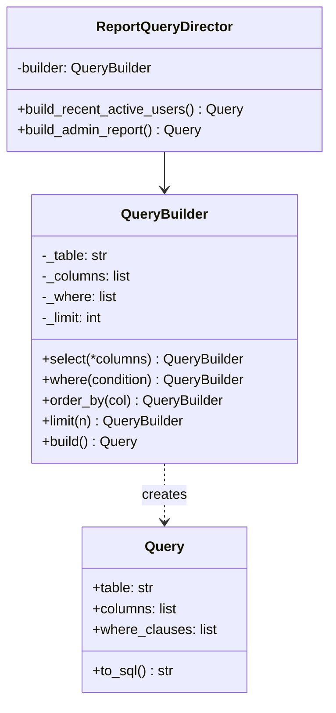

# Builder Pattern

> Construct complex objects step by step, separating construction from representation.

**Type:** Creational  
**Complexity:** Medium  
**Popularity:** High

---

## Real-World Analogy

Building a house: you don't receive the house all at once. A construction director oversees carpenters who build the walls, electricians who wire it, and plumbers who install pipes — each step by step. The same house plan can be used to build a small cabin or a mansion.

---

## The Problem

A class with many optional configuration fields forces either:

1. **A telescope constructor** — an explosion of constructor overloads.
2. **Setters everywhere** — the object is in an inconsistent state mid-construction.

```python
# BAD: Telescoping constructor. 6 parameters, many combinations.
class QueryBuilder:
    def __init__(self, table, columns=None, where=None,
                 order_by=None, limit=None, offset=None):
        self.table = table
        self.columns = columns or ["*"]
        self.where = where
        self.order_by = order_by
        self.limit = limit
        self.offset = offset

# At the call site: what does each positional argument mean?
query = QueryBuilder("users", ["id", "name"], "age > 18", "name ASC", 10, 0)
# Is that limit=10, offset=0? Or limit=0, offset=10? Easy to get wrong.
```

For 10+ optional fields, this becomes unreadable. Positional arguments are ambiguous, and every new optional parameter breaks every existing call.

---

## The Solution

Use a **Builder** object that accumulates parameters via named methods, then constructs the final object when you call `build()`.

```python
from dataclasses import dataclass, field

@dataclass
class Query:
    table: str
    columns: list[str]
    where_clauses: list[str]
    order_by: str | None
    limit: int | None
    offset: int | None

    def to_sql(self) -> str:
        cols = ", ".join(self.columns)
        sql = f"SELECT {cols} FROM {self.table}"
        if self.where_clauses:
            sql += " WHERE " + " AND ".join(self.where_clauses)
        if self.order_by:
            sql += f" ORDER BY {self.order_by}"
        if self.limit is not None:
            sql += f" LIMIT {self.limit}"
        if self.offset is not None:
            sql += f" OFFSET {self.offset}"
        return sql


class QueryBuilder:
    def __init__(self, table: str):
        self._table = table
        self._columns: list[str] = ["*"]
        self._where: list[str] = []
        self._order_by: str | None = None
        self._limit: int | None = None
        self._offset: int | None = None

    def select(self, *columns: str) -> "QueryBuilder":
        self._columns = list(columns)
        return self     # return self enables method chaining

    def where(self, condition: str) -> "QueryBuilder":
        self._where.append(condition)
        return self

    def order_by(self, column: str) -> "QueryBuilder":
        self._order_by = column
        return self

    def limit(self, n: int) -> "QueryBuilder":
        self._limit = n
        return self

    def offset(self, n: int) -> "QueryBuilder":
        self._offset = n
        return self

    def build(self) -> Query:
        return Query(
            table=self._table,
            columns=self._columns,
            where_clauses=self._where,
            order_by=self._order_by,
            limit=self._limit,
            offset=self._offset,
        )


# Usage: reads like prose
query = (
    QueryBuilder("users")
    .select("id", "name", "email")
    .where("age > 18")
    .where("is_active = TRUE")
    .order_by("name ASC")
    .limit(10)
    .offset(0)
    .build()
)

print(query.to_sql())
# → SELECT id, name, email FROM users WHERE age > 18 AND is_active = TRUE ORDER BY name ASC LIMIT 10 OFFSET 0
```

Each step is clearly named. You only call the methods you need. The final `build()` creates a fully configured, immutable `Query` object.

---

## Builder with a Director

When you need to produce predefined configurations repeatedly, a **Director** encapsulates common build sequences.

```python
class ReportQueryDirector:
    def __init__(self, builder: QueryBuilder):
        self.builder = builder

    def build_recent_active_users(self) -> Query:
        return (
            self.builder
            .select("id", "name", "last_login")
            .where("is_active = TRUE")
            .order_by("last_login DESC")
            .limit(100)
            .build()
        )

    def build_admin_report(self) -> Query:
        return (
            self.builder
            .select("*")
            .where("role = 'admin'")
            .order_by("id ASC")
            .build()
        )

director = ReportQueryDirector(QueryBuilder("users"))
query = director.build_recent_active_users()
```

---

## Diagram



---

## Python's Dataclass as Builder

Python's `dataclass` with keyword arguments is often sufficient for objects with few fields:

```python
from dataclasses import dataclass

@dataclass
class EmailConfig:
    host: str
    port: int = 587
    use_tls: bool = True
    timeout: int = 30

config = EmailConfig(host="smtp.gmail.com", use_tls=True)
```

Use the full Builder pattern when:
- Construction involves complex validation or computation between steps.
- You need method chaining for readability.
- Different configurations produce objects of different types or shapes.

---

## When to Use / When NOT to Use

**Use when:**
- A constructor has more than 4–5 parameters, especially optional ones.
- Object construction involves multiple steps or validation.
- You want to reuse the same construction process for different representations.

**Don't use when:**
- The object is simple with 2–3 fields — a dataclass or named parameters suffice.
- You never need to produce different variants of the object.

---

## Key Takeaways

- Builder solves the "telescoping constructor" problem by making construction readable and explicit.
- Method chaining (`return self`) makes builder code read like a specification.
- The `build()` step is the only place where the final object is created — intermediate steps just accumulate state.
- A Director is optional but useful when you have common build recipes that clients shouldn't repeat.
- Builder is widely used in query builders (SQLAlchemy), HTTP clients (requests), and configuration objects.
