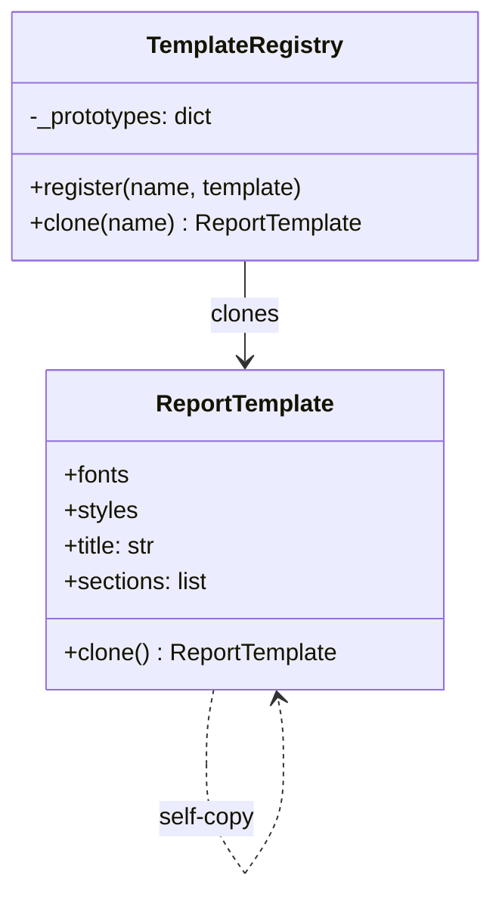

# Prototype Pattern

> Create new objects by copying an existing object (prototype), instead of constructing from scratch.

**Type:** Creational  
**Complexity:** Low  
**Popularity:** Medium

---

## Real-World Analogy

A cell divides by copying itself — not by rebuilding from atomic components. The copy starts with all the parent cell's configuration and then diverges. Document templates work the same way: you clone a template and customize the copy.

---

## The Problem

Object creation is expensive (loads from disk, makes network calls, does heavy computation). Or, an object has a complex nested state that is tedious to reconstruct field by field.

```python
# BAD: ReportTemplate is expensive to initialize (loads fonts, fetches styles,
# parses XML schema). Rebuilding it for every report wastes time.

class ReportTemplate:
    def __init__(self, config_file: str):
        print("Loading fonts...")           # expensive
        print("Fetching style config...")   # expensive
        print("Parsing XML schema...")      # expensive
        self.fonts = load_fonts(config_file)
        self.styles = fetch_styles(config_file)
        self.schema = parse_schema(config_file)
        self.title = "Untitled Report"
        self.sections = []

# Creating 100 reports = 100 expensive initializations
reports = [ReportTemplate("base_config.xml") for _ in range(100)]
```

---

## The Solution

Create one canonical instance (the prototype), then clone it. Customization happens on the clone.

```python
import copy
from typing import Any

class ReportTemplate:
    def __init__(self, config_file: str):
        print("Loading resources...")   # happens ONCE
        self.fonts = load_fonts(config_file)
        self.styles = fetch_styles(config_file)
        self.title = "Untitled Report"
        self.sections: list = []
        self.metadata: dict = {}

    def clone(self) -> "ReportTemplate":
        """Returns a deep copy so the clone's sections/metadata are independent."""
        return copy.deepcopy(self)


# --- Usage ---
# Initialize the prototype once
prototype = ReportTemplate("base_config.xml")
# "Loading resources..." printed once

# Clone cheaply for each report
monthly_report = prototype.clone()
monthly_report.title = "Monthly Sales Report"
monthly_report.sections.append("Executive Summary")

annual_report = prototype.clone()
annual_report.title = "Annual Revenue Report"
annual_report.sections.append("Year-over-Year Analysis")

# prototype.sections is still [] — clones are independent
print(prototype.sections)      # []
print(monthly_report.sections) # ["Executive Summary"]
print(annual_report.sections)  # ["Year-over-Year Analysis"]
```

---

## Shallow Copy vs. Deep Copy

Understanding the difference is critical when using Prototype.

```python
import copy

class Node:
    def __init__(self, value: int, children: list):
        self.value = value
        self.children = children   # mutable list

original = Node(1, [Node(2, []), Node(3, [])])

shallow = copy.copy(original)
deep    = copy.deepcopy(original)

# Shallow copy: top-level fields are new, but nested objects are shared
shallow.children.append(Node(4, []))
print(len(original.children))  # 3 — original.children was mutated!

# Deep copy: completely independent
deep.children.append(Node(5, []))
print(len(original.children))  # still 3 — original unchanged
```

**Rule:** Use `copy.deepcopy()` unless you explicitly want shared sub-objects (shared = copies change together).

---

## Prototype Registry

When you have multiple prototypes, a registry makes lookup clean:

```python
class TemplateRegistry:
    def __init__(self):
        self._prototypes: dict[str, ReportTemplate] = {}

    def register(self, name: str, template: ReportTemplate) -> None:
        self._prototypes[name] = template

    def clone(self, name: str) -> ReportTemplate:
        if name not in self._prototypes:
            raise KeyError(f"No prototype registered as '{name}'")
        return self._prototypes[name].clone()


# Setup (once at application startup)
registry = TemplateRegistry()
registry.register("sales", ReportTemplate("sales_config.xml"))
registry.register("finance", ReportTemplate("finance_config.xml"))

# Usage (fast clones anywhere in the app)
q1_report = registry.clone("sales")
q1_report.title = "Q1 Sales"
```

---

## Diagram



---

## When to Use / When NOT to Use

**Use when:**
- Object creation is expensive (I/O, network, computation).
- You need many objects that are slight variations of each other.
- You want to decouple object creation from its initial configuration.

**Don't use when:**
- Object construction is cheap — just call the constructor.
- Objects have circular references that make deep copying complex or dangerous.
- The object's state is derived from external systems that should be re-fetched on creation.

---

## Key Takeaways

- Prototype trades constructor cost for copy cost — only valuable when cloning is cheaper than constructing.
- `copy.deepcopy()` in Python handles most cases, but be aware of circular references and shared state.
- A Prototype Registry provides a named catalog of base instances to clone from.
- This pattern is commonly used in game development (spawning enemies), document editors (duplicating slides), and configuration objects.
