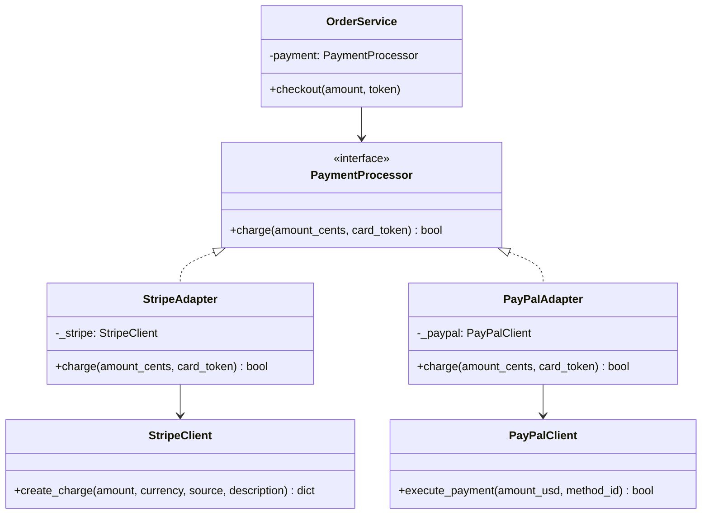

# Adapter Pattern

> Convert the interface of a class into another interface that clients expect — making incompatible classes work together.

**Type:** Structural  
**Complexity:** Low  
**Popularity:** High

---

## Real-World Analogy

A power adapter lets a US laptop plug work in a European socket. The laptop and the socket are incompatible, but the adapter bridges them without modifying either one.

---

## The Problem

You have existing code that works with one interface, and a new component that provides the same capability but through a different interface. You can't modify either side.

```python
# Your system expects all loggers to have this interface:
class Logger:
    def log(self, message: str) -> None: ...

# Your existing code
class OrderService:
    def __init__(self, logger: Logger):
        self.logger = logger

    def process(self, order_id: int) -> None:
        self.logger.log(f"Processing order {order_id}")


# A third-party library (you can't modify it) has this interface:
class ThirdPartyLogger:
    def write_entry(self, severity: str, text: str) -> None:
        print(f"[{severity.upper()}] {text}")

# Problem: ThirdPartyLogger.write_entry() is not compatible with Logger.log()
# You can't pass ThirdPartyLogger directly to OrderService.
```

---

## The Solution

Write an Adapter that wraps the incompatible class and exposes the expected interface.

```python
# The Adapter wraps ThirdPartyLogger and exposes the Logger interface.
class ThirdPartyLoggerAdapter(Logger):
    def __init__(self, third_party: ThirdPartyLogger):
        self._logger = third_party

    def log(self, message: str) -> None:
        # Translate the call to the third-party format
        self._logger.write_entry("info", message)


# Now they work together without modifying either original class:
third_party = ThirdPartyLogger()
adapter = ThirdPartyLoggerAdapter(third_party)

service = OrderService(adapter)
service.process(42)
# → [INFO] Processing order 42
```

---

## Two Forms of Adapter

### Object Adapter (Composition — preferred)

The adapter *contains* the adaptee. This is what the example above shows.

```python
class Adapter(Target):
    def __init__(self, adaptee: Adaptee):
        self._adaptee = adaptee     # composition

    def target_method(self):
        return self._adaptee.specific_method()
```

### Class Adapter (Multiple Inheritance — less common)

The adapter *inherits from both* the target and adaptee. Only works in languages with multiple inheritance.

```python
class ClassAdapter(Target, Adaptee):
    def target_method(self):
        return self.specific_method()   # directly calls Adaptee's method
```

Prefer Object Adapter — it doesn't tie you to the adaptee's class hierarchy and is easier to test.

---

## Real-World Example: Payment Gateways

```python
# Your system's payment interface
class PaymentProcessor:
    def charge(self, amount_cents: int, card_token: str) -> bool: ...


# Stripe SDK (third-party, you can't modify it)
class StripeClient:
    def create_charge(self, amount: int, currency: str,
                      source: str, description: str) -> dict:
        ...
        return {"status": "succeeded", "id": "ch_xxx"}


# PayPal SDK (different interface, you can't modify it)
class PayPalClient:
    def execute_payment(self, amount_usd: float, payment_method_id: str) -> bool:
        ...
        return True


# Adapters
class StripeAdapter(PaymentProcessor):
    def __init__(self, client: StripeClient):
        self._stripe = client

    def charge(self, amount_cents: int, card_token: str) -> bool:
        result = self._stripe.create_charge(
            amount=amount_cents,
            currency="usd",
            source=card_token,
            description="Order payment",
        )
        return result["status"] == "succeeded"


class PayPalAdapter(PaymentProcessor):
    def __init__(self, client: PayPalClient):
        self._paypal = client

    def charge(self, amount_cents: int, card_token: str) -> bool:
        amount_usd = amount_cents / 100
        return self._paypal.execute_payment(amount_usd, card_token)


# OrderService only knows about PaymentProcessor — works with Stripe, PayPal, or any future gateway
class OrderService:
    def __init__(self, payment: PaymentProcessor):
        self.payment = payment

    def checkout(self, amount_cents: int, card_token: str) -> None:
        if self.payment.charge(amount_cents, card_token):
            print("Payment successful")
        else:
            print("Payment failed")
```

---

## Diagram



---

## When to Use / When NOT to Use

**Use when:**
- Integrating third-party libraries whose interfaces differ from what your system expects.
- Reusing existing code that has a different interface.
- Creating a consistent interface over multiple different implementations.

**Don't use when:**
- You can modify the source — it's simpler to fix the interface directly.
- The interfaces are fundamentally different in behavior, not just name — an adapter can only translate the call, not change what the code does.

---

## Key Takeaways

- Adapter is a translation layer — it converts one interface to another without modifying either side.
- Prefer composition (Object Adapter) over inheritance (Class Adapter) for flexibility.
- Heavily used in integration layers: third-party SDKs, legacy system wrappers, cross-platform abstractions.
- Combined with Dependency Injection, it makes your core logic completely independent of external libraries.
