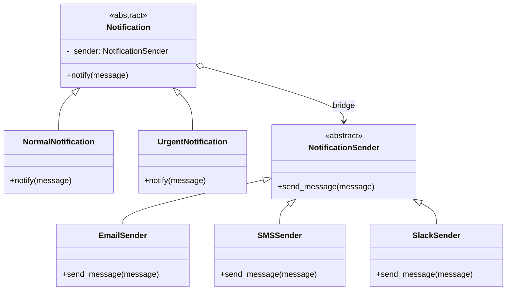

# Bridge Pattern

> Decouple an abstraction from its implementation so that the two can vary independently.

**Type:** Structural  
**Complexity:** High  
**Popularity:** Medium

---

## Real-World Analogy

A remote control (abstraction) can operate a TV, a stereo, or an AC unit (implementations). The remote and the device evolve independently — you can create a new advanced remote without changing the TV, and add a new device without changing any remote.

---

## The Problem

You use inheritance to combine two dimensions of variation. The result is a class explosion.

Imagine: you have `Notification` (Email, SMS, Push) and `NotificationPriority` (Normal, Urgent). Using inheritance:

```
EmailNormalNotification
EmailUrgentNotification
SMSNormalNotification
SMSUrgentNotification
PushNormalNotification
PushUrgentNotification
```

**3 channels × 2 priorities = 6 classes.** Adding a 3rd priority (Scheduled) would require 3 more classes. Adding a 4th channel (Slack) would require 2 more classes. The combination explodes: m × n classes for m abstractions and n implementations.

```python
# BAD: Inheritance-based explosion
class EmailNormalNotification:
    def send(self, msg): print(f"[Normal Email] {msg}")

class EmailUrgentNotification:
    def send(self, msg): print(f"[URGENT Email] *** {msg} ***")

class SMSNormalNotification:
    def send(self, msg): print(f"[Normal SMS] {msg}")

class SMSUrgentNotification:
    def send(self, msg): print(f"[URGENT SMS] *** {msg} ***")
# ... and so on
```

---

## The Solution

Replace inheritance with composition. Separate the two dimensions into a **Abstraction** hierarchy and an **Implementation** hierarchy. The abstraction holds a reference to the implementation.

```python
from abc import ABC, abstractmethod

# --- Implementation side: HOW to send ---
class NotificationSender(ABC):
    @abstractmethod
    def send_message(self, message: str) -> None: ...

class EmailSender(NotificationSender):
    def send_message(self, message: str) -> None:
        print(f"[Email] {message}")

class SMSSender(NotificationSender):
    def send_message(self, message: str) -> None:
        print(f"[SMS] {message}")

class SlackSender(NotificationSender):             # New channel: zero changes elsewhere
    def send_message(self, message: str) -> None:
        print(f"[Slack] {message}")


# --- Abstraction side: WHAT kind of notification ---
class Notification(ABC):
    def __init__(self, sender: NotificationSender):
        self._sender = sender                      # The "bridge"

    @abstractmethod
    def notify(self, message: str) -> None: ...

class NormalNotification(Notification):
    def notify(self, message: str) -> None:
        self._sender.send_message(message)

class UrgentNotification(Notification):
    def notify(self, message: str) -> None:
        self._sender.send_message(f"*** URGENT *** {message}")

class ScheduledNotification(Notification):        # New priority: zero changes elsewhere
    def __init__(self, sender: NotificationSender, delay_seconds: int):
        super().__init__(sender)
        self._delay = delay_seconds

    def notify(self, message: str) -> None:
        print(f"[Scheduled in {self._delay}s]")
        self._sender.send_message(message)


# --- Usage ---
# Mix and match freely — no class explosion
urgent_email = UrgentNotification(EmailSender())
urgent_email.notify("Server is down!")
# → [Email] *** URGENT *** Server is down!

normal_slack = NormalNotification(SlackSender())
normal_slack.notify("Deployment finished.")
# → [Slack] Deployment finished.
```

With Bridge: **m + n classes** instead of **m × n classes**.

---

## Diagram



---

## Bridge vs. Adapter

| | Bridge | Adapter |
|-|--------|---------|
| **Purpose** | Separate two dimensions that both need to vary | Make two incompatible interfaces work together |
| **Designed** | Up-front | After the fact (retrofit) |
| **Both sides** | Both abstraction and implementation can vary | One side is fixed (the adaptee) |

---

## When to Use / When NOT to Use

**Use when:**
- You want to avoid a class hierarchy explosion from two independent dimensions of variation.
- Both the abstraction and its implementation should be extensible via subclassing.
- You want to switch implementations at runtime.

**Don't use when:**
- Only one dimension varies — simple inheritance or composition is sufficient.
- The two dimensions don't really vary independently.

---

## Key Takeaways

- Bridge solves the **m × n class explosion** problem by replacing inheritance with composition.
- The "bridge" is the reference from the abstraction to the implementation — they are linked but independent.
- Both sides can be extended independently without touching the other.
- Common in graphics rendering (shapes × rendering APIs), cross-platform UI toolkits, and notification systems.
