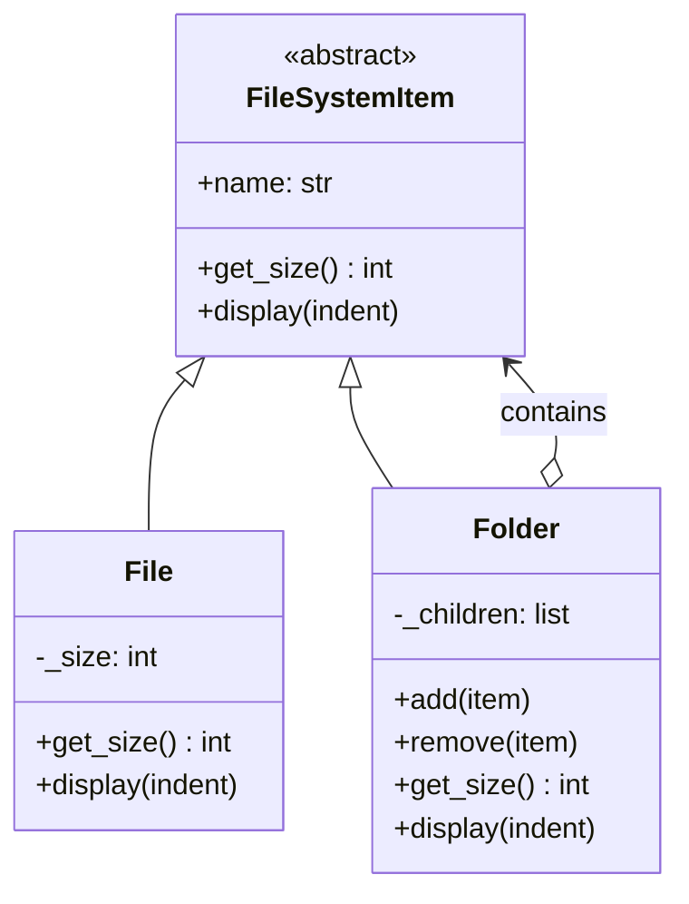

# Composite Pattern

> Compose objects into tree structures to represent part-whole hierarchies. Treat individual objects and compositions uniformly.

**Type:** Structural  
**Complexity:** Medium  
**Popularity:** Medium

---

## Real-World Analogy

A file system: a folder can contain files or other folders. Whether you call `get_size()` on a single file or an entire directory tree, the operation works the same way — the folder recursively sums the sizes of everything inside it.

---

## The Problem

You have a tree structure (menu items, organizational charts, file systems, UI components) and your code needs special-case logic to distinguish between leaf nodes and container nodes.

```python
# BAD: Code must check if something is a file or a folder at every step.
# This gets ugly fast with deep trees.

class File:
    def __init__(self, name, size): ...

class Folder:
    def __init__(self, name):
        self.children = []   # can contain Files or Folders

def get_total_size(item):
    if isinstance(item, File):
        return item.size
    elif isinstance(item, Folder):
        total = 0
        for child in item.children:
            total += get_total_size(child)   # recursive, but needs type checks
        return total
    else:
        raise TypeError("Unknown item type")
```

As you add more node types, every function that walks the tree grows `isinstance` checks.

---

## The Solution

Define a common interface for both leaf nodes and composite (container) nodes. The composite implements the interface by delegating to its children — the caller never needs to know whether it has a leaf or a composite.

```python
from abc import ABC, abstractmethod

# --- Component: common interface for both leaves and composites ---
class FileSystemItem(ABC):
    def __init__(self, name: str):
        self.name = name

    @abstractmethod
    def get_size(self) -> int: ...

    @abstractmethod
    def display(self, indent: int = 0) -> None: ...


# --- Leaf: no children ---
class File(FileSystemItem):
    def __init__(self, name: str, size: int):
        super().__init__(name)
        self._size = size

    def get_size(self) -> int:
        return self._size

    def display(self, indent: int = 0) -> None:
        print(" " * indent + f"📄 {self.name} ({self._size} bytes)")


# --- Composite: has children (files or folders) ---
class Folder(FileSystemItem):
    def __init__(self, name: str):
        super().__init__(name)
        self._children: list[FileSystemItem] = []

    def add(self, item: FileSystemItem) -> None:
        self._children.append(item)

    def remove(self, item: FileSystemItem) -> None:
        self._children.remove(item)

    def get_size(self) -> int:
        return sum(child.get_size() for child in self._children)

    def display(self, indent: int = 0) -> None:
        print(" " * indent + f"📁 {self.name}/ ({self.get_size()} bytes)")
        for child in self._children:
            child.display(indent + 2)


# --- Usage ---
root = Folder("home")

docs = Folder("documents")
docs.add(File("resume.pdf", 204800))
docs.add(File("cover_letter.docx", 51200))

photos = Folder("photos")
photos.add(File("vacation.jpg", 3145728))
photos.add(File("birthday.png", 2097152))

root.add(docs)
root.add(photos)
root.add(File("notes.txt", 1024))

root.display()
# 📁 home/ (5500928 bytes)
#   📁 documents/ (256000 bytes)
#     📄 resume.pdf (204800 bytes)
#     📄 cover_letter.docx (51200 bytes)
#   📁 photos/ (5242880 bytes)
#     📄 vacation.jpg (3145728 bytes)
#     📄 birthday.png (2097152 bytes)
#   📄 notes.txt (1024 bytes)

print(root.get_size())   # 5500928 — works the same whether leaf or composite
```

`root.get_size()` works identically on a `File` or a `Folder`. No `isinstance` checks anywhere.

---

## More Examples

```python
# --- UI Component tree ---
class Widget(ABC):
    @abstractmethod
    def render(self) -> None: ...

class Button(Widget):
    def render(self): print("<button>")

class Panel(Widget):
    def __init__(self):
        self._widgets: list[Widget] = []

    def add(self, w: Widget): self._widgets.append(w)

    def render(self):
        print("<panel>")
        for w in self._widgets:
            w.render()
        print("</panel>")


# --- Organizational hierarchy ---
class Employee(ABC):
    @abstractmethod
    def get_salary_cost(self) -> float: ...

class Developer(Employee):
    def __init__(self, salary): self.salary = salary
    def get_salary_cost(self): return self.salary

class Department(Employee):
    def __init__(self):
        self._members: list[Employee] = []

    def add(self, e: Employee): self._members.append(e)
    def get_salary_cost(self): return sum(m.get_salary_cost() for m in self._members)
```

---

## Diagram



---

## When to Use / When NOT to Use

**Use when:**
- You have a tree structure where clients should treat leaves and nodes uniformly.
- You want to add new component types without changing the code that traverses the tree.

**Don't use when:**
- The hierarchy is flat (there is no meaningful nesting).
- Leaves and composites need fundamentally different interfaces — forcing them into one common interface makes the design awkward.

---

## Key Takeaways

- Composite eliminates `isinstance` checks in tree-traversal code.
- The key insight: both `File` and `Folder` implement the same `FileSystemItem` interface.
- The composite delegates its operations to its children recursively.
- Common uses: file systems, UI component trees, organizational charts, syntax trees, scene graphs (games/graphics).
