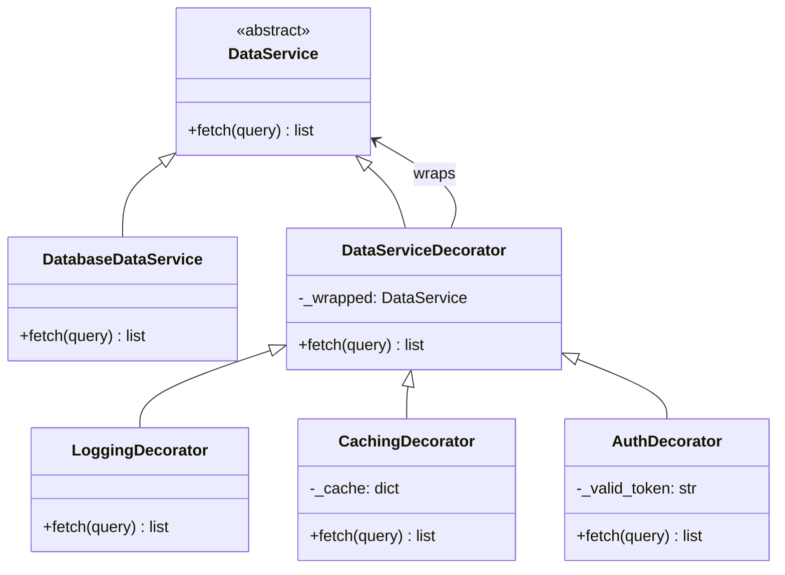

# Decorator Pattern

> Attach additional responsibilities to an object dynamically, without modifying its class or subclassing.

**Type:** Structural  
**Complexity:** Medium  
**Popularity:** High

---

## Real-World Analogy

Coffee at a café: you start with plain espresso. Add milk → latte. Add caramel → caramel latte. Each addition wraps the previous drink and adds a behavior (cost, description). You're not creating a new coffee class for each combination — you're layering additions at runtime.

---

## The Problem

You want to add behavior to individual objects without affecting other objects of the same class. Subclassing leads to a class explosion when many combinations of features are needed.

```python
# BAD: One subclass per feature combination.
# 3 features (logging, caching, auth) applied to one DataService
# = 2^3 = 8 subclasses for all combinations.

class DataService:
    def fetch(self, query): return raw_data

class LoggingDataService(DataService):
    def fetch(self, query):
        log(query)
        return super().fetch(query)

class CachingDataService(DataService):
    def fetch(self, query):
        if cached(query): return cache[query]
        return super().fetch(query)

class LoggingCachingDataService(DataService):
    # combines both — now what about auth? Another 4 classes...
    ...
```

---

## The Solution

Each decorator wraps the component, adds its behavior, and delegates to the wrapped object. Decorators are composable: you can layer any number of them at runtime.

```python
from abc import ABC, abstractmethod
import time

# --- Component interface ---
class DataService(ABC):
    @abstractmethod
    def fetch(self, query: str) -> list: ...


# --- Concrete component ---
class DatabaseDataService(DataService):
    def fetch(self, query: str) -> list:
        print(f"  [DB] Fetching: {query}")
        return [{"id": 1, "data": "result"}]


# --- Base Decorator: implements component interface, wraps a component ---
class DataServiceDecorator(DataService):
    def __init__(self, wrapped: DataService):
        self._wrapped = wrapped

    def fetch(self, query: str) -> list:
        return self._wrapped.fetch(query)


# --- Concrete Decorators ---
class LoggingDecorator(DataServiceDecorator):
    def fetch(self, query: str) -> list:
        print(f"[LOG] Query: {query}")
        start = time.time()
        result = self._wrapped.fetch(query)
        elapsed = (time.time() - start) * 1000
        print(f"[LOG] Completed in {elapsed:.1f}ms, {len(result)} rows")
        return result


class CachingDecorator(DataServiceDecorator):
    def __init__(self, wrapped: DataService):
        super().__init__(wrapped)
        self._cache: dict[str, list] = {}

    def fetch(self, query: str) -> list:
        if query not in self._cache:
            print(f"[CACHE] Miss for: {query}")
            self._cache[query] = self._wrapped.fetch(query)
        else:
            print(f"[CACHE] Hit for: {query}")
        return self._cache[query]


class AuthDecorator(DataServiceDecorator):
    def __init__(self, wrapped: DataService, token: str):
        super().__init__(wrapped)
        self._valid_token = token

    def fetch(self, query: str) -> list:
        if not self._valid_token:
            raise PermissionError("Unauthorized")
        return self._wrapped.fetch(query)


# --- Compose at runtime ---
service = DatabaseDataService()
service = AuthDecorator(service, token="secret123")
service = CachingDecorator(service)
service = LoggingDecorator(service)

result = service.fetch("SELECT * FROM users")
# [LOG] Query: SELECT * FROM users
# [CACHE] Miss for: SELECT * FROM users
#   [DB] Fetching: SELECT * FROM users
# [LOG] Completed in 0.1ms, 1 rows

result = service.fetch("SELECT * FROM users")   # second call
# [LOG] Query: SELECT * FROM users
# [CACHE] Hit for: SELECT * FROM users            ← cached
# [LOG] Completed in 0.0ms, 1 rows
```

Adding `ValidationDecorator` later? Create a new class. No existing code changes.

---

## Python Decorators (Language Feature)

Python's `@decorator` syntax is the Decorator pattern applied to functions:

```python
import functools

def log_calls(func):
    @functools.wraps(func)
    def wrapper(*args, **kwargs):
        print(f"Calling {func.__name__}")
        result = func(*args, **kwargs)
        print(f"{func.__name__} returned {result}")
        return result
    return wrapper

def cache_result(func):
    memo = {}
    @functools.wraps(func)
    def wrapper(*args):
        if args not in memo:
            memo[args] = func(*args)
        return memo[args]
    return wrapper

@log_calls
@cache_result
def fibonacci(n: int) -> int:
    if n <= 1: return n
    return fibonacci(n - 1) + fibonacci(n - 2)
```

The `@log_calls` and `@cache_result` decorators wrap `fibonacci` just like the OOP Decorator pattern wraps objects.

---

## Diagram



---

## When to Use / When NOT to Use

**Use when:**
- You want to add responsibilities to objects at runtime, not at compile time.
- Extending by subclassing is impractical because of the combination explosion.
- You need to layer behaviors independently.

**Don't use when:**
- The order of decorators matters and is hard to control — bugs from wrong ordering are tricky to debug.
- You need to modify the interface, not just add behavior — decorators must implement the same interface.

---

## Key Takeaways

- Decorator is composition masquerading as inheritance — it adds behavior without modifying the original class.
- Decorators are stackable and composable: change the stack to change behavior at runtime.
- Python's `@decorator` syntax is a direct implementation of this pattern for functions.
- Common real-world uses: middleware (web frameworks), I/O streams, logging wrappers, authentication layers.
