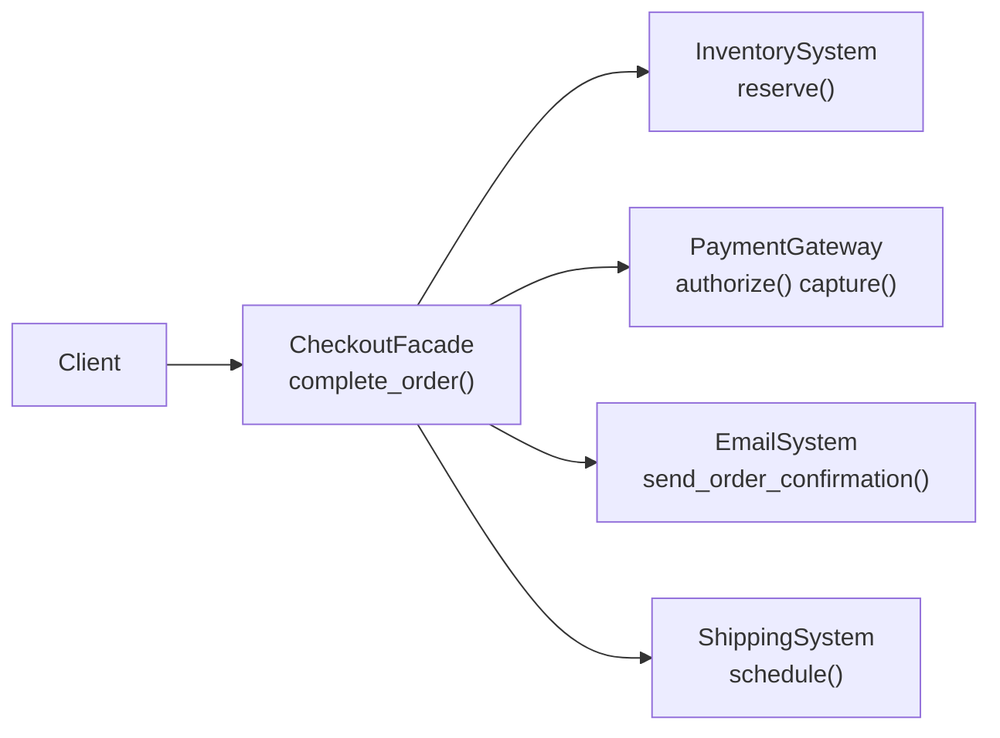

# Facade Pattern

> Provide a simplified interface to a complex subsystem.

**Type:** Structural  
**Complexity:** Low  
**Popularity:** High

---

## Real-World Analogy

Starting a car: you press one button. Under the hood, the engine management system checks fuel, ignition, battery, transmission, and a dozen other systems. The "start" button is the facade — a single, simple interface to a complex subsystem.

---

## The Problem

A subsystem has many classes and operations. Clients need to coordinate several of them in a specific order to accomplish a task. This coupling spreads the knowledge of how the subsystem works throughout the entire codebase.

```python
# BAD: Every place that needs to "send an order email" must know
# how to coordinate three separate subsystems in the right order.

def checkout(order):
    # Client code has to know ALL of this:
    inventory = InventorySystem()
    inventory.reserve(order.items)

    payment = PaymentGateway()
    payment.authorize(order.card)
    payment.capture(order.card, order.total)

    emailer = EmailSystem()
    template = emailer.load_template("order_confirmation")
    body = emailer.render(template, order)
    emailer.send(order.customer.email, "Order Confirmed", body)

    shipping = ShippingSystem()
    label = shipping.generate_label(order)
    shipping.schedule_pickup(label)
```

This appears in every controller, background job, and test that needs to complete a checkout. If `PaymentGateway` changes its API, you update every one of those sites.

---

## The Solution

Create a Facade class that orchestrates the subsystem and exposes a single, high-level operation.

```python
# --- Complex subsystems (unchanged) ---
class InventorySystem:
    def reserve(self, items: list) -> None:
        print(f"Inventory reserved for {len(items)} items")

class PaymentGateway:
    def authorize(self, card: str) -> str:
        print("Card authorized")
        return "auth_token_123"

    def capture(self, auth_token: str, amount: float) -> None:
        print(f"Payment captured: ${amount:.2f}")

class EmailSystem:
    def send_order_confirmation(self, email: str, order) -> None:
        print(f"Order confirmation sent to {email}")

class ShippingSystem:
    def schedule(self, order) -> str:
        print("Shipping scheduled")
        return "TRACK-12345"


# --- The Facade ---
class CheckoutFacade:
    def __init__(self):
        self._inventory = InventorySystem()
        self._payment = PaymentGateway()
        self._email = EmailSystem()
        self._shipping = ShippingSystem()

    def complete_order(self, order) -> str:
        """Single entry point. Clients call only this."""
        self._inventory.reserve(order.items)
        auth = self._payment.authorize(order.card)
        self._payment.capture(auth, order.total)
        self._email.send_order_confirmation(order.customer_email, order)
        tracking = self._shipping.schedule(order)
        return tracking


# --- Client code: one line ---
checkout = CheckoutFacade()
tracking_number = checkout.complete_order(order)
print(f"Order complete. Track at: {tracking_number}")
```

Client code went from 10 lines of complex orchestration to 1 line. The subsystem complexity is hidden behind the facade.

---

## Facade Does Not Lock You Out

The facade simplifies access but doesn't prevent power users from using the subsystem directly when they need fine-grained control.

```python
# Normal client: uses the facade
tracking = CheckoutFacade().complete_order(order)

# Power user: uses subsystem directly for a custom flow
payment = PaymentGateway()
auth = payment.authorize(order.card)
# ... custom logic before capture ...
payment.capture(auth, discounted_total)
```

---

## Diagram



---

## Facade vs. Adapter

| | Facade | Adapter |
|-|--------|---------|
| **Purpose** | Simplify a complex subsystem | Make incompatible interfaces compatible |
| **Interfaces** | Creates a new, simpler interface | Translates between two existing interfaces |
| **Subsystem** | Unchanged | One side is the adaptee |

---

## When to Use / When NOT to Use

**Use when:**
- A subsystem has many classes and clients need a simplified entry point.
- You want to layer your system and provide entry points into each layer.
- You want to isolate client code from subsystem changes.

**Don't use when:**
- The subsystem is already simple — adding a Facade is pointless overhead.
- Different clients need fundamentally different views of the subsystem — multiple specialized facades may be better than one general one.

---

## Key Takeaways

- Facade is the "make it easy" pattern — it wraps a complex subsystem behind a simple interface.
- It reduces coupling between clients and subsystem internals.
- It does not prevent direct access to the subsystem when needed.
- Common uses: libraries wrapping third-party SDKs, application service layers, facade services in microservices (API Gateway is a facade at the network level).
