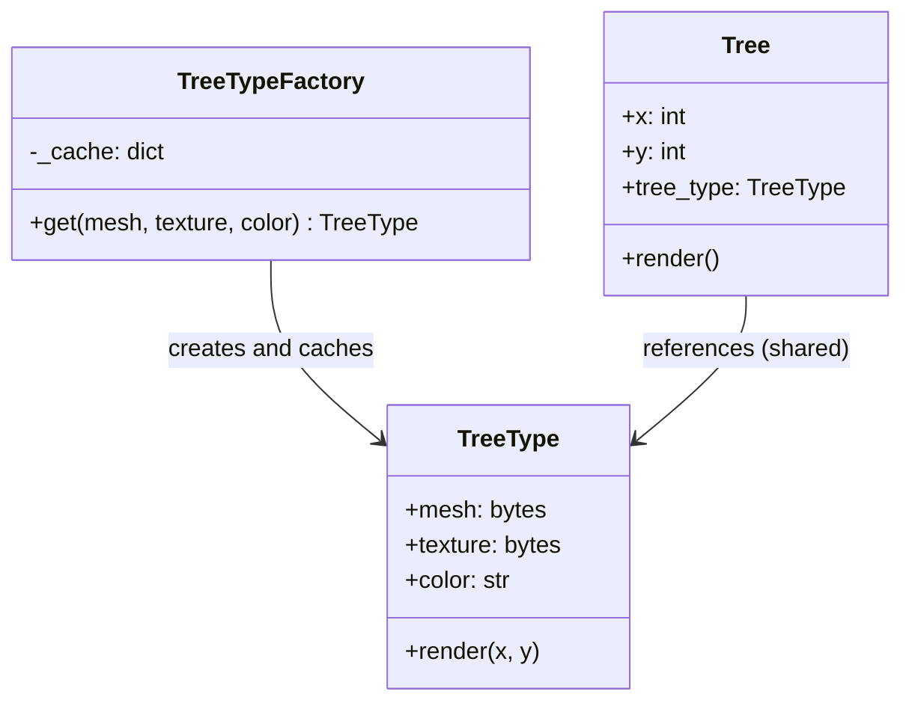

# Flyweight Pattern

> Use sharing to efficiently support a large number of fine-grained objects.

**Type:** Structural  
**Complexity:** High  
**Popularity:** Low–Medium

---

## Real-World Analogy

A word processor has millions of characters on screen. Each character has a glyph (shape data), a font, and a size — but also a position on the page. Instead of storing full glyph data for every character, the processor stores the glyph once in a shared pool and only stores the position per character. The shared data is the flyweight.

---

## The Problem

You need a large number of objects, but each object stores redundant data that could be shared, causing memory exhaustion.

```python
# BAD: A game with 1,000,000 trees. Each Tree stores the full mesh,
# texture, and color — even though most trees share the same visual data.

class Tree:
    def __init__(self, x, y, mesh, texture, color):
        self.x = x
        self.y = y
        self.mesh = mesh          # heavy — 50KB
        self.texture = texture    # heavy — 200KB
        self.color = color        # heavy — 10KB
        # Each tree: ~260KB. 1M trees = 260 GB. Unacceptable.

forest = [Tree(i, i*2, load_mesh(), load_texture(), "#228B22") for i in range(1_000_000)]
```

---

## The Solution

Split the object's state into:

- **Intrinsic state**: shared, immutable data (the flyweight). Stored once.
- **Extrinsic state**: context-specific data. Passed to operations, not stored in the flyweight.

```python
from dataclasses import dataclass

# --- Flyweight: shared, immutable visual data ---
@dataclass(frozen=True)
class TreeType:
    mesh: bytes        # heavy — stored ONCE per tree type
    texture: bytes     # heavy — stored ONCE per tree type
    color: str

    def render(self, x: int, y: int) -> None:
        print(f"Rendering tree at ({x}, {y}) with color {self.color}")


# --- Flyweight Factory: ensures shared instances ---
class TreeTypeFactory:
    _cache: dict[tuple, TreeType] = {}

    @classmethod
    def get(cls, mesh: bytes, texture: bytes, color: str) -> TreeType:
        key = (mesh, texture, color)
        if key not in cls._cache:
            cls._cache[key] = TreeType(mesh, texture, color)
            print(f"Created new TreeType for color {color}")
        return cls._cache[key]


# --- Context: holds extrinsic state (position) + reference to flyweight ---
class Tree:
    def __init__(self, x: int, y: int, tree_type: TreeType):
        self.x = x
        self.y = y
        self.tree_type = tree_type   # shared reference, not a copy

    def render(self) -> None:
        self.tree_type.render(self.x, self.y)   # passes extrinsic state


# --- Usage ---
oak_type   = TreeTypeFactory.get(b"oak_mesh",   b"oak_tex",   "#228B22")
pine_type  = TreeTypeFactory.get(b"pine_mesh",  b"pine_tex",  "#006400")

# 1,000,000 trees using only 2 TreeType objects in memory
forest = []
for i in range(500_000):
    forest.append(Tree(i, i * 2, oak_type))   # all share oak_type
for i in range(500_000):
    forest.append(Tree(i, i * 3, pine_type))  # all share pine_type

# Created new TreeType for color #228B22  ← printed once
# Created new TreeType for color #006400  ← printed once

print(f"Trees: {len(forest)}, TreeType objects: {len(TreeTypeFactory._cache)}")
# Trees: 1000000, TreeType objects: 2
```

Memory: 2 heavy `TreeType` objects instead of 1,000,000.

---

## Character Rendering Example

```python
# Flyweight for character glyph data
@dataclass(frozen=True)
class Glyph:
    char: str
    font: str
    size: int
    bitmap: bytes   # actual rendering data — heavy

class GlyphFactory:
    _glyphs: dict = {}

    @classmethod
    def get_glyph(cls, char: str, font: str, size: int) -> Glyph:
        key = (char, font, size)
        if key not in cls._glyphs:
            cls._glyphs[key] = Glyph(char, font, size, render_bitmap(char, font, size))
        return cls._glyphs[key]

# Each character on screen is just (x, y, glyph_reference)
# Even with 10,000 instances of 'a', the bitmap is stored once.
```

---

## Diagram



---

## Intrinsic vs. Extrinsic State Summary

| | Intrinsic State | Extrinsic State |
|-|-----------------|-----------------|
| **Stored in** | Flyweight (shared) | Context / client |
| **Changes?** | Never (immutable) | Varies per instance |
| **Example** | Tree mesh, texture | Tree x, y position |
| **Example** | Character glyph | Character position on page |

---

## When to Use / When NOT to Use

**Use when:**
- The application uses a huge number of similar objects.
- Object memory cost is high due to redundant shared data.
- Objects can be distinguished into intrinsic (shared) and extrinsic (unique) state.

**Don't use when:**
- The number of objects is small — the overhead of the factory isn't worth it.
- Objects don't share enough state — little memory would actually be saved.
- Code simplicity matters more than memory — Flyweight adds significant complexity.

---

## Key Takeaways

- Flyweight trades code complexity for memory efficiency — only worth it at large scale.
- The key split: **intrinsic** (shared, immutable) vs. **extrinsic** (unique, passed as context).
- A factory ensures the same flyweight is reused across all contexts.
- Classic uses: game engines (particles, trees, tiles), text rendering (glyphs), network connections.
