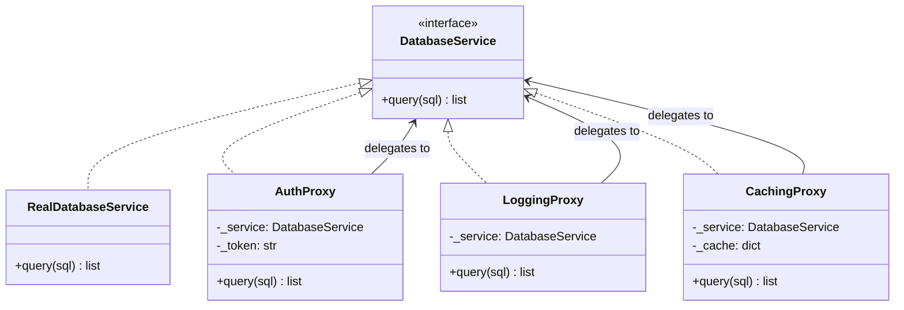

# Proxy Pattern

> Provide a surrogate or placeholder for another object to control access to it.

**Type:** Structural  
**Complexity:** Medium  
**Popularity:** High

---

## Real-World Analogy

A credit card is a proxy for your bank account. When you make a payment, the credit card handles security checks, fraud detection, and currency conversion before the actual funds move. The merchant interacts with the card the same way they would with cash — but extra logic runs transparently.

---

## The Problem

You need to add access control, lazy loading, logging, or caching around an object — but you don't want to modify the object itself, and you don't want clients to know the extra logic exists.

```python
# BAD: Access control and logging tangled into the service itself.
# Testing the business logic requires setting up auth and logging.

class DatabaseService:
    def query(self, sql: str) -> list:
        if not self._is_authenticated():          # auth concern
            raise PermissionError("Not authenticated")
        self._log(f"Executing: {sql}")            # logging concern
        return self._execute(sql)                 # actual work

    def _is_authenticated(self): ...
    def _log(self, msg): ...
    def _execute(self, sql): ...
```

---

## The Solution

Create a proxy that implements the same interface as the real object. The proxy adds its cross-cutting concern and delegates to the real object.

```python
from abc import ABC, abstractmethod
import time

# --- Subject interface ---
class DatabaseService(ABC):
    @abstractmethod
    def query(self, sql: str) -> list: ...


# --- Real Subject ---
class RealDatabaseService(DatabaseService):
    def query(self, sql: str) -> list:
        print(f"  [DB] Executing: {sql}")
        return [{"id": 1, "name": "Alice"}, {"id": 2, "name": "Bob"}]


# --- Proxy 1: Authentication Proxy ---
class AuthProxy(DatabaseService):
    def __init__(self, service: DatabaseService, token: str | None):
        self._service = service
        self._token = token

    def query(self, sql: str) -> list:
        if not self._token:
            raise PermissionError("Access denied: no token provided")
        return self._service.query(sql)


# --- Proxy 2: Logging Proxy ---
class LoggingProxy(DatabaseService):
    def __init__(self, service: DatabaseService):
        self._service = service

    def query(self, sql: str) -> list:
        start = time.time()
        result = self._service.query(sql)
        elapsed = (time.time() - start) * 1000
        print(f"[LOG] Query took {elapsed:.2f}ms, returned {len(result)} rows")
        return result


# --- Proxy 3: Caching Proxy ---
class CachingProxy(DatabaseService):
    def __init__(self, service: DatabaseService):
        self._service = service
        self._cache: dict[str, list] = {}

    def query(self, sql: str) -> list:
        if sql not in self._cache:
            self._cache[sql] = self._service.query(sql)
            print(f"[CACHE] Stored result for: {sql}")
        else:
            print(f"[CACHE] Returning cached result for: {sql}")
        return self._cache[sql]


# --- Compose proxies ---
real_service = RealDatabaseService()
authenticated = AuthProxy(real_service, token="valid_token")
logged = LoggingProxy(authenticated)
cached = CachingProxy(logged)

result = cached.query("SELECT * FROM users")
# [CACHE] Stored result for: SELECT * FROM users
# [LOG] Query took 0.12ms, returned 2 rows
#   [DB] Executing: SELECT * FROM users

result = cached.query("SELECT * FROM users")    # second call
# [CACHE] Returning cached result for: SELECT * FROM users
```

---

## Three Classic Proxy Types

### 1. Virtual Proxy (Lazy Initialization)

Defers expensive object creation until it's actually needed.

```python
class LazyImageProxy:
    def __init__(self, filename: str):
        self._filename = filename
        self._real_image = None     # not loaded yet

    def display(self) -> None:
        if self._real_image is None:
            print(f"Loading {self._filename} from disk...")
            self._real_image = RealImage(self._filename)   # expensive
        self._real_image.display()
```

### 2. Protection Proxy (Access Control)

Controls who can call which operations.

```python
class ReadOnlyProxy(DatabaseService):
    def query(self, sql: str) -> list:
        if sql.strip().upper().startswith(("INSERT", "UPDATE", "DELETE", "DROP")):
            raise PermissionError("Write operations not allowed through this proxy")
        return self._service.query(sql)
```

### 3. Remote Proxy

Represents an object in a different address space (e.g., a remote service).

```python
class RemoteServiceProxy:
    def __init__(self, host: str, port: int):
        self._host = host
        self._port = port

    def query(self, sql: str) -> list:
        # Serialize, send over network, deserialize response
        response = http_request(f"http://{self._host}:{self._port}/query", sql)
        return response.json()
```

---

## Diagram



---

## Proxy vs. Decorator

Both wrap an object and implement the same interface. The difference is intent:

| | Proxy | Decorator |
|-|-------|-----------|
| **Purpose** | Control access to the subject | Add behavior to the subject |
| **Relationship** | Usually manages the subject's lifecycle | Subject is passed in |
| **Examples** | Lazy init, auth, remote stub | Logging, caching, compression |

In practice, the implementation is almost identical — the distinction is conceptual.

---

## When to Use / When NOT to Use

**Use when:**
- You need lazy initialization of a heavy object (Virtual Proxy).
- You need access control without modifying the original class (Protection Proxy).
- You need a local representation of a remote object (Remote Proxy).
- You need transparent caching or logging.

**Don't use when:**
- The original class is simple and doesn't need protecting — a Proxy adds indirection with no benefit.

---

## Key Takeaways

- Proxy controls access to the real object while maintaining the same interface — callers don't know they're talking to a proxy.
- The three classic types — virtual, protection, remote — each solve a different access concern.
- Combining Proxy with Dependency Injection makes cross-cutting concerns (auth, logging, caching) completely transparent to business logic.
- Python's `__getattr__` can implement a universal transparent proxy for any object.
