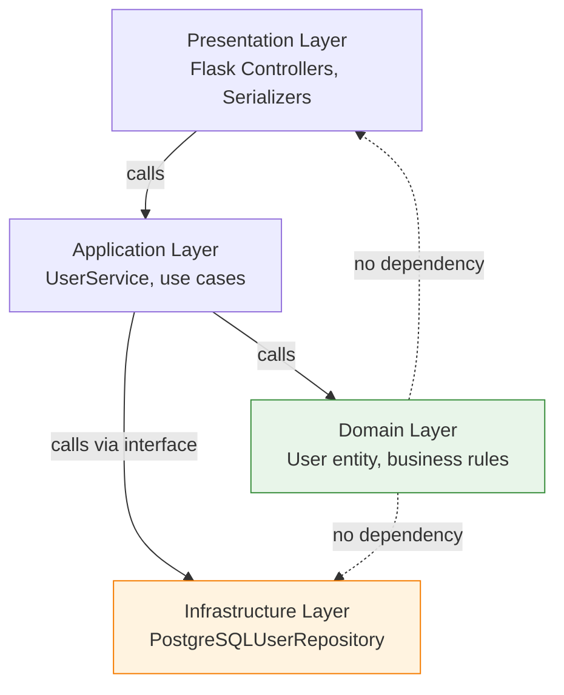

# Layered Architecture

> Organize a system into horizontal layers, where each layer provides services to the layer above it and depends only on the layer below it.

Also called **N-Tier Architecture**.

---

## The Problem

Without structure, code becomes a tangled mess where presentation logic calls the database directly, business rules leak into UI code, and changing one thing breaks everything else.

```python
# BAD: A Flask route doing everything.
# This is untestable, unreusable, and impossible to maintain at scale.

@app.route("/users/<int:user_id>")
def get_user(user_id):
    conn = psycopg2.connect("host=localhost dbname=app")  # DB connection in UI!
    cur = conn.cursor()
    cur.execute("SELECT * FROM users WHERE id = %s AND active = true", (user_id,))
    row = cur.fetchone()
    if row is None:
        return jsonify({"error": "User not found"}), 404
    # Business logic in the UI layer!
    if row["role"] == "admin" and row["last_login"] < 30_days_ago:
        deactivate_user(user_id)
        return jsonify({"error": "Admin account expired"}), 403
    return jsonify({"id": row["id"], "name": row["name"]})
```

---

## The Solution

Separate responsibilities into layers with a strict dependency rule: **each layer may only depend on the layer directly below it**.

### The Four Standard Layers

```
┌────────────────────────────────────────┐
│         Presentation Layer             │  ← HTTP, HTML, JSON, CLI
│   (Controllers, Views, Serializers)    │
├────────────────────────────────────────┤
│         Application Layer             │  ← Use cases, orchestration
│   (Services, Command handlers)         │
├────────────────────────────────────────┤
│          Domain Layer                  │  ← Business rules, entities
│   (Entities, Domain Services, Events)  │
├────────────────────────────────────────┤
│        Infrastructure Layer            │  ← DB, email, file system, APIs
│   (Repositories, Adapters, Clients)    │
└────────────────────────────────────────┘
```

```python
# --- Infrastructure Layer ---
# users/infrastructure/user_repository.py
import psycopg2
from users.domain.user import User

class PostgreSQLUserRepository:
    def __init__(self, connection):
        self._conn = connection

    def find_by_id(self, user_id: int) -> User | None:
        cur = self._conn.cursor()
        cur.execute("SELECT id, name, email, role, last_login FROM users WHERE id=%s", (user_id,))
        row = cur.fetchone()
        if row is None:
            return None
        return User(id=row[0], name=row[1], email=row[2], role=row[3], last_login=row[4])

    def save(self, user: User) -> None:
        cur = self._conn.cursor()
        cur.execute("UPDATE users SET active=%s WHERE id=%s", (user.is_active, user.id))
        self._conn.commit()


# --- Domain Layer ---
# users/domain/user.py
from dataclasses import dataclass
from datetime import datetime, timedelta

@dataclass
class User:
    id: int
    name: str
    email: str
    role: str
    last_login: datetime
    is_active: bool = True

    def is_admin_account_expired(self) -> bool:
        """Business rule lives here, in the domain."""
        if self.role != "admin":
            return False
        return datetime.now() - self.last_login > timedelta(days=30)

    def deactivate(self) -> None:
        self.is_active = False


# --- Application Layer ---
# users/application/user_service.py
class UserService:
    def __init__(self, repo):
        self._repo = repo

    def get_user(self, user_id: int) -> User:
        user = self._repo.find_by_id(user_id)
        if user is None:
            raise UserNotFoundError(f"User {user_id} not found")
        if user.is_admin_account_expired():
            user.deactivate()
            self._repo.save(user)
            raise AdminAccountExpiredError(f"Admin account for {user.name} has expired")
        return user


# --- Presentation Layer ---
# users/presentation/user_controller.py
from flask import Blueprint, jsonify

users_bp = Blueprint("users", __name__)

@users_bp.route("/users/<int:user_id>")
def get_user(user_id: int):
    try:
        user = user_service.get_user(user_id)
        return jsonify({"id": user.id, "name": user.name})
    except UserNotFoundError:
        return jsonify({"error": "User not found"}), 404
    except AdminAccountExpiredError:
        return jsonify({"error": "Admin account expired"}), 403
```

---

## Dependency Flow



The Domain layer has **zero dependencies** on infrastructure. You can unit-test every business rule without a database.

---

## What Belongs Where

| Layer | Contains | Does NOT contain |
|-------|----------|-----------------|
| **Presentation** | HTTP routing, serialization, input validation | Business logic, DB calls |
| **Application** | Use case orchestration, transaction management | Business rules, HTTP concepts |
| **Domain** | Entities, value objects, domain services, business rules | DB queries, HTTP, email |
| **Infrastructure** | DB repos, email clients, file I/O, external API calls | Business rules, HTTP routing |

---

## Testing Strategy

```python
# Domain tests: pure Python, no mocking needed
def test_admin_account_expires_after_30_days():
    user = User(id=1, name="Alice", role="admin",
                last_login=datetime.now() - timedelta(days=31), ...)
    assert user.is_admin_account_expired() is True

# Application tests: mock the repository
def test_get_user_deactivates_expired_admin():
    mock_repo = Mock()
    mock_repo.find_by_id.return_value = expired_admin_user
    service = UserService(mock_repo)
    with pytest.raises(AdminAccountExpiredError):
        service.get_user(1)
    mock_repo.save.assert_called_once()

# Infrastructure tests: use a real test database
def test_repository_finds_user_by_id():
    repo = PostgreSQLUserRepository(test_connection)
    user = repo.find_by_id(1)
    assert user.name == "Alice"
```

---

## Pros and Cons

| Pros | Cons |
|------|------|
| Clear separation of concerns | Risk of "anemic domain model" (logic leaks into application layer) |
| Each layer testable independently | Can feel over-engineered for simple CRUD apps |
| Easy to swap infrastructure (e.g., Postgres → MySQL) | Strict layer dependency can lead to unnecessary passing of objects |
| Team members can own a layer | Performance overhead from multiple abstraction layers |

---

## When to Use / When NOT to Use

**Use when:**
- Standard web applications, REST APIs, or business systems.
- Teams need clear ownership boundaries.
- The system needs to last years and will be maintained by multiple developers.

**Don't use when:**
- Simple scripts or throwaway tools.
- Extreme performance requirements where every layer of abstraction costs.

---

## Key Takeaways

- Layered Architecture is the default starting point for most business applications.
- The strict dependency rule (dependencies point downward only) is what makes each layer independently testable.
- The Domain layer must never import from Infrastructure — this is the most important rule.
- Violations of layer boundaries are **technical debt** that compounds over time.
