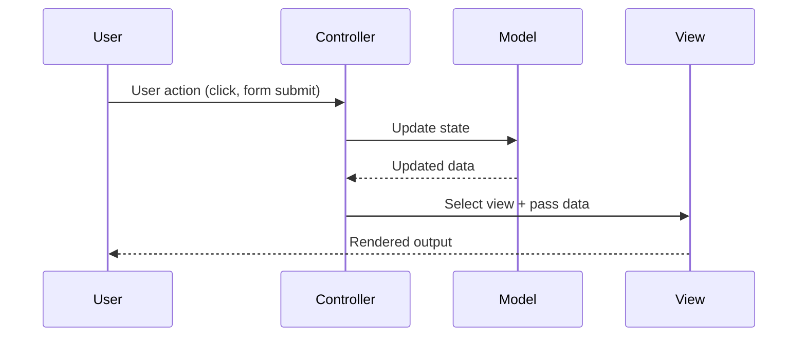
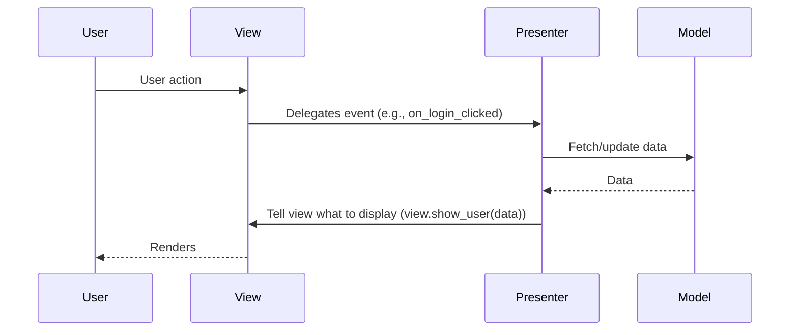
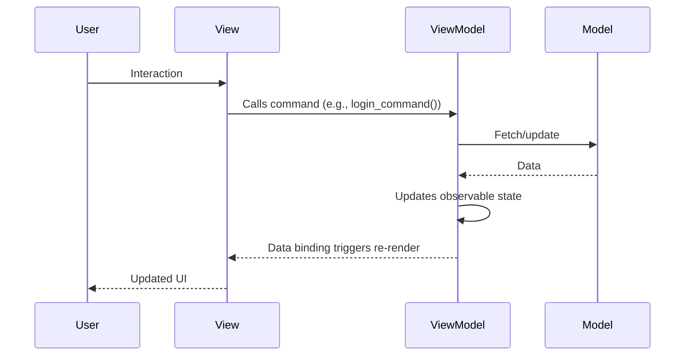
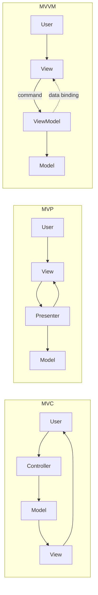

# MVC / MVP / MVVM

> Three patterns for separating user interface logic from business logic. Each solves the same problem with different trade-offs in testability and data-binding.

---

## The Problem

UI code and business logic mixed together is impossible to test, reuse, or maintain. A change in the database schema should not require editing an HTML template, and vice versa.

---

## MVC — Model-View-Controller

The original pattern (1970s, Smalltalk). Separates the application into three components.

### Components

- **Model** — application data and business logic. Knows nothing about the UI.
- **View** — renders the model for the user. Observes the model.
- **Controller** — handles user input, updates the model, decides which view to show.

### How It Works



### Code Example (Flask-style)

```python
# --- Model ---
class UserModel:
    def __init__(self, db):
        self._db = db

    def get_user(self, user_id: int) -> dict | None:
        return self._db.query("SELECT * FROM users WHERE id = %s", user_id)

    def update_email(self, user_id: int, email: str) -> None:
        self._db.execute("UPDATE users SET email = %s WHERE id = %s", email, user_id)


# --- View (template rendering or JSON serialization) ---
def render_user_profile(user: dict) -> str:
    return f"<h1>{user['name']}</h1><p>{user['email']}</p>"

def render_user_json(user: dict) -> dict:
    return {"id": user["id"], "name": user["name"], "email": user["email"]}


# --- Controller ---
class UserController:
    def __init__(self, model: UserModel):
        self._model = model

    def get_profile(self, user_id: int) -> str:
        user = self._model.get_user(user_id)
        if user is None:
            return render_error("User not found", 404)
        return render_user_profile(user)

    def update_email(self, user_id: int, new_email: str) -> dict:
        self._model.update_email(user_id, new_email)
        user = self._model.get_user(user_id)
        return render_user_json(user)
```

### Pros / Cons of MVC

| Pros | Cons |
|------|------|
| Clear roles for each component | Controller can grow large ("fat controller") |
| Model is reusable across views | View can directly observe model — tight coupling in some variants |
| Well-understood, widely adopted | Input handling in Controller can become complex |

---

## MVP — Model-View-Presenter

A refinement of MVC. The **Presenter** replaces the Controller and handles ALL view logic. The View is **passive** — it only displays what the Presenter tells it to, and delegates all events back to the Presenter.

### Components

- **Model** — same as MVC.
- **View** — a passive interface. Contains no logic. Only displays data.
- **Presenter** — middle-man. Retrieves data from Model, formats it for the View, handles all UI logic.

### Key Difference from MVC

In MVC, the View can directly observe the Model. In MVP, the View is **completely decoupled** from the Model — the Presenter mediates all interaction.



### Code Example

```python
# --- View Interface (passive) ---
from abc import ABC, abstractmethod

class LoginView(ABC):
    @abstractmethod
    def get_username(self) -> str: ...

    @abstractmethod
    def get_password(self) -> str: ...

    @abstractmethod
    def show_error(self, message: str) -> None: ...

    @abstractmethod
    def navigate_to_dashboard(self) -> None: ...


# --- Presenter: contains ALL UI logic ---
class LoginPresenter:
    def __init__(self, view: LoginView, auth_service):
        self._view = view
        self._auth = auth_service

    def on_login_clicked(self) -> None:
        username = self._view.get_username()
        password = self._view.get_password()

        if not username or not password:
            self._view.show_error("Username and password are required")
            return

        user = self._auth.authenticate(username, password)
        if user is None:
            self._view.show_error("Invalid credentials")
            return

        self._view.navigate_to_dashboard()


# --- Test: easy because the View is just an interface ---
class FakeLoginView(LoginView):
    def __init__(self, username, password):
        self._username = username
        self._password = password
        self.error_shown = None
        self.navigated = False

    def get_username(self) -> str: return self._username
    def get_password(self) -> str: return self._password
    def show_error(self, message: str) -> None: self.error_shown = message
    def navigate_to_dashboard(self) -> None: self.navigated = True

def test_login_with_empty_password():
    view = FakeLoginView("alice", "")
    presenter = LoginPresenter(view, mock_auth)
    presenter.on_login_clicked()
    assert view.error_shown == "Username and password are required"
    assert view.navigated is False
```

### Pros / Cons of MVP

| Pros | Cons |
|------|------|
| Highly testable — View is a pure interface | Presenter can grow large |
| Strict separation — View knows nothing about Model | More boilerplate than MVC |
| Easy to swap View implementations | |

---

## MVVM — Model-View-ViewModel

Designed for **data-binding** frameworks (Angular, React, WPF, Kotlin/Android). The ViewModel exposes **observable data** that the View binds to automatically.

### Components

- **Model** — same as before.
- **View** — binds to ViewModel properties. Automatically re-renders when data changes.
- **ViewModel** — exposes observable state. Handles commands. Does NOT reference the View.

### Key Difference

In MVVM, the View → ViewModel binding is **automatic and reactive** (via data-binding). The ViewModel never calls methods on the View — it only exposes observable state.



### Code Example (Python observable simulation)

```python
from typing import Callable, Any

class Observable:
    """A reactive property that notifies listeners when changed."""
    def __init__(self, initial_value=None):
        self._value = initial_value
        self._listeners: list[Callable] = []

    @property
    def value(self):
        return self._value

    @value.setter
    def value(self, new_value):
        self._value = new_value
        for listener in self._listeners:
            listener(new_value)

    def bind(self, callback: Callable) -> None:
        self._listeners.append(callback)


# --- ViewModel ---
class UserProfileViewModel:
    def __init__(self, user_service):
        self._service = user_service
        # Observable properties the View binds to
        self.name = Observable("")
        self.email = Observable("")
        self.is_loading = Observable(False)
        self.error_message = Observable(None)

    def load_user(self, user_id: int) -> None:
        self.is_loading.value = True
        self.error_message.value = None
        try:
            user = self._service.get_user(user_id)
            self.name.value = user.name
            self.email.value = user.email
        except UserNotFoundError as e:
            self.error_message.value = str(e)
        finally:
            self.is_loading.value = False


# --- View binds to ViewModel properties ---
class UserProfileView:
    def __init__(self, vm: UserProfileViewModel):
        self._vm = vm
        # Bind: when ViewModel state changes, auto-update the UI
        vm.name.bind(lambda v: self._update_name_label(v))
        vm.is_loading.bind(lambda v: self._show_spinner(v))
        vm.error_message.bind(lambda v: self._show_error(v) if v else None)

    def _update_name_label(self, name: str) -> None:
        print(f"[UI] Name label: {name}")

    def _show_spinner(self, loading: bool) -> None:
        print(f"[UI] Spinner: {'on' if loading else 'off'}")

    def _show_error(self, message: str) -> None:
        print(f"[UI] Error: {message}")

    def on_page_load(self, user_id: int) -> None:
        self._vm.load_user(user_id)   # trigger the ViewModel


# Test ViewModel without a View at all
def test_viewmodel_loads_user():
    mock_service = Mock()
    mock_service.get_user.return_value = User(name="Alice", email="a@b.com")
    vm = UserProfileViewModel(mock_service)
    vm.load_user(1)
    assert vm.name.value == "Alice"
    assert vm.is_loading.value is False
```

### Pros / Cons of MVVM

| Pros | Cons |
|------|------|
| View is declarative — very little code | Overkill for simple UIs |
| ViewModel fully testable without a View | Data binding complexity can hide bugs |
| Reactive UI updates automatically | |

---

## Side-by-Side Comparison



| | MVC | MVP | MVVM |
|-|-----|-----|------|
| **View observes Model?** | Yes (in classic MVC) | No | No |
| **Who handles UI logic?** | Controller | Presenter | ViewModel |
| **View testable?** | Hard | Easy (via interface) | Not needed (binds to VM) |
| **Best for** | Server-side web apps | Android (classic), desktop | React, Angular, WPF |

---

## Key Takeaways

- All three patterns separate UI from business logic — the difference is in **who mediates** and **how the View is updated**.
- **MVC** is the server-side standard (Django, Rails, Spring MVC).
- **MVP** is the most testable of the three — the View is just a dumb interface.
- **MVVM** shines in reactive, data-bound UIs where you want the View to auto-update.
- Don't mix them: pick one and be consistent throughout the application.
