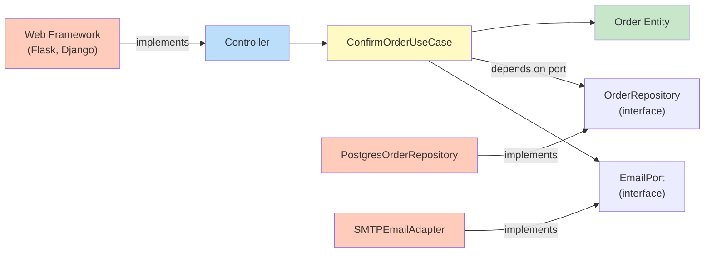

# Clean Architecture

> Organize code in concentric rings where the Dependency Rule is strictly enforced: source code dependencies may only point inward — toward higher-level policy.

Proposed by Robert C. Martin (Uncle Bob). Clean Architecture is a synthesis of Layered Architecture, Hexagonal Architecture, and Domain-Driven Design ideas.

---

## The Problem

In many layered systems, the domain logic ends up depending on the database, the web framework, or specific libraries. When those dependencies change, the business rules break.

```python
# BAD: Domain entity directly uses SQLAlchemy (framework/infrastructure).
# Changing the ORM requires changing the business entity.
from sqlalchemy import Column, Integer, String
from sqlalchemy.ext.declarative import declarative_base

Base = declarative_base()

class User(Base):                          # ← business concept tied to ORM
    __tablename__ = "users"
    id = Column(Integer, primary_key=True)
    email = Column(String)

    def can_purchase(self) -> bool:        # business rule
        return self.email.endswith("@verified.com")  # domain logic mixed with ORM model
```

The business rule `can_purchase` is baked into an ORM model. Testing it requires a database.

---

## The Solution: The Dependency Rule

**Source code dependencies must only point inward.** Nothing in an inner ring knows anything about an outer ring.

```
            ┌─────────────────────────────────────────┐
            │           Frameworks & Drivers           │  ← Web, DB, UI
            │  ┌───────────────────────────────────┐  │
            │  │     Interface Adapters             │  │  ← Controllers, Presenters, Gateways
            │  │  ┌─────────────────────────────┐  │  │
            │  │  │     Application             │  │  │  ← Use Cases
            │  │  │  ┌───────────────────────┐  │  │  │
            │  │  │  │     Domain            │  │  │  │  ← Entities, Business Rules
            │  │  │  └───────────────────────┘  │  │  │
            │  │  └─────────────────────────────┘  │  │
            │  └───────────────────────────────────┘  │
            └─────────────────────────────────────────┘
            
            Dependencies point INWARD only →
```

### The Four Rings

| Ring | Name | Contains |
|------|------|----------|
| Innermost | **Entities** | Enterprise business rules. Plain objects with no dependencies. |
| 2nd | **Use Cases** | Application business rules. Orchestrate entities. |
| 3rd | **Interface Adapters** | Convert data between use cases and external formats (web, DB). |
| Outermost | **Frameworks & Drivers** | Web framework, database, UI, external services. |

---

## Code Structure

```python
# ────────────────────────────────────
# RING 1: ENTITIES (no imports from outer rings)
# ────────────────────────────────────
# domain/entities/order.py
from dataclasses import dataclass, field
from datetime import datetime
from enum import Enum

class OrderStatus(Enum):
    PENDING = "PENDING"
    CONFIRMED = "CONFIRMED"
    SHIPPED = "SHIPPED"
    DELIVERED = "DELIVERED"

@dataclass
class Order:
    id: int
    customer_email: str
    items: list[dict]
    status: OrderStatus = OrderStatus.PENDING
    created_at: datetime = field(default_factory=datetime.now)

    def total(self) -> float:
        return sum(item["price"] * item["qty"] for item in self.items)

    def can_be_cancelled(self) -> bool:
        """Business rule: orders can only be cancelled if not yet shipped."""
        return self.status in (OrderStatus.PENDING, OrderStatus.CONFIRMED)

    def confirm(self) -> None:
        if self.status != OrderStatus.PENDING:
            raise ValueError("Only pending orders can be confirmed")
        self.status = OrderStatus.CONFIRMED


# ────────────────────────────────────
# RING 2: USE CASES (depends on Entities only)
# ────────────────────────────────────
# application/use_cases/confirm_order.py
from abc import ABC, abstractmethod
from domain.entities.order import Order

class OrderRepository(ABC):
    """Port — defined in the use case ring, implemented in infrastructure."""
    @abstractmethod
    def find_by_id(self, order_id: int) -> Order | None: ...

    @abstractmethod
    def save(self, order: Order) -> None: ...

class EmailPort(ABC):
    @abstractmethod
    def send_confirmation(self, email: str, order: Order) -> None: ...

class ConfirmOrderUseCase:
    def __init__(self, repo: OrderRepository, email: EmailPort):
        self._repo = repo
        self._email = email

    def execute(self, order_id: int) -> Order:
        order = self._repo.find_by_id(order_id)
        if order is None:
            raise OrderNotFoundError(order_id)
        order.confirm()
        self._repo.save(order)
        self._email.send_confirmation(order.customer_email, order)
        return order


# ────────────────────────────────────
# RING 3: INTERFACE ADAPTERS (depends on Use Cases and Entities)
# ────────────────────────────────────
# adapters/web/order_controller.py
from flask import Blueprint, jsonify, request

orders_bp = Blueprint("orders", __name__)

@orders_bp.route("/orders/<int:order_id>/confirm", methods=["POST"])
def confirm_order(order_id: int):
    try:
        order = confirm_order_use_case.execute(order_id)
        return jsonify({"id": order.id, "status": order.status.value}), 200
    except OrderNotFoundError:
        return jsonify({"error": "Order not found"}), 404
    except ValueError as e:
        return jsonify({"error": str(e)}), 422


# ────────────────────────────────────
# RING 4: INFRASTRUCTURE (frameworks, databases)
# ────────────────────────────────────
# infrastructure/repositories/postgres_order_repository.py
import psycopg2
from application.use_cases.confirm_order import OrderRepository
from domain.entities.order import Order, OrderStatus

class PostgresOrderRepository(OrderRepository):
    def __init__(self, connection):
        self._conn = connection

    def find_by_id(self, order_id: int) -> Order | None:
        cur = self._conn.cursor()
        cur.execute("SELECT * FROM orders WHERE id = %s", (order_id,))
        row = cur.fetchone()
        if row is None:
            return None
        return Order(id=row["id"], customer_email=row["email"],
                     items=row["items"], status=OrderStatus(row["status"]))

    def save(self, order: Order) -> None:
        cur = self._conn.cursor()
        cur.execute("UPDATE orders SET status = %s WHERE id = %s",
                    (order.status.value, order.id))
        self._conn.commit()


# infrastructure/email/smtp_email_adapter.py
import smtplib
from application.use_cases.confirm_order import EmailPort

class SMTPEmailAdapter(EmailPort):
    def send_confirmation(self, email: str, order: Order) -> None:
        # Send real email via SMTP
        ...


# ────────────────────────────────────
# WIRING (main.py or DI container)
# ────────────────────────────────────
def create_app():
    conn = psycopg2.connect(DATABASE_URL)
    repo = PostgresOrderRepository(conn)
    email = SMTPEmailAdapter()
    confirm_order_use_case = ConfirmOrderUseCase(repo, email)
    app = Flask(__name__)
    app.register_blueprint(orders_bp)
    return app
```

---

## The Dependency Rule — Visualized



Arrows show the **dependency** direction. All infrastructure arrows point toward the core, never the other way.

---

## Testing Under Clean Architecture

```python
# Unit-test an entity — no dependencies at all
def test_order_can_be_cancelled_when_pending():
    order = Order(id=1, customer_email="a@b.com", items=[], status=OrderStatus.PENDING)
    assert order.can_be_cancelled() is True

# Unit-test a use case — fake repositories, no database
class FakeOrderRepository(OrderRepository):
    def __init__(self, orders: list[Order]):
        self._orders = {o.id: o for o in orders}

    def find_by_id(self, order_id): return self._orders.get(order_id)
    def save(self, order): self._orders[order.id] = order

def test_confirm_order_use_case():
    order = Order(id=1, customer_email="a@b.com", items=[], status=OrderStatus.PENDING)
    repo = FakeOrderRepository([order])
    email = Mock(spec=EmailPort)
    use_case = ConfirmOrderUseCase(repo, email)

    result = use_case.execute(1)

    assert result.status == OrderStatus.CONFIRMED
    email.send_confirmation.assert_called_once_with("a@b.com", result)
```

---

## File Structure Convention

```
project/
├── domain/
│   ├── entities/
│   └── value_objects/
├── application/
│   ├── use_cases/
│   └── ports/         ← interfaces (abstract base classes)
├── adapters/
│   ├── web/           ← controllers, serializers
│   └── cli/
└── infrastructure/
    ├── repositories/  ← DB implementations
    ├── email/
    └── external_apis/
```

---

## When to Use / When NOT to Use

**Use when:**
- Complex, long-lived applications with rich business logic.
- Multiple teams working on different layers.
- The infrastructure (database, framework) may change over time.

**Don't use when:**
- Simple CRUD apps with little business logic — it's overkill.
- Small scripts or short-lived tools.

---

## Key Takeaways

- The Dependency Rule is the single most important rule: **dependencies only point inward**.
- Entities know nothing about the database, web framework, or any external system.
- Use Cases define **ports** (interfaces) that infrastructure must implement.
- This makes your business logic completely framework-agnostic and testable in milliseconds.
- The cost: more files, more boilerplate. The benefit: code that survives years of infrastructure changes.
