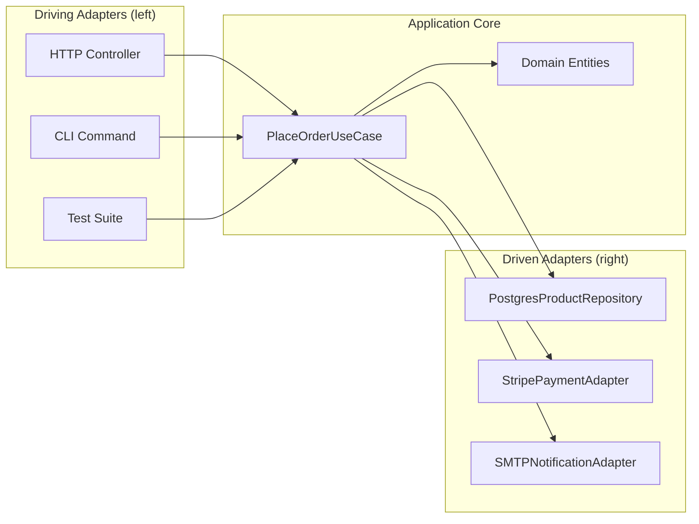

# Hexagonal Architecture

> Isolate the application core from the outside world using Ports (interfaces) and Adapters (implementations). The application talks to the world only through ports.

Also called **Ports and Adapters** (the original name by Alistair Cockburn, 2005).

---

## The Problem

The application core is coupled to specific technologies. Changing the database, adding a CLI on top of a web app, or testing without spinning up real services is painful.

```python
# BAD: The application logic directly uses Django ORM, email library,
# and a specific HTTP client. Testing requires all of them running.

class OrderService:
    def place_order(self, request):
        # Directly coupled to Django ORM
        user = DjangoUser.objects.get(id=request.user_id)
        product = DjangoProduct.objects.get(id=request.product_id)

        # Business logic mixed with infrastructure
        if product.stock < request.quantity:
            raise InsufficientStockError()

        # Directly coupled to stripe library
        stripe.Charge.create(amount=product.price * 100, currency="usd",
                             source=request.stripe_token)

        # Directly coupled to Django ORM mutations
        order = DjangoOrder.objects.create(user=user, product=product,
                                           quantity=request.quantity)

        # Directly coupled to django-mailer
        send_mail("Order Confirmed", ..., [user.email])
        return order
```

---

## The Solution

The hexagonal model places the application at the center of a hexagon. Each face of the hexagon is a **port** — an interface. Adapters plug into ports.

```
                    ┌─────────────┐
    HTTP Request → [ HTTP Adapter ]─────┐
                    └─────────────┘     │
                                        ▼
    CLI Command  → [ CLI Adapter ]──→ [ Port: OrderInputPort ]──→ [Application Core]
                                                                         │
                                      [Port: OrderRepository]──────────►│
                                      [Port: PaymentGateway]────────────►│
                                      [Port: NotificationPort]─────────►│
                                              │
              ┌────────────────┐              │
              [Postgres Adapter]◄─────────────┘
              [Stripe Adapter  ]
              [SMTP Adapter    ]
```

### Ports: Two Types

- **Driving ports** (left side): how the outside world drives the application (REST API, CLI, tests, message consumer).
- **Driven ports** (right side): how the application drives the outside world (database, email, payment API).

```python
from abc import ABC, abstractmethod
from dataclasses import dataclass

# ─── Domain ───
@dataclass
class Product:
    id: int
    name: str
    price: float
    stock: int

@dataclass
class Order:
    id: int | None
    user_id: int
    product_id: int
    quantity: int

    def total(self, price: float) -> float:
        return price * self.quantity


# ─── Driven Ports (RIGHT SIDE) ───
class ProductRepository(ABC):
    @abstractmethod
    def find_by_id(self, product_id: int) -> Product | None: ...

    @abstractmethod
    def decrement_stock(self, product_id: int, qty: int) -> None: ...

class OrderRepository(ABC):
    @abstractmethod
    def save(self, order: Order) -> Order: ...

class PaymentGateway(ABC):
    @abstractmethod
    def charge(self, amount_cents: int, token: str) -> str: ...  # returns charge ID

class NotificationPort(ABC):
    @abstractmethod
    def send_order_confirmation(self, user_id: int, order: Order) -> None: ...


# ─── Application Core (no framework imports!) ───
class PlaceOrderUseCase:
    def __init__(self, products: ProductRepository, orders: OrderRepository,
                 payment: PaymentGateway, notifications: NotificationPort):
        self._products = products
        self._orders = orders
        self._payment = payment
        self._notifications = notifications

    def execute(self, user_id: int, product_id: int, quantity: int, payment_token: str) -> Order:
        product = self._products.find_by_id(product_id)
        if product is None:
            raise ProductNotFoundError(product_id)
        if product.stock < quantity:
            raise InsufficientStockError(product_id, quantity, product.stock)

        order = Order(id=None, user_id=user_id, product_id=product_id, quantity=quantity)
        amount_cents = int(order.total(product.price) * 100)

        self._payment.charge(amount_cents, payment_token)
        self._products.decrement_stock(product_id, quantity)
        saved_order = self._orders.save(order)
        self._notifications.send_order_confirmation(user_id, saved_order)
        return saved_order


# ─── Driving Port (LEFT SIDE): how clients call the core ───
class OrderInputPort(ABC):
    @abstractmethod
    def place_order(self, user_id: int, product_id: int,
                    quantity: int, payment_token: str) -> Order: ...
```

### Adapters

```python
# ─── Driven Adapters (infrastructure) ───
class PostgresProductRepository(ProductRepository):
    def find_by_id(self, product_id: int) -> Product | None:
        row = db.execute("SELECT * FROM products WHERE id=%s", product_id).fetchone()
        return Product(**row) if row else None

    def decrement_stock(self, product_id: int, qty: int) -> None:
        db.execute("UPDATE products SET stock = stock - %s WHERE id=%s", qty, product_id)

class StripePaymentAdapter(PaymentGateway):
    def charge(self, amount_cents: int, token: str) -> str:
        charge = stripe.Charge.create(amount=amount_cents, currency="usd", source=token)
        return charge.id

class SMTPNotificationAdapter(NotificationPort):
    def send_order_confirmation(self, user_id: int, order: Order) -> None:
        email = fetch_email(user_id)
        smtp.sendmail("shop@example.com", email, f"Order {order.id} confirmed!")


# ─── Driving Adapters (how the world calls the app) ───
from flask import Blueprint, request, jsonify

orders_bp = Blueprint("orders", __name__)

@orders_bp.route("/orders", methods=["POST"])
def place_order():
    data = request.json
    try:
        order = use_case.execute(
            user_id=data["user_id"],
            product_id=data["product_id"],
            quantity=data["quantity"],
            payment_token=data["payment_token"],
        )
        return jsonify({"order_id": order.id}), 201
    except InsufficientStockError as e:
        return jsonify({"error": str(e)}), 409
```

### Testing Without Infrastructure

```python
# ─── In-Memory Adapters (for fast tests) ───
class InMemoryProductRepository(ProductRepository):
    def __init__(self, products: list[Product]):
        self._products = {p.id: p for p in products}

    def find_by_id(self, product_id: int) -> Product | None:
        return self._products.get(product_id)

    def decrement_stock(self, product_id: int, qty: int) -> None:
        self._products[product_id].stock -= qty

class FakePaymentGateway(PaymentGateway):
    def __init__(self, should_fail: bool = False):
        self.charges: list[tuple] = []
        self._should_fail = should_fail

    def charge(self, amount_cents: int, token: str) -> str:
        if self._should_fail:
            raise PaymentDeclinedError()
        self.charges.append((amount_cents, token))
        return "fake_charge_id"

# Test: pure Python, no database, no HTTP, no Stripe
def test_place_order_decrements_stock():
    product = Product(id=1, name="Widget", price=10.00, stock=5)
    use_case = PlaceOrderUseCase(
        products=InMemoryProductRepository([product]),
        orders=Mock(spec=OrderRepository),
        payment=FakePaymentGateway(),
        notifications=Mock(spec=NotificationPort),
    )
    use_case.execute(user_id=42, product_id=1, quantity=2, payment_token="tok_test")
    assert product.stock == 3
```

---

## Architecture Diagram



---

## Hexagonal vs. Clean Architecture

They are very similar — many developers use them interchangeably.

| | Hexagonal | Clean Architecture |
|-|-----------|--------------------|
| **Origin** | Alistair Cockburn (2005) | Robert C. Martin (2012) |
| **Core abstraction** | Ports & Adapters | Concentric rings + Dependency Rule |
| **Terminology** | Driving / Driven ports | Use Cases / Entities / Interface Adapters |
| **Focus** | Testability via adapter swapping | Strict layer isolation |

Both enforce the same core idea: the application core must not depend on infrastructure.

---

## Key Takeaways

- The application core has **zero imports** from Flask, SQLAlchemy, Stripe, or any other framework.
- Ports (interfaces) decouple the core from its infrastructure.
- Adapters are swappable: swap Postgres for MongoDB, Stripe for PayPal, SMTP for SendGrid — zero changes to business logic.
- Tests run in milliseconds using in-memory adapters — no database, no HTTP server needed.
- The most testable architecture available for complex domain logic.
