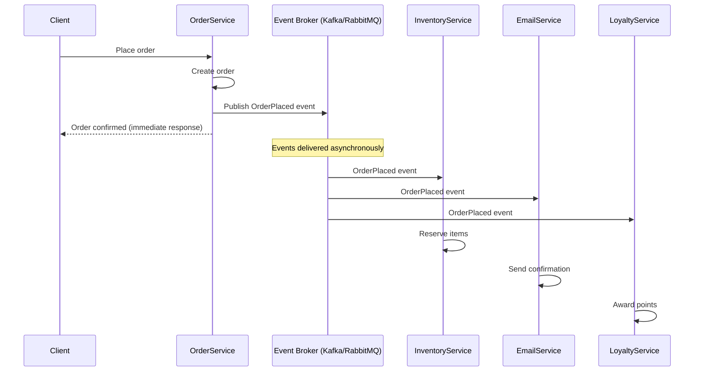

# Event-Driven Architecture

> Components communicate by producing and consuming events, rather than calling each other directly. Services are decoupled in time and space.

---

## The Problem

In a synchronous system, services call each other directly. This creates tight coupling — when the `email service` is down, the `order service` fails too, even though sending an email is not critical to placing an order.

```python
# BAD: Synchronous, tightly-coupled chain of calls.
# If EmailService is slow or down, the whole checkout fails.

class OrderService:
    def place_order(self, order_data: dict) -> Order:
        order = self._create_order(order_data)

        # Synchronous calls — all must succeed for the order to complete
        self._inventory_service.reserve(order.items)        # network call
        self._payment_service.charge(order.total)           # network call
        self._email_service.send_confirmation(order)        # network call — not critical!
        self._analytics_service.track_order(order)          # network call — not critical!
        self._loyalty_service.award_points(order)           # network call — not critical!

        return order
```

Five services are synchronously coupled. The order is 5x as likely to fail. Each service must be running for checkout to work.

---

## The Solution

`OrderService` places the order and publishes an `OrderPlaced` event. All downstream services subscribe and react independently. The order service doesn't know (or care) who is listening.



The order service response time is now just the time to save the order + publish one event. Everything else is asynchronous.

---

## Core Concepts

### Event

An immutable, timestamped record of something that happened.

```python
from dataclasses import dataclass, field
from datetime import datetime
from uuid import uuid4, UUID

@dataclass(frozen=True)
class OrderPlacedEvent:
    event_id: UUID = field(default_factory=uuid4)
    event_type: str = "order.placed"
    occurred_at: datetime = field(default_factory=datetime.utcnow)
    order_id: int = 0
    customer_id: int = 0
    items: tuple = ()
    total_amount: float = 0.0
    version: int = 1
```

Events are:
- **Immutable** — they represent history, cannot be changed.
- **Named in past tense** — `OrderPlaced`, `PaymentProcessed`, `ItemShipped`.
- **Self-contained** — carry all data consumers need.

### Event Broker

A message system that receives events from producers and delivers them to subscribers. Common brokers:

| Broker | Characteristics |
|--------|----------------|
| Kafka | High throughput, durable log, replay support |
| RabbitMQ | Flexible routing, AMQP protocol |
| AWS SNS/SQS | Managed, serverless-friendly |
| Redis Streams | Simple, in-memory, low latency |

---

## Implementation

### Producer

```python
import json
from dataclasses import asdict

class OrderService:
    def __init__(self, order_repo, event_broker):
        self._repo = order_repo
        self._broker = event_broker

    def place_order(self, customer_id: int, items: list, total: float) -> dict:
        # Core business logic only
        order = self._repo.create(customer_id=customer_id, items=items, total=total)

        # Publish event — non-blocking
        event = OrderPlacedEvent(
            order_id=order["id"],
            customer_id=customer_id,
            items=tuple(items),
            total_amount=total,
        )
        self._broker.publish("orders.events", event)

        return {"order_id": order["id"], "status": "confirmed"}


class KafkaEventBroker:
    def __init__(self, bootstrap_servers: str):
        from kafka import KafkaProducer
        self._producer = KafkaProducer(
            bootstrap_servers=bootstrap_servers,
            value_serializer=lambda v: json.dumps(asdict(v)).encode("utf-8"),
        )

    def publish(self, topic: str, event) -> None:
        self._producer.send(topic, value=event)
        self._producer.flush()
```

### Consumer

```python
class EmailService:
    def __init__(self, smtp_client):
        self._smtp = smtp_client

    def on_order_placed(self, event: OrderPlacedEvent) -> None:
        email = fetch_customer_email(event.customer_id)
        self._smtp.send(
            to=email,
            subject=f"Order #{event.order_id} Confirmed",
            body=f"Your order of ${event.total_amount:.2f} is confirmed.",
        )


class LoyaltyService:
    def on_order_placed(self, event: OrderPlacedEvent) -> None:
        points = int(event.total_amount)
        award_points(event.customer_id, points)


# Kafka consumer
from kafka import KafkaConsumer

def start_email_consumer():
    consumer = KafkaConsumer(
        "orders.events",
        bootstrap_servers="localhost:9092",
        value_deserializer=lambda v: json.loads(v.decode("utf-8")),
    )
    service = EmailService(smtp_client)
    for message in consumer:
        event_data = message.value
        if event_data["event_type"] == "order.placed":
            event = OrderPlacedEvent(**event_data)
            service.on_order_placed(event)
```

---

## Event-Driven Patterns

### Pattern 1: Event Notification
Minimal payload — subscribers fetch details themselves.
```json
{ "type": "order.placed", "order_id": 123 }
```

### Pattern 2: Event-Carried State Transfer
Full data in the event — no need to call back.
```json
{ "type": "order.placed", "order_id": 123, "items": [...], "total": 99.99, "customer_email": "..." }
```

### Pattern 3: Event Sourcing
Events ARE the source of truth (see Event Sourcing chapter).

---

## Delivery Guarantees

| Guarantee | Meaning | Risk |
|-----------|---------|------|
| **At most once** | May lose events | Data loss |
| **At least once** | May duplicate events | Idempotency required |
| **Exactly once** | No duplicates, no loss | Expensive, complex |

**Practical approach:** Use **at-least-once** delivery and make consumers **idempotent** (processing the same event twice has no additional effect).

```python
class IdempotentEmailService:
    def __init__(self):
        self._processed_events: set[UUID] = set()

    def on_order_placed(self, event: OrderPlacedEvent) -> None:
        if event.event_id in self._processed_events:
            return   # already handled — skip
        self._send_email(event)
        self._processed_events.add(event.event_id)
```

---

## Pros and Cons

| Pros | Cons |
|------|------|
| Services are decoupled — failures are isolated | Harder to trace request flow (need distributed tracing) |
| Easy to add new consumers without changing producers | Eventual consistency — data may be temporarily stale |
| Natural scalability — consumers scale independently | Message ordering can be tricky |
| Easy to replay events for new consumers | Debugging is harder than synchronous calls |

---

## Key Takeaways

- EDA decouples services in time — the producer doesn't wait for consumers.
- Events are immutable records of past facts, named in past tense.
- Use at-least-once delivery with idempotent consumers as the default.
- You need distributed tracing (e.g., OpenTelemetry) to follow a request through an event-driven system.
- Don't use EDA for every operation — synchronous calls are better when you need an immediate consistent response.
