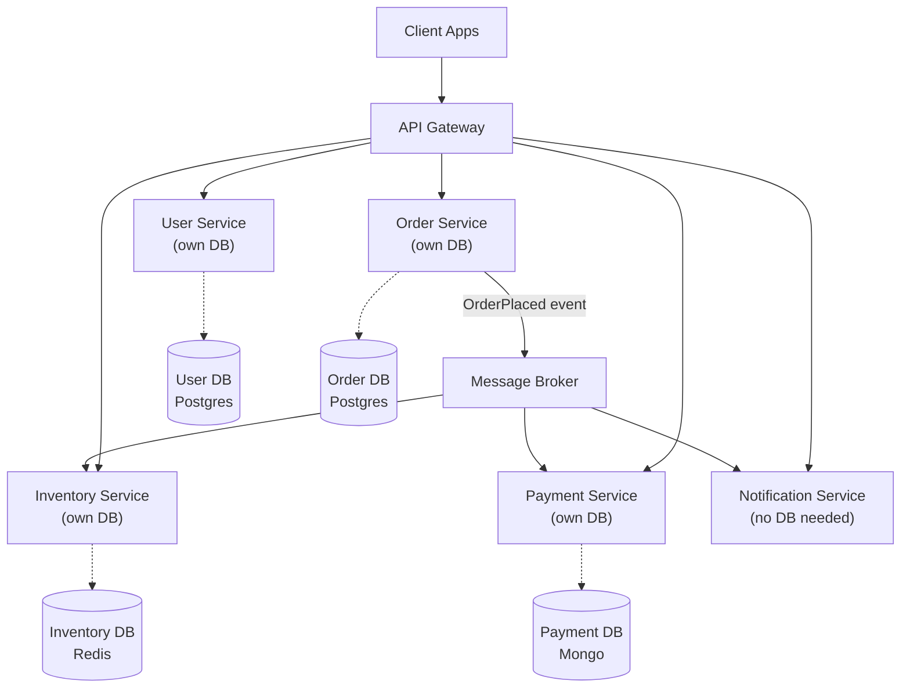
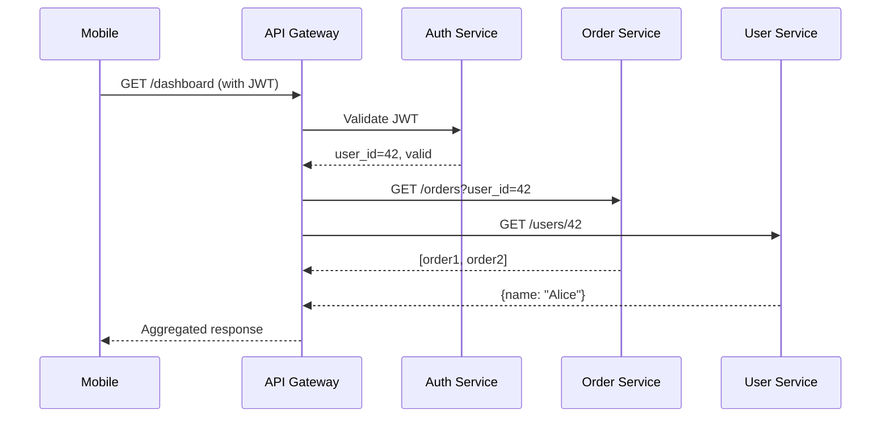

# Microservices Architecture

> Structure an application as a collection of small, independently deployable services, each owning its own data and communicating over a network.

---

## The Problem: The Monolith at Scale

A monolith starts as a good idea. Over time, as teams and features grow, it becomes:

```
┌─────────────────────────────────────────────────────┐
│                      Monolith                        │
│  ┌──────────┐  ┌──────────┐  ┌──────────────────┐  │
│  │  Users   │  │  Orders  │  │  Inventory       │  │
│  │  Module  │  │  Module  │  │  Module          │  │
│  └────┬─────┘  └────┬─────┘  └────────┬─────────┘  │
│       │             │                  │             │
│  ┌────┴─────────────┴──────────────────┴──────────┐ │
│  │               Shared Database                  │ │
│  └─────────────────────────────────────────────────┘ │
└─────────────────────────────────────────────────────┘
```

Problems at scale:
- **Deployment coupling**: A bug in Orders prevents deploying a fix to Inventory.
- **Tech lock-in**: Everything must use the same language, framework, library versions.
- **Team scaling**: 20 developers editing the same codebase causes constant conflicts.
- **Scaling inefficiency**: You can't scale just the checkout service during Black Friday.

---

## The Solution

Decompose the monolith into independent services. Each service:
- Owns a bounded context (a specific business capability).
- Has its own database (no shared DB).
- Deploys independently.
- Communicates via APIs or events.



---

## Decomposition Strategies

### By Business Capability

Each service maps to a business function.

```
User Service    → account management, authentication
Order Service   → cart, checkout, order lifecycle
Payment Service → billing, refunds, fraud detection
Inventory       → stock levels, reservations, supplier orders
```

### By Domain (Domain-Driven Design)

Each service maps to a **Bounded Context** — a domain with its own ubiquitous language.

```python
# In the Order service, "Product" means something ordered
# In the Inventory service, "Product" means something stocked
# These are DIFFERENT concepts — each service defines its own Product model

# order_service/models.py
@dataclass
class OrderedProduct:
    product_id: str
    name: str
    price_at_time_of_order: float  # snapshot — doesn't change after order
    quantity: int

# inventory_service/models.py
@dataclass
class StockedProduct:
    product_id: str
    sku: str
    current_stock: int
    reorder_threshold: int
    supplier_id: str
```

---

## Communication Patterns

### Synchronous (HTTP/gRPC)

Use when you need an immediate response.

```python
# Order service calling Inventory service synchronously
import httpx

class InventoryClient:
    def __init__(self, base_url: str):
        self._base = base_url

    def check_availability(self, product_id: str, quantity: int) -> bool:
        response = httpx.get(
            f"{self._base}/products/{product_id}/availability",
            params={"quantity": quantity},
            timeout=5.0,
        )
        response.raise_for_status()
        return response.json()["available"]

    def reserve(self, product_id: str, quantity: int, order_id: str) -> str:
        response = httpx.post(
            f"{self._base}/reservations",
            json={"product_id": product_id, "quantity": quantity, "order_id": order_id},
            timeout=5.0,
        )
        response.raise_for_status()
        return response.json()["reservation_id"]
```

### Asynchronous (Events)

Use when you don't need an immediate response, or want to decouple services.

```python
# Order service publishes event — doesn't call Inventory directly
class OrderService:
    def confirm_order(self, order_id: str) -> None:
        order = self._repo.get(order_id)
        order.confirm()
        self._repo.save(order)
        # Publish — Inventory service will react
        self._broker.publish("order.confirmed", {
            "order_id": order_id,
            "items": order.items,
        })
```

---

## The API Gateway Pattern

All client requests go through a single API Gateway. It handles:
- Routing to the correct service
- Authentication & authorization
- Rate limiting
- Request aggregation
- SSL termination



---

## Service Discovery

Services don't hardcode each other's addresses. They register with a Service Registry (Consul, Kubernetes DNS) and look up addresses dynamically.

```python
# Without service discovery
INVENTORY_URL = "http://192.168.1.42:8080"   # hardcoded — breaks if service moves

# With service discovery (Kubernetes DNS)
INVENTORY_URL = "http://inventory-service.production.svc.cluster.local"
# Kubernetes resolves this to the current IP automatically
```

---

## Data Management Challenges

### The Shared Database Anti-Pattern

```
# NEVER DO THIS:
ORDER SERVICE ────────┐
                       ├──► SHARED DATABASE ◄── Breaks service independence
INVENTORY SERVICE ────┘
```

If services share a database, a schema change in one service can break another. Deploy them independently? Impossible.

### Database per Service

Each service owns its data. Cross-service queries require API calls or eventual consistency via events.

```python
# CORRECT: Order service needs user info → call User Service API
class OrderPresenter:
    def __init__(self, order_repo, user_client: UserServiceClient):
        self._orders = order_repo
        self._users = user_client

    def get_order_with_user(self, order_id: str) -> dict:
        order = self._orders.get(order_id)
        user = self._users.get_user(order.user_id)
        return {**order.to_dict(), "user_name": user["name"]}
```

---

## Pitfalls of Microservices

| Pitfall | Description | Mitigation |
|---------|-------------|------------|
| **Distributed monolith** | Services that can't deploy independently | Enforce DB-per-service, loosely couple communication |
| **Chatty services** | Too many synchronous calls between services | Use async events; implement API aggregation |
| **No circuit breaker** | One slow service cascades failures | Add circuit breaker + timeout to all HTTP calls |
| **Premature decomposition** | Splitting before understanding domain boundaries | Start monolith-first, extract when pain is felt |
| **No observability** | Can't trace a request across 10 services | Add distributed tracing (Jaeger, OpenTelemetry) |

---

## When to Use Microservices

**Use when:**
- Multiple independent teams own different business capabilities.
- Different services have different scaling requirements.
- You need independent deployment schedules per team.
- You've already built and learned from a monolith.

**Don't use when:**
- You're starting a new product — start with a monolith. Extract services when boundaries become clear.
- Your team is small (< 5 engineers) — the operational overhead isn't worth it.
- You don't have robust CI/CD, monitoring, and service mesh in place.

---

## Key Takeaways

- Microservices solve **organizational scaling** problems more than technical ones.
- The hardest part is finding the right service boundaries (Bounded Contexts).
- Each service must own its own data — no shared databases.
- You need distributed tracing, centralized logging, and circuit breakers before microservices work reliably.
- The monolith-first approach: build a well-structured monolith, then extract services when team/scale pain demands it.
