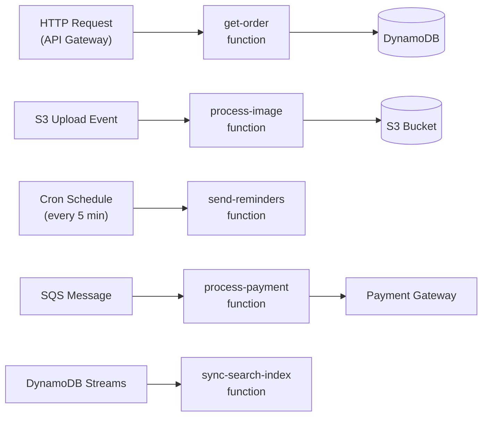
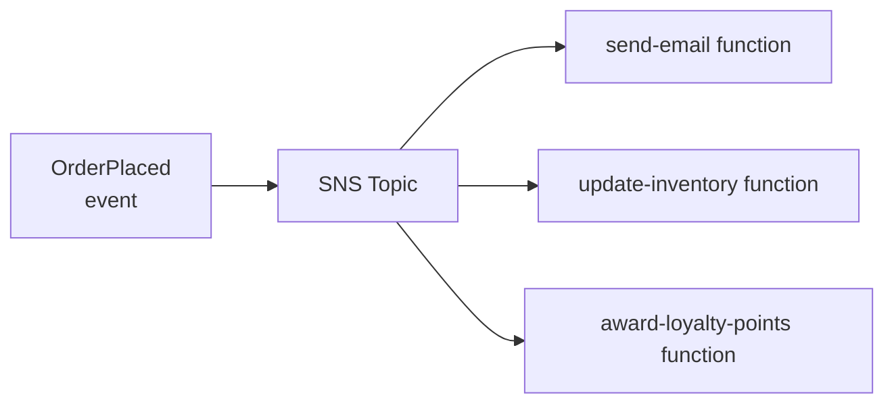

# Serverless Architecture

> Deploy individual functions as the unit of execution. The cloud provider manages all server infrastructure — scaling, patching, and availability are handled automatically.

---

## The Problem

Provisioning and managing servers for workloads that are bursty, intermittent, or unpredictable wastes money and operational effort.

```
Traditional approach:
- Reserve servers for peak load → 80% idle the rest of the time
- Pay for 24/7 whether you have traffic or not
- Manual scaling during traffic spikes
- OS patching, security updates, capacity planning = operational burden
```

---

## The Solution: Functions as a Service (FaaS)

Write a function. Deploy it. The platform:
- Runs it only when triggered
- Scales automatically (from 0 to thousands of instances)
- Charges per invocation and execution time (not idle time)
- Handles all server management

```python
# AWS Lambda handler — pure business logic, no server code
import json
import boto3

def handler(event, context):
    """
    Triggered by: API Gateway, S3 event, SQS message, scheduled cron, etc.
    event: the trigger payload
    context: Lambda runtime info (timeout, memory, request ID)
    """
    order_id = event["pathParameters"]["orderId"]

    dynamodb = boto3.resource("dynamodb")
    table = dynamodb.Table("orders")

    response = table.get_item(Key={"orderId": order_id})
    order = response.get("Item")

    if not order:
        return {
            "statusCode": 404,
            "body": json.dumps({"error": "Order not found"}),
        }

    return {
        "statusCode": 200,
        "headers": {"Content-Type": "application/json"},
        "body": json.dumps(order),
    }
```

---

## Serverless Event Sources

Functions are triggered by events — not running continuously.



---

## The Cold Start Problem

When a function hasn't been called recently, the platform must:
1. Download the function code
2. Initialize the runtime (Python, Node.js, etc.)
3. Execute the handler

This initialization (cold start) adds **100ms–2000ms latency** to the first invocation after idle time.

```python
# Cold start mitigation 1: Move initialization outside the handler
# These run ONCE per container lifecycle, not per invocation

import boto3

# ✅ Module-level initialization — runs at cold start only
dynamodb = boto3.resource("dynamodb")   # expensive connection
table = dynamodb.Table("orders")
logger = get_configured_logger()

# ✅ Cached across warm invocations
_db_connection = None

def get_db():
    global _db_connection
    if _db_connection is None:
        _db_connection = create_connection()
    return _db_connection

def handler(event, context):
    # This runs on EVERY invocation — keep it fast
    order_id = event["pathParameters"]["orderId"]
    response = table.get_item(Key={"orderId": order_id})
    return format_response(response)
```

```python
# Cold start mitigation 2: Provisioned Concurrency (AWS Lambda)
# AWS keeps N instances always warm — no cold starts for those N invocations
# Cost: you pay for idle time again (trade-off)

# In Terraform:
# aws_lambda_provisioned_concurrency_config {
#   function_name   = aws_lambda_function.get_order.function_name
#   qualifier       = aws_lambda_alias.live.name
#   provisioned_concurrent_executions = 5
# }
```

---

## Serverless Patterns

### Fan-Out

One event triggers multiple parallel functions.



### Chained Functions (Step Functions)

Orchestrate a sequence of functions as a state machine.

```python
# AWS Step Functions definition (ASL JSON)
{
  "StartAt": "ValidateOrder",
  "States": {
    "ValidateOrder": {
      "Type": "Task",
      "Resource": "arn:aws:lambda:...:validate-order",
      "Next": "ProcessPayment"
    },
    "ProcessPayment": {
      "Type": "Task",
      "Resource": "arn:aws:lambda:...:process-payment",
      "Catch": [{"ErrorEquals": ["PaymentFailed"], "Next": "HandlePaymentFailure"}],
      "Next": "FulfillOrder"
    },
    "FulfillOrder": {
      "Type": "Task",
      "Resource": "arn:aws:lambda:...:fulfill-order",
      "End": true
    },
    "HandlePaymentFailure": {
      "Type": "Task",
      "Resource": "arn:aws:lambda:...:notify-payment-failure",
      "End": true
    }
  }
}
```

### API Gateway + Lambda (REST API)

```
POST /orders        → create-order function
GET  /orders/{id}   → get-order function
PUT  /orders/{id}   → update-order function
DELETE /orders/{id} → cancel-order function
```

```python
# Shared infrastructure code (keep DRY across functions)
# shared/response.py

def ok(body: dict) -> dict:
    return {"statusCode": 200, "headers": {"Content-Type": "application/json"},
            "body": json.dumps(body)}

def not_found(message: str) -> dict:
    return {"statusCode": 404, "body": json.dumps({"error": message})}

def bad_request(message: str) -> dict:
    return {"statusCode": 400, "body": json.dumps({"error": message})}
```

---

## Deployment with Serverless Framework

```yaml
# serverless.yml
service: order-api

provider:
  name: aws
  runtime: python3.12
  region: us-east-1
  environment:
    ORDERS_TABLE: ${self:service}-orders-${sls:stage}

functions:
  getOrder:
    handler: handlers/get_order.handler
    events:
      - httpApi:
          path: /orders/{orderId}
          method: GET
    timeout: 10

  createOrder:
    handler: handlers/create_order.handler
    events:
      - httpApi:
          path: /orders
          method: POST
    timeout: 30

  processPayment:
    handler: handlers/process_payment.handler
    events:
      - sqs:
          arn: !GetAtt PaymentsQueue.Arn
          batchSize: 10

resources:
  Resources:
    OrdersTable:
      Type: AWS::DynamoDB::Table
      Properties:
        TableName: ${self:provider.environment.ORDERS_TABLE}
        BillingMode: PAY_PER_REQUEST
        AttributeDefinitions:
          - AttributeName: orderId
            AttributeType: S
        KeySchema:
          - AttributeName: orderId
            KeyType: HASH
```

---

## Cost Model

| Model | Cost | Best For |
|-------|------|----------|
| **Serverless** | Per invocation + GB-seconds | Spiky, unpredictable traffic |
| **Containers (ECS/EKS)** | Per running instance | Steady-state, high-volume traffic |
| **VMs** | Per hour | Predictable, consistent load |

Break-even: Serverless becomes more expensive than containers at ~10 million+ invocations/month with high memory requirements.

---

## When to Use / When NOT to Use

**Use when:**
- Event-driven, async workloads (file processing, queue consumers, webhooks).
- Unpredictable or spiky traffic patterns.
- Scheduled tasks (cron jobs, nightly reports).
- Small teams with limited ops capacity.

**Don't use when:**
- Long-running processes (Lambda max 15 minutes).
- Latency-sensitive real-time applications where cold starts are unacceptable.
- Compute-heavy workloads with consistent traffic (containers are cheaper).
- Complex stateful workflows (use Step Functions or containers).

---

## Key Takeaways

- Serverless shifts operational responsibility to the cloud provider — you manage code, not servers.
- The unit of deployment is a function, triggered by an event.
- Cold starts are the main latency pitfall — mitigate with module-level initialization and provisioned concurrency.
- Cost is per invocation — excellent for intermittent workloads, potentially expensive for high-volume steady-state.
- Keep functions small, single-purpose, and stateless.
