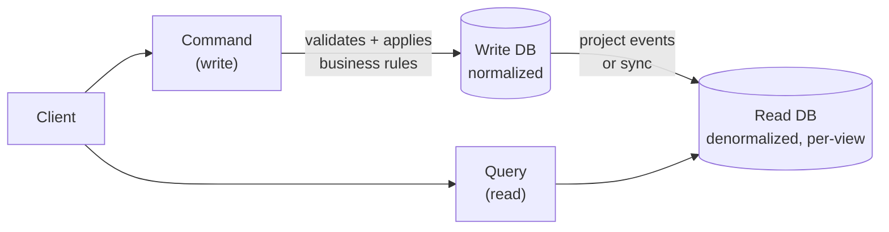
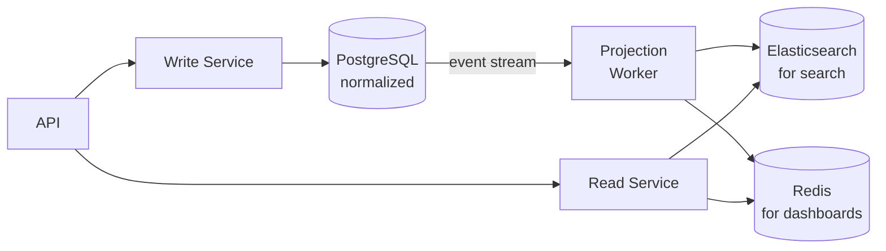

# CQRS — Command Query Responsibility Segregation

> Separate the model used to update information (Commands) from the model used to read information (Queries). They have different needs — stop forcing one model to satisfy both.

---

## The Problem

A single model that handles both reads and writes is optimized for neither.

```python
# BAD: One User model forced to serve both concerns.

class User:
    id: int
    first_name: str
    last_name: str
    email: str
    hashed_password: str        # write concern
    failed_login_attempts: int  # write concern
    last_login: datetime        # write concern
    role: str
    created_at: datetime
    updated_at: datetime
    # ... 20 more fields for audit, permissions, preferences

# For a dashboard that shows "name + last login", you load all 25 fields.
# For authentication, you need hashed_password + failed_login_attempts,
# but load the entire heavy model.
```

**Read-side issues:**
- Reads must join many tables or load large objects even when displaying a few fields.
- Complex reporting queries run on the same database that handles writes, slowing both down.
- Read-side scaling (replicas) is disconnected from write-side scaling.

---

## The Solution

Use **two separate models**:
- **Command model** (Write side): optimized for consistency, validation, and business rules.
- **Query model** (Read side): optimized for the specific view needed. Denormalized. Fast.



---

## Command Side

Commands represent **intent to change state**. They carry a verb: `CreateUser`, `UpdateEmail`, `PlaceOrder`.

```python
from dataclasses import dataclass
from abc import ABC, abstractmethod

# --- Commands (DTOs expressing intent) ---
@dataclass(frozen=True)
class CreateUserCommand:
    email: str
    first_name: str
    last_name: str
    password_plaintext: str

@dataclass(frozen=True)
class UpdateUserEmailCommand:
    user_id: int
    new_email: str

# --- Command Handler ---
class CreateUserHandler:
    def __init__(self, user_repo, password_hasher, event_bus):
        self._repo = user_repo
        self._hasher = password_hasher
        self._events = event_bus

    def handle(self, cmd: CreateUserCommand) -> int:
        if self._repo.exists_by_email(cmd.email):
            raise EmailAlreadyExistsError(cmd.email)

        user = User(
            email=cmd.email,
            first_name=cmd.first_name,
            last_name=cmd.last_name,
            hashed_password=self._hasher.hash(cmd.password_plaintext),
        )
        user_id = self._repo.save(user)
        self._events.publish("user.created", {"user_id": user_id, "email": cmd.email})
        return user_id

# --- Command Bus: routes commands to handlers ---
class CommandBus:
    def __init__(self):
        self._handlers: dict[type, object] = {}

    def register(self, command_type: type, handler) -> None:
        self._handlers[command_type] = handler

    def dispatch(self, command) -> any:
        handler = self._handlers.get(type(command))
        if handler is None:
            raise ValueError(f"No handler for {type(command).__name__}")
        return handler.handle(command)

# Wiring
bus = CommandBus()
bus.register(CreateUserCommand, CreateUserHandler(repo, hasher, event_bus))
bus.register(UpdateUserEmailCommand, UpdateUserEmailHandler(repo, event_bus))

# Usage
user_id = bus.dispatch(CreateUserCommand("alice@example.com", "Alice", "Smith", "p@ss"))
```

---

## Query Side

Queries return **read-optimized view models**. No business logic. No mutations. Tailored to the exact shape the UI needs.

```python
from dataclasses import dataclass

# --- View Models (tailored to each use case, not the domain model) ---
@dataclass(frozen=True)
class UserProfileView:
    id: int
    full_name: str
    email: str
    member_since: str   # pre-formatted for display

@dataclass(frozen=True)
class UserDashboardView:
    id: int
    full_name: str
    last_login: str
    open_orders: int
    total_spent: float

# --- Query Handlers (return exactly what the view needs) ---
class GetUserProfileQueryHandler:
    def __init__(self, db):
        self._db = db

    def handle(self, user_id: int) -> UserProfileView:
        row = self._db.execute("""
            SELECT id, first_name || ' ' || last_name AS full_name,
                   email, to_char(created_at, 'Month DD, YYYY') AS member_since
            FROM users WHERE id = %s
        """, (user_id,)).fetchone()
        if row is None:
            raise UserNotFoundError(user_id)
        return UserProfileView(**row)

class GetUserDashboardQueryHandler:
    def __init__(self, read_db):
        self._db = read_db   # Could be a separate read replica or materialized view

    def handle(self, user_id: int) -> UserDashboardView:
        # This query would be expensive to run on the write DB
        # On a read-optimized model, it's pre-computed
        row = self._db.execute("""
            SELECT u.id, u.first_name || ' ' || u.last_name AS full_name,
                   to_char(u.last_login, 'DD Mon YYYY HH24:MI') AS last_login,
                   COUNT(o.id) FILTER (WHERE o.status = 'OPEN') AS open_orders,
                   COALESCE(SUM(o.total), 0) AS total_spent
            FROM users u
            LEFT JOIN orders o ON o.user_id = u.id
            WHERE u.id = %s
            GROUP BY u.id
        """, (user_id,)).fetchone()
        return UserDashboardView(**row)
```

---

## Synchronizing the Read Model

When the write model changes, the read model must be updated. Three approaches:

### 1. Synchronous Projection (simple)

Update both models in the same transaction.

```python
def handle(self, cmd: CreateUserCommand) -> int:
    user_id = self._write_repo.save(user)
    # Update read model in same transaction
    self._read_repo.upsert_user_summary(user_id, full_name, email)
    return user_id
```

### 2. Event-Driven Projection (recommended)

Write side publishes events. A projection reads events and updates the read model asynchronously.

```python
class UserReadModelProjection:
    """Consumes events and keeps the read model up to date."""
    def __init__(self, read_db):
        self._db = read_db

    def on_user_created(self, event: dict) -> None:
        self._db.execute("""
            INSERT INTO user_summaries (id, full_name, email, created_at)
            VALUES (%s, %s, %s, NOW())
        """, (event["user_id"], event["full_name"], event["email"]))

    def on_order_placed(self, event: dict) -> None:
        self._db.execute("""
            UPDATE user_summaries
            SET total_spent = total_spent + %s, open_orders = open_orders + 1
            WHERE id = %s
        """, (event["order_total"], event["user_id"]))
```

### 3. Materialized Views (database-level)

Let the database maintain the read model as a materialized view — refreshed automatically or on schedule.

---

## Separate Read Database

For high-performance systems, the read model lives in a different datastore:



---

## CQRS + Event Sourcing

CQRS pairs naturally with Event Sourcing (next section):
- Write side: store events instead of current state.
- Read side: project events into any shape needed.

---

## When to Use / When NOT to Use

**Use when:**
- Read and write workloads have significantly different scaling needs.
- Complex reporting queries are slowing down the write database.
- You have many different read views of the same data.
- Combined with Event Sourcing for audit trails.

**Don't use when:**
- Simple CRUD apps — two models for one resource adds complexity with no benefit.
- The team is small and read/write patterns are similar.

---

## Key Takeaways

- CQRS separates reading and writing into different code paths — each optimized for its purpose.
- Commands mutate state; Queries return view models — never the other way around.
- The read model can be any shape the UI needs — it doesn't have to match the domain model.
- You pay for complexity: two models to maintain, synchronization logic, eventual consistency on the read side.
- Start without CQRS. Add it only when a single model demonstrably hurts performance or complexity.
