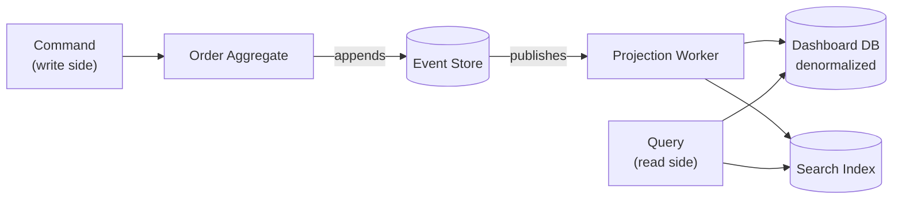

# Event Sourcing

> Instead of storing only the current state of an entity, store the full sequence of events that led to that state. The current state is derived by replaying events.

---

## The Problem

Traditional systems store only the **current state**. The history is gone.

```sql
-- Traditional approach: only current state survives
UPDATE orders SET status = 'SHIPPED', shipped_at = NOW() WHERE id = 42;

-- What happened before? You have no idea.
-- When was it created? When was it confirmed? Who modified it? What changed?
-- All historical information is destroyed on every UPDATE.
```

Problems this creates:
- No audit trail for compliance or debugging.
- Can't answer "what did this look like 3 days ago?"
- Can't replay historical data for new analytics.
- State corruption is silent — if a bug sets wrong state, the correct state is lost forever.

---

## The Solution

Never update or delete records. **Append only**. Store events.

```
Events table (append-only):
┌─────┬──────────┬──────────────────┬───────────────────────────────────────────────────────┐
│ seq │ order_id │ type             │ data                                                  │
├─────┼──────────┼──────────────────┼───────────────────────────────────────────────────────┤
│ 1   │ 42       │ OrderCreated     │ {"customer_id": 7, "items": [...], "total": 99.99}   │
│ 2   │ 42       │ OrderConfirmed   │ {"confirmed_at": "2024-01-15T10:30:00"}               │
│ 3   │ 42       │ PaymentReceived  │ {"amount": 99.99, "method": "credit_card"}            │
│ 4   │ 42       │ ItemShipped      │ {"tracking": "1Z999AA10123456784"}                    │
│ 5   │ 42       │ OrderDelivered   │ {"delivered_at": "2024-01-20T14:22:00"}               │
└─────┴──────────┴──────────────────┴───────────────────────────────────────────────────────┘
```

The current state is **derived** by replaying all events for an entity.

---

## Implementing an Event Store

```python
from dataclasses import dataclass, field, asdict
from datetime import datetime
from uuid import uuid4, UUID
from typing import Any
import json

# --- Events ---
@dataclass(frozen=True)
class DomainEvent:
    event_id: UUID = field(default_factory=uuid4)
    occurred_at: datetime = field(default_factory=datetime.utcnow)

@dataclass(frozen=True)
class OrderCreated(DomainEvent):
    order_id: int = 0
    customer_id: int = 0
    items: tuple = ()
    total: float = 0.0

@dataclass(frozen=True)
class OrderConfirmed(DomainEvent):
    order_id: int = 0

@dataclass(frozen=True)
class PaymentReceived(DomainEvent):
    order_id: int = 0
    amount: float = 0.0
    method: str = ""

@dataclass(frozen=True)
class OrderShipped(DomainEvent):
    order_id: int = 0
    tracking_number: str = ""

@dataclass(frozen=True)
class OrderDelivered(DomainEvent):
    order_id: int = 0


# --- Event Store ---
class EventStore:
    def __init__(self, db):
        self._db = db

    def append(self, stream_id: str, events: list[DomainEvent],
               expected_version: int | None = None) -> None:
        """Append events to a stream. expected_version enables optimistic concurrency."""
        for event in events:
            self._db.execute("""
                INSERT INTO events (stream_id, event_type, data, occurred_at)
                VALUES (%s, %s, %s, %s)
            """, (
                stream_id,
                type(event).__name__,
                json.dumps(asdict(event), default=str),
                event.occurred_at,
            ))

    def load(self, stream_id: str, from_version: int = 0) -> list[dict]:
        rows = self._db.execute("""
            SELECT event_type, data, occurred_at, seq
            FROM events
            WHERE stream_id = %s AND seq > %s
            ORDER BY seq ASC
        """, (stream_id, from_version)).fetchall()
        return [{"type": r["event_type"], "data": json.loads(r["data"]),
                 "seq": r["seq"]} for r in rows]
```

---

## Aggregate: State from Events

The aggregate rebuilds its state by applying each event in sequence.

```python
from enum import Enum

class OrderStatus(Enum):
    PENDING   = "PENDING"
    CONFIRMED = "CONFIRMED"
    PAID      = "PAID"
    SHIPPED   = "SHIPPED"
    DELIVERED = "DELIVERED"

class Order:
    """Reconstructs state by replaying events."""

    def __init__(self, order_id: int):
        self.order_id = order_id
        self.status = None
        self.customer_id = None
        self.items = []
        self.total = 0.0
        self.tracking_number = None
        self._version = 0
        self._uncommitted_events: list[DomainEvent] = []

    # ── Command methods (business logic → emit events) ──
    def create(self, customer_id: int, items: list, total: float) -> None:
        if self.status is not None:
            raise ValueError("Order already exists")
        self._emit(OrderCreated(order_id=self.order_id,
                                customer_id=customer_id,
                                items=tuple(items),
                                total=total))

    def confirm(self) -> None:
        if self.status != OrderStatus.PENDING:
            raise ValueError(f"Cannot confirm an order in {self.status} state")
        self._emit(OrderConfirmed(order_id=self.order_id))

    def receive_payment(self, amount: float, method: str) -> None:
        if self.status != OrderStatus.CONFIRMED:
            raise ValueError("Payment received for unconfirmed order")
        self._emit(PaymentReceived(order_id=self.order_id, amount=amount, method=method))

    def ship(self, tracking_number: str) -> None:
        if self.status != OrderStatus.PAID:
            raise ValueError("Cannot ship unpaid order")
        self._emit(OrderShipped(order_id=self.order_id, tracking_number=tracking_number))

    # ── Apply methods (update in-memory state) ──
    def _apply(self, event: DomainEvent) -> None:
        if isinstance(event, OrderCreated):
            self.status = OrderStatus.PENDING
            self.customer_id = event.customer_id
            self.items = list(event.items)
            self.total = event.total
        elif isinstance(event, OrderConfirmed):
            self.status = OrderStatus.CONFIRMED
        elif isinstance(event, PaymentReceived):
            self.status = OrderStatus.PAID
        elif isinstance(event, OrderShipped):
            self.status = OrderStatus.SHIPPED
            self.tracking_number = event.tracking_number
        elif isinstance(event, OrderDelivered):
            self.status = OrderStatus.DELIVERED

    def _emit(self, event: DomainEvent) -> None:
        self._apply(event)
        self._uncommitted_events.append(event)

    # ── Reconstitute from event history ──
    @classmethod
    def from_history(cls, order_id: int, events: list) -> "Order":
        order = cls(order_id)
        for event_data in events:
            # Deserialize event from store
            event_type = globals()[event_data["type"]]
            event = event_type(**event_data["data"])
            order._apply(event)
            order._version += 1
        return order

    def take_uncommitted_events(self) -> list[DomainEvent]:
        events = self._uncommitted_events.copy()
        self._uncommitted_events.clear()
        return events
```

### Repository with Event Store

```python
class OrderRepository:
    def __init__(self, event_store: EventStore):
        self._store = event_store

    def load(self, order_id: int) -> Order:
        stream_id = f"order-{order_id}"
        history = self._store.load(stream_id)
        if not history:
            raise OrderNotFoundError(order_id)
        return Order.from_history(order_id, history)

    def save(self, order: Order) -> None:
        stream_id = f"order-{order.order_id}"
        events = order.take_uncommitted_events()
        self._store.append(stream_id, events)


# --- Usage ---
repo = OrderRepository(event_store)

# Create
order = Order(order_id=42)
order.create(customer_id=7, items=[{"product_id": 1, "qty": 2, "price": 49.99}], total=99.99)
order.confirm()
repo.save(order)

# Later — load and continue
order = repo.load(42)
order.receive_payment(99.99, "credit_card")
order.ship("1Z999AA10123456784")
repo.save(order)

# Load again — full history replayed
order = repo.load(42)
print(order.status)          # SHIPPED
print(order.tracking_number) # 1Z999AA10123456784
```

---

## Snapshots (Performance Optimization)

Replaying 10,000 events per request is slow. Take a snapshot periodically.

```python
class SnapshotRepository:
    SNAPSHOT_THRESHOLD = 100

    def save(self, order: Order) -> None:
        events = order.take_uncommitted_events()
        self._event_store.append(f"order-{order.order_id}", events)

        if order._version % self.SNAPSHOT_THRESHOLD == 0:
            # Save a snapshot every 100 events
            self._snapshot_store.save(f"order-{order.order_id}", {
                "version": order._version,
                "state": asdict(order),   # current state snapshot
            })

    def load(self, order_id: int) -> Order:
        snapshot = self._snapshot_store.load(f"order-{order_id}")
        if snapshot:
            # Start from snapshot, apply only events after snapshot version
            order = Order.from_snapshot(order_id, snapshot["state"])
            events = self._event_store.load(f"order-{order_id}",
                                            from_version=snapshot["version"])
        else:
            order = Order(order_id)
            events = self._event_store.load(f"order-{order_id}")

        for event_data in events:
            order._apply(deserialize_event(event_data))
        return order
```

---

## Temporal Queries

Event Sourcing makes "time travel" trivial:

```python
# What was the order status on January 15th?
def get_order_state_at(order_id: int, timestamp: datetime) -> Order:
    history = event_store.load(f"order-{order_id}")
    order = Order(order_id)
    for event_data in history:
        if event_data["occurred_at"] > timestamp:
            break   # stop replaying at the point in time we care about
        order._apply(deserialize_event(event_data))
    return order
```

---

## Event Sourcing + CQRS



---

## When to Use / When NOT to Use

**Use when:**
- You need a complete audit trail (financial, medical, legal systems).
- Business needs temporal queries ("what did this look like last month?").
- You want to rebuild projections (new reporting view over historical data).
- Combined with CQRS for maximum flexibility.

**Don't use when:**
- Simple CRUD with no audit requirements.
- The team is unfamiliar with the pattern — there's a steep learning curve.
- Your entities have millions of events per aggregate — snapshot strategy becomes critical.

---

## Key Takeaways

- Event Sourcing stores **how we got here**, not just where we are.
- State is always derived by replaying events — current state is a projection.
- The event log is immutable — it is the single source of truth.
- Enables temporal queries, full audit trail, and projection rebuilding.
- Use snapshots to avoid replaying thousands of events on every load.
- Best paired with CQRS: event store on the write side, projected views on the read side.
