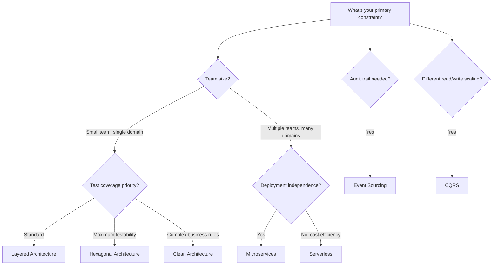

# 02 — Architecture Patterns

> High-level blueprints for structuring entire systems.

Where design patterns solve problems at the class level, architecture patterns solve problems at the *system* level — how to organize entire applications, how components communicate, how data flows.

## Topics

| # | Pattern | Scale | Best For |
|---|---------|-------|----------|
| 1 | [Layered Architecture](./01-layered-architecture.md) | Application | Standard web apps, most business systems |
| 2 | [MVC / MVP / MVVM](./02-mvc-mvp-mvvm.md) | Application | UI-heavy apps, separation of presentation |
| 3 | [Clean Architecture](./03-clean-architecture.md) | Application | Complex domain logic, long-lived systems |
| 4 | [Hexagonal Architecture](./04-hexagonal-architecture.md) | Application | Maximum testability, swappable infrastructure |
| 5 | [Event-Driven Architecture](./05-event-driven-architecture.md) | System | Async workflows, decoupled systems |
| 6 | [Microservices](./06-microservices.md) | System | Independent deployability, team scalability |
| 7 | [Serverless](./07-serverless.md) | System | Variable workloads, minimal ops overhead |
| 8 | [CQRS](./08-cqrs.md) | Application/System | Different read/write scaling needs |
| 9 | [Event Sourcing](./09-event-sourcing.md) | Application/System | Full audit trail, temporal queries |

## How to Choose

