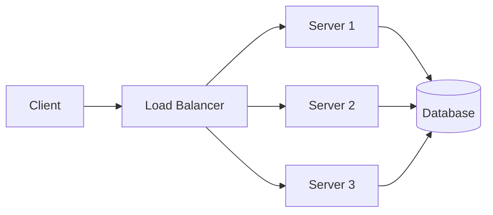
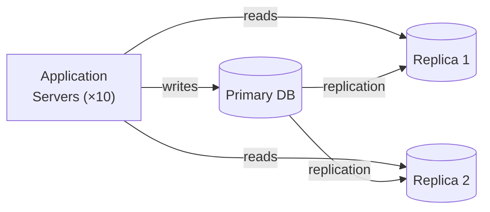
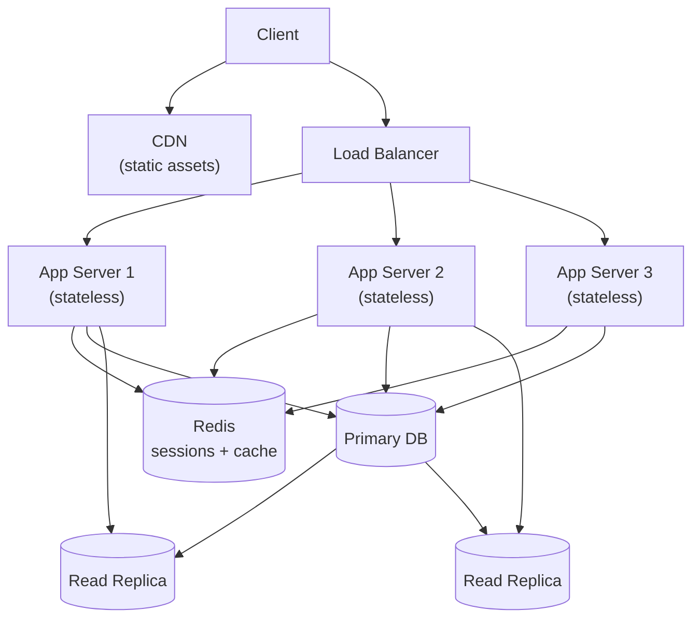

# Scalability

> The ability of a system to handle a growing amount of work by adding resources.

---

## The Problem

Your system works fine for 100 users. Then you hit 10,000, then 1,000,000. The architecture that worked at small scale breaks down:
- The single server is CPU-saturated.
- The database can't keep up with write load.
- Response times climb from 50ms to 5 seconds.

---

## Vertical vs. Horizontal Scaling

### Vertical Scaling (Scale Up)

Add more resources to the **same** machine: more CPU, more RAM, faster disk.

```
Before: 4 CPU, 16GB RAM → After: 32 CPU, 256GB RAM
```

**Pros:** Simple. No code changes. No distribution complexity.  
**Cons:** Has a hard limit (biggest machine available). Single point of failure. Expensive at high end.

### Horizontal Scaling (Scale Out)

Add **more machines** and distribute the load across them.

```
Before: 1 server → After: 10 servers behind a load balancer
```

**Pros:** Theoretically unlimited. Fault-tolerant (one machine fails, others continue). Cost-effective at large scale.  
**Cons:** Requires stateless services. Needs load balancer. Distributed systems problems apply.



---

## Stateless Services — The Key to Horizontal Scaling

For horizontal scaling to work, any server must be able to handle any request. This requires servers to be **stateless** — they store no user-specific data between requests.

```python
# BAD: Storing session state in memory — breaks with multiple servers.
# User logs in on Server 1, next request goes to Server 2 → no session found.

sessions = {}   # in-memory — exists only on this server

@app.route("/login", methods=["POST"])
def login():
    user = authenticate(request.json["username"], request.json["password"])
    sessions[user.id] = {"user_id": user.id, "role": user.role}
    return jsonify({"session_id": user.id})

@app.route("/profile")
def profile():
    session_id = request.headers.get("Session-Id")
    session = sessions.get(session_id)   # only works if same server handles both requests!
    if not session:
        return 401
    ...
```

```python
# GOOD: State stored in Redis (shared across all servers).
import redis
import jwt

redis_client = redis.Redis(host="redis.internal", port=6379)

@app.route("/login", methods=["POST"])
def login():
    user = authenticate(request.json["username"], request.json["password"])
    # JWT is stateless — any server can verify it with the secret key
    token = jwt.encode(
        {"user_id": user.id, "role": user.role, "exp": ...},
        SECRET_KEY,
        algorithm="HS256",
    )
    return jsonify({"token": token})

@app.route("/profile")
def profile():
    token = request.headers.get("Authorization", "").replace("Bearer ", "")
    payload = jwt.decode(token, SECRET_KEY, algorithms=["HS256"])
    # Any server can decode this — stateless!
    ...
```

---

## Database Scaling

The application servers can scale horizontally easily. The database is the hardest part.

### Read Replicas

For read-heavy workloads, add database replicas. All writes go to the primary; reads are distributed across replicas.

```python
class DatabasePool:
    def __init__(self):
        self.primary = create_connection(PRIMARY_DB_URL)
        self.replicas = [
            create_connection(REPLICA_1_URL),
            create_connection(REPLICA_2_URL),
        ]
        self._replica_index = 0

    def write_connection(self):
        return self.primary

    def read_connection(self):
        # Round-robin across replicas
        conn = self.replicas[self._replica_index % len(self.replicas)]
        self._replica_index += 1
        return conn

class OrderRepository:
    def save(self, order: Order) -> None:
        db.write_connection().execute("INSERT INTO orders ...", order)

    def find_by_id(self, order_id: int) -> Order:
        return db.read_connection().execute("SELECT * FROM orders WHERE id=%s", order_id)
```



### Database Sharding

Split data across multiple databases based on a shard key.

```python
class ShardedUserRepository:
    NUM_SHARDS = 4

    def __init__(self, shard_connections: list):
        self._shards = shard_connections

    def _get_shard(self, user_id: int):
        """Hash-based sharding — consistent distribution."""
        shard_index = user_id % self.NUM_SHARDS
        return self._shards[shard_index]

    def find_by_id(self, user_id: int) -> dict | None:
        shard = self._get_shard(user_id)
        return shard.execute("SELECT * FROM users WHERE id=%s", user_id).fetchone()

    def save(self, user: dict) -> None:
        shard = self._get_shard(user["id"])
        shard.execute("INSERT INTO users ...", user)
```

**Sharding trade-offs:**
- Cross-shard queries are expensive (joins across shards don't work).
- Resharding (adding more shards) requires data migration.
- Consistent hashing reduces resharding impact.

---

## Stateless Application Server Pattern



---

## Auto-Scaling

Cloud platforms can automatically add/remove servers based on load.

```yaml
# AWS Auto Scaling configuration
AutoScalingGroup:
  MinSize: 2          # always at least 2 servers
  MaxSize: 20         # never more than 20 servers
  DesiredCapacity: 4

ScalingPolicy:
  ScaleOut:
    MetricType: CPUUtilization
    Threshold: 70     # add a server when avg CPU > 70%
    Cooldown: 300     # wait 5 min before scaling again
  ScaleIn:
    Threshold: 30     # remove a server when avg CPU < 30%
```

---

## Scalability Checklist

| Concern | Solution |
|---------|----------|
| App server state | Externalize to Redis, use JWT |
| Static files | CDN (CloudFront, Cloudflare) |
| Read-heavy DB | Read replicas |
| Write-heavy DB | Sharding or CQRS |
| Background jobs | Queue (SQS, Celery) + worker pool |
| Expensive computations | Cache results (Redis) |
| Geographic distribution | Multi-region with latency routing |

---

## Key Takeaways

- Horizontal scaling requires stateless services — move all state to a shared store (Redis, database).
- Database is usually the bottleneck — read replicas and caching solve most read problems.
- Auto-scaling is the cloud way: provision for average load, scale automatically for peaks.
- Measure before adding complexity — premature optimization creates over-engineered systems.
- Scalability is a spectrum: design for 10x current load, not 1000x.
