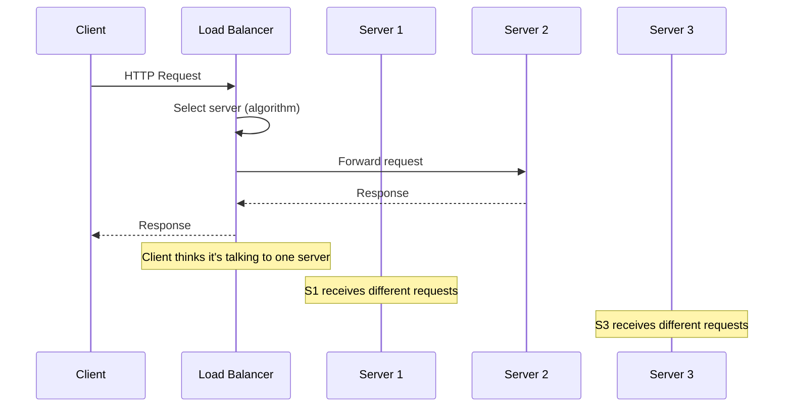

# Load Balancing

> Distribute incoming network traffic across multiple servers to ensure no single server bears too much load, improving availability and throughput.

---

## The Problem

A single server has finite capacity. Without load balancing:
- One server saturates while others idle.
- A server crash takes the entire service down.
- Deployments require downtime.

---

## How a Load Balancer Works



The client talks to a single virtual IP. The load balancer forwards to one of the backend servers.

---

## Load Balancing Algorithms

### 1. Round Robin

Requests distributed in sequence: Server 1, Server 2, Server 3, Server 1, ...

```python
class RoundRobinBalancer:
    def __init__(self, servers: list[str]):
        self._servers = servers
        self._index = 0

    def get_server(self) -> str:
        server = self._servers[self._index % len(self._servers)]
        self._index += 1
        return server

balancer = RoundRobinBalancer(["server1:8080", "server2:8080", "server3:8080"])
print(balancer.get_server())   # server1:8080
print(balancer.get_server())   # server2:8080
print(balancer.get_server())   # server3:8080
print(balancer.get_server())   # server1:8080
```

**Best for:** Servers with uniform capacity, requests with similar processing time.  
**Weakness:** Doesn't account for server load or request weight.

### 2. Weighted Round Robin

Servers with more capacity get more requests.

```python
class WeightedRoundRobinBalancer:
    def __init__(self, servers: list[tuple[str, int]]):
        # Expand: [("server1", 3), ("server2", 1)] → ["server1", "server1", "server1", "server2"]
        self._pool = [server for server, weight in servers for _ in range(weight)]
        self._index = 0

    def get_server(self) -> str:
        server = self._pool[self._index % len(self._pool)]
        self._index += 1
        return server

# server1 has 3x the capacity of server2
balancer = WeightedRoundRobinBalancer([
    ("server1:8080", 3),   # powerful server
    ("server2:8080", 1),   # smaller server
])
```

### 3. Least Connections

Route to the server with the fewest active connections.

```python
import threading

class LeastConnectionsBalancer:
    def __init__(self, servers: list[str]):
        self._servers = {s: 0 for s in servers}   # server → active connection count
        self._lock = threading.Lock()

    def acquire(self) -> str:
        with self._lock:
            server = min(self._servers, key=lambda s: self._servers[s])
            self._servers[server] += 1
            return server

    def release(self, server: str) -> None:
        with self._lock:
            self._servers[server] = max(0, self._servers[server] - 1)
```

**Best for:** Long-lived connections, variable request processing time (some requests take much longer).

### 4. Consistent Hashing

A request's server is determined by hashing the request key (e.g., user ID, IP address). The same key always routes to the same server (unless that server is down).

```python
import hashlib
import bisect

class ConsistentHashBalancer:
    def __init__(self, servers: list[str], virtual_nodes: int = 100):
        self._ring: list[tuple[int, str]] = []
        for server in servers:
            for i in range(virtual_nodes):
                key = f"{server}:vnode:{i}"
                hash_val = int(hashlib.md5(key.encode()).hexdigest(), 16)
                bisect.insort(self._ring, (hash_val, server))

    def get_server(self, request_key: str) -> str:
        if not self._ring:
            raise ValueError("No servers available")
        hash_val = int(hashlib.md5(request_key.encode()).hexdigest(), 16)
        # Find the first server clockwise from the hash
        idx = bisect.bisect_left(self._ring, (hash_val,))
        idx = idx % len(self._ring)   # wrap around
        return self._ring[idx][1]

balancer = ConsistentHashBalancer(["server1:8080", "server2:8080", "server3:8080"])
# Same user_id always goes to the same server (cache affinity)
print(balancer.get_server("user_42"))   # deterministic
```

**Best for:** Caching (requests for same data go to same server). Minimizes cache invalidation when servers are added/removed.

---

## Health Checks

A load balancer must detect unhealthy servers and stop routing traffic to them.

```python
import requests
import threading
import time

class HealthAwareBalancer:
    def __init__(self, servers: list[str]):
        self._servers = servers
        self._healthy: set[str] = set(servers)
        self._check_interval = 10  # seconds
        threading.Thread(target=self._health_check_loop, daemon=True).start()

    def _health_check_loop(self) -> None:
        while True:
            for server in self._servers:
                try:
                    response = requests.get(f"http://{server}/health", timeout=2)
                    if response.status_code == 200:
                        self._healthy.add(server)
                    else:
                        self._healthy.discard(server)
                except requests.exceptions.RequestException:
                    self._healthy.discard(server)
            time.sleep(self._check_interval)

    def get_server(self) -> str | None:
        healthy = list(self._healthy)
        if not healthy:
            return None   # all servers down
        return healthy[hash(time.time()) % len(healthy)]


# Health endpoint on each server
@app.route("/health")
def health():
    return jsonify({
        "status": "healthy",
        "db": check_db_connection(),
        "memory_mb": get_memory_usage(),
    }), 200
```

---

## Layer 4 vs. Layer 7 Load Balancing

| | Layer 4 (Transport) | Layer 7 (Application) |
|-|---------------------|----------------------|
| **Works on** | TCP/UDP packets | HTTP requests |
| **Routing** | By IP + port only | By URL, headers, cookies, content |
| **Speed** | Very fast | Slightly slower (reads HTTP headers) |
| **Examples** | AWS NLB, HAProxy TCP | NGINX, AWS ALB, Traefik |
| **Use case** | Raw throughput, non-HTTP | HTTP microservices, content routing |

```nginx
# NGINX Layer 7 load balancer config
upstream api_servers {
    least_conn;   # algorithm

    server server1:8080 weight=3;
    server server2:8080 weight=1;
    server server3:8080;

    keepalive 32;   # keep connections open for efficiency
}

server {
    listen 80;

    # Route API requests to API servers
    location /api/ {
        proxy_pass http://api_servers;
        proxy_connect_timeout 5s;
        proxy_read_timeout 60s;
    }

    # Route static files to file servers
    location /static/ {
        proxy_pass http://static_servers;
    }
}
```

---

## Sticky Sessions (Session Affinity)

Sometimes you need the same client to always reach the same server (for in-memory session state, which you should avoid, or for stateful WebSocket connections).

```nginx
upstream websocket_servers {
    ip_hash;   # same client IP always routes to same server
    server ws1:8080;
    server ws2:8080;
}
```

**Warning:** Sticky sessions break even distribution and complicate deployments. Prefer stateless services with external session storage.

---

## Global Load Balancing (GeoDNS)

Route users to the nearest data center.

```
User in Europe  → DNS resolves to EU load balancer → EU servers
User in US      → DNS resolves to US load balancer → US servers
User in Asia    → DNS resolves to APAC load balancer → APAC servers
```

Services: AWS Route 53 latency routing, Cloudflare, Akamai.

---

## Key Takeaways

- Round Robin is the default; use Least Connections for variable-duration requests.
- Consistent Hashing minimizes cache disruption when servers are added or removed.
- Health checks are mandatory — a load balancer without health checks will send traffic to dead servers.
- Layer 7 load balancing enables content-based routing (route `/api` vs `/static` to different servers).
- Design services to be stateless so any server can handle any request — sticky sessions are a last resort.
