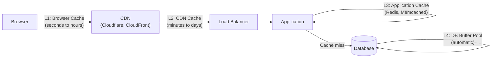

# Caching

> Store the result of an expensive operation so subsequent requests can be served from the cache — faster and without hitting the original source.

---

## The Problem

Every database read takes 5–50ms. For a page that makes 20 database queries, that's 100–1000ms just for data fetching. If 90% of those queries return the same data for the same user, you're doing the same work 90% of the time unnecessarily.

---

## Where to Cache



Each layer serves different content with different TTLs.

---

## Caching Strategies

### 1. Cache-Aside (Lazy Loading)

The application checks the cache first. On a miss, it reads from the database and populates the cache. The most common strategy.

```python
import redis
import json

cache = redis.Redis(host="redis.internal", decode_responses=True)

class UserRepository:
    def __init__(self, db, cache):
        self._db = db
        self._cache = cache

    def find_by_id(self, user_id: int) -> dict | None:
        cache_key = f"user:{user_id}"

        # 1. Check cache
        cached = self._cache.get(cache_key)
        if cached:
            return json.loads(cached)   # Cache HIT — fast path

        # 2. Cache MISS — query the database
        user = self._db.execute("SELECT * FROM users WHERE id=%s", user_id).fetchone()
        if user is None:
            return None

        # 3. Populate cache (TTL: 5 minutes)
        self._cache.setex(cache_key, 300, json.dumps(user))
        return user

    def update_user(self, user_id: int, updates: dict) -> None:
        self._db.execute("UPDATE users SET ... WHERE id=%s", user_id)
        # Invalidate cache — it's stale now
        self._cache.delete(f"user:{user_id}")
```

**Pros:** Cache only contains data that was actually requested (no cold cache waste).  
**Cons:** First request always misses (cache cold start). Stale data if invalidation is missed.

### 2. Write-Through

Write to cache and database simultaneously. Cache is always up to date.

```python
class UserRepository:
    def save(self, user: dict) -> None:
        # 1. Write to database
        self._db.execute("INSERT INTO users ...", user)
        # 2. Write to cache immediately
        self._cache.setex(f"user:{user['id']}", 300, json.dumps(user))

    def find_by_id(self, user_id: int) -> dict | None:
        cached = self._cache.get(f"user:{user_id}")
        if cached:
            return json.loads(cached)
        # Miss only happens for data that was never written since cache restart
        return self._db.execute("SELECT * FROM users WHERE id=%s", user_id).fetchone()
```

**Pros:** Cache always consistent with the database. No stale reads.  
**Cons:** Every write hits both the database AND the cache. Unused data also cached (wasteful).

### 3. Write-Behind (Write-Back)

Write to cache immediately, write to database asynchronously. Fastest writes, but risks data loss if cache crashes before database write.

```python
class WriteBackRepository:
    def __init__(self, db, cache, write_queue):
        self._db = db
        self._cache = cache
        self._queue = write_queue

    def save(self, user: dict) -> None:
        # Write to cache immediately (fast)
        self._cache.setex(f"user:{user['id']}", 3600, json.dumps(user))
        # Queue async database write (slow, doesn't block)
        self._queue.enqueue("sync_user_to_db", user)

    def flush(self, user_id: int) -> None:
        """Worker: actually write to DB."""
        cached = self._cache.get(f"user:{user_id}")
        if cached:
            self._db.execute("INSERT INTO users ... ON CONFLICT DO UPDATE SET ...", json.loads(cached))
```

**Pros:** Lowest write latency — feels instant.  
**Cons:** Data loss risk if cache fails before async write. Complexity of managing the write queue.

### 4. Read-Through

Cache sits in front of the database. The cache itself queries the database on a miss. Application only talks to the cache.

```python
# Redis modules like RedisGears or LookAside proxies implement this pattern.
# Application code is simple:
result = cache.get("user:42")   # Cache handles the DB query on miss
```

**Best for:** Managed cache layers (e.g., ElastiCache with Auto-TTL).

---

## Cache Eviction Policies

When the cache is full, which entry to remove?

| Policy | Rule | Best For |
|--------|------|----------|
| **LRU** (Least Recently Used) | Evict the entry not used for the longest time | General use (most common) |
| **LFU** (Least Frequently Used) | Evict the entry used the fewest times | When recency doesn't predict future use |
| **TTL** (Time To Live) | Evict entries after a fixed duration | Volatile data (prices, rates) |
| **FIFO** | Evict the oldest entry regardless of use | Simple, but suboptimal |
| **Random** | Evict a random entry | Simple, cache is huge anyway |

```python
from collections import OrderedDict

class LRUCache:
    def __init__(self, capacity: int):
        self._capacity = capacity
        self._cache = OrderedDict()

    def get(self, key: str) -> str | None:
        if key not in self._cache:
            return None
        self._cache.move_to_end(key)    # mark as recently used
        return self._cache[key]

    def put(self, key: str, value: str) -> None:
        if key in self._cache:
            self._cache.move_to_end(key)
        else:
            if len(self._cache) >= self._capacity:
                self._cache.popitem(last=False)   # evict LRU (first item)
        self._cache[key] = value
```

---

## Redis Patterns

### Simple Key-Value

```python
import redis
r = redis.Redis()

# String: user profile as JSON
r.setex("user:42", 300, json.dumps({"id": 42, "name": "Alice"}))

# Counter: rate limiting
r.incr("rate_limit:user:42:minute:2024011510")
r.expire("rate_limit:user:42:minute:2024011510", 60)

# Flag with TTL: "email verified in last hour"
r.setex("email_verified:42", 3600, "true")
```

### Hash: Partial Updates

```python
# Instead of serializing the whole object, use Redis Hash for partial updates
r.hset("user:42", mapping={"name": "Alice", "email": "alice@example.com", "role": "admin"})

# Update just the email without loading/serializing the whole user
r.hset("user:42", "email", "newalice@example.com")

# Read individual field
name = r.hget("user:42", "name")
```

### Sorted Set: Leaderboard

```python
# Add score
r.zadd("leaderboard", {"player:alice": 1500, "player:bob": 1200, "player:carol": 1800})

# Top 10 players
top_10 = r.zrevrange("leaderboard", 0, 9, withscores=True)
# [("player:carol", 1800), ("player:alice", 1500), ...]

# Player's rank
rank = r.zrevrank("leaderboard", "player:alice")   # 1 (0-indexed)
```

---

## Cache Invalidation Strategies

> "There are only two hard things in Computer Science: cache invalidation and naming things." — Phil Karlton

### TTL (Time-Based Expiry)

Simplest. Cache entries expire after N seconds. Accept brief stale reads.

```python
cache.setex(key, 60, value)   # Expires in 60 seconds
```

Good for: Product listings, public content, pricing (stale for seconds is acceptable).

### Event-Driven Invalidation

Invalidate when data changes.

```python
def update_user_email(user_id: int, new_email: str) -> None:
    db.execute("UPDATE users SET email=%s WHERE id=%s", new_email, user_id)
    cache.delete(f"user:{user_id}")             # direct invalidation
    cache.delete(f"user_dashboard:{user_id}")   # related view cache
```

Good for: Consistency-sensitive data.

### Cache Versioning

Add a version key. Incrementing the version key effectively invalidates all versioned cache entries without deleting them individually.

```python
def get_user_cache_key(user_id: int) -> str:
    version = cache.get("cache_version") or "1"
    return f"user:{user_id}:v{version}"

def invalidate_all_user_caches() -> None:
    cache.incr("cache_version")   # all old keys are now "wrong version"
```

---

## Cache Stampede (Thundering Herd)

When a popular cached item expires, thousands of requests simultaneously try to populate the cache — all hitting the database at once.

```python
import threading

class StampedeProtectedCache:
    def __init__(self, cache, db):
        self._cache = cache
        self._db = db
        self._locks: dict[str, threading.Lock] = {}

    def get(self, key: str, fetch_fn, ttl: int = 300) -> any:
        value = self._cache.get(key)
        if value:
            return json.loads(value)

        # Acquire a per-key lock — only one thread regenerates the cache
        lock = self._locks.setdefault(key, threading.Lock())
        with lock:
            # Double-check after acquiring lock
            value = self._cache.get(key)
            if value:
                return json.loads(value)
            # This thread regenerates; others wait for the lock
            result = fetch_fn()
            self._cache.setex(key, ttl, json.dumps(result))
            return result
```

---

## Key Takeaways

- Cache-Aside is the default pattern: check cache, miss → load from DB + populate cache.
- Write-through for strong consistency; write-behind for maximum write performance.
- LRU is the default eviction policy for most use cases.
- Cache invalidation is the hard part — use TTL when stale reads are acceptable; event-driven invalidation when they're not.
- Protect against cache stampedes with distributed locks or probabilistic refresh.
- Don't cache everything — cache only what is frequently read, expensive to compute, and changes infrequently.
