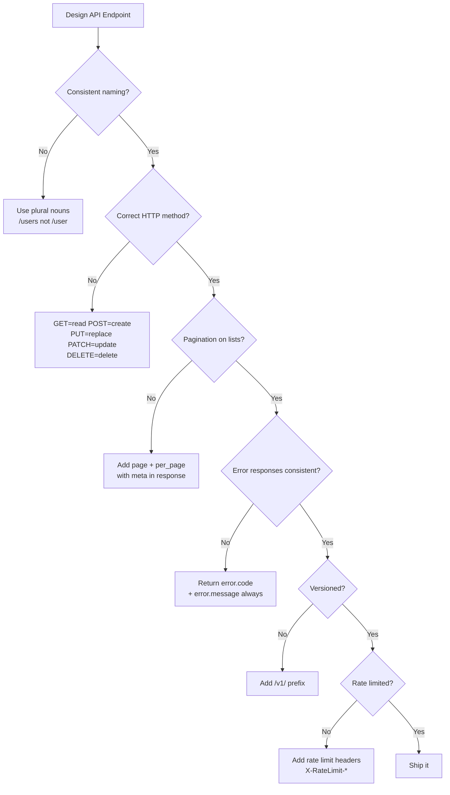

# API Design

> Design APIs that are usable, consistent, versioned, and performant. A good API is a product — it communicates your domain clearly and is a pleasure to build against.

---

## REST — Representational State Transfer

The dominant style for HTTP APIs. REST treats every resource as a URL and uses HTTP verbs to express operations.

### REST Principles

```
1. Resource-based URLs (nouns, not verbs)
2. Use HTTP methods correctly
3. Stateless (each request contains all needed context)
4. Consistent response structure
```

### URL Design

```
GOOD: nouns, hierarchical
GET    /users                   # list users
POST   /users                   # create user
GET    /users/{id}              # get user
PUT    /users/{id}              # replace user
PATCH  /users/{id}              # partially update user
DELETE /users/{id}              # delete user

GET    /users/{id}/orders       # list user's orders
POST   /users/{id}/orders       # create order for user
GET    /users/{id}/orders/{oid} # specific order

BAD: verbs, inconsistent
GET  /getUser?userId=42
POST /createOrder
GET  /user-orders-list/42
```

### HTTP Method Semantics

| Method | Meaning | Idempotent | Body |
|--------|---------|-----------|------|
| GET | Retrieve | Yes | No |
| POST | Create (non-idempotent) | No | Yes |
| PUT | Replace entirely | Yes | Yes |
| PATCH | Partial update | No (can be) | Yes |
| DELETE | Remove | Yes | No |

**Idempotent** = calling the same operation N times has the same result as calling it once.

### REST Response Structure

```python
from flask import jsonify
from http import HTTPStatus

# GOOD: Consistent structure across all endpoints
@app.route("/users/<int:user_id>")
def get_user(user_id: int):
    user = user_service.get(user_id)
    if user is None:
        return jsonify({
            "error": {
                "code": "USER_NOT_FOUND",
                "message": f"No user with id {user_id}",
            }
        }), HTTPStatus.NOT_FOUND

    return jsonify({
        "data": {
            "id": user.id,
            "name": user.name,
            "email": user.email,
            "created_at": user.created_at.isoformat(),
        }
    }), HTTPStatus.OK

# List response with pagination
@app.route("/users")
def list_users():
    page = int(request.args.get("page", 1))
    per_page = min(int(request.args.get("per_page", 20)), 100)  # max 100
    users, total = user_service.list_paginated(page, per_page)

    return jsonify({
        "data": [u.to_dict() for u in users],
        "meta": {
            "page": page,
            "per_page": per_page,
            "total": total,
            "total_pages": (total + per_page - 1) // per_page,
        },
        "links": {
            "self": f"/users?page={page}&per_page={per_page}",
            "next": f"/users?page={page+1}&per_page={per_page}" if page * per_page < total else None,
            "prev": f"/users?page={page-1}&per_page={per_page}" if page > 1 else None,
        }
    })
```

---

## API Versioning

APIs evolve. Without versioning, every breaking change breaks all clients.

### URL Versioning (Most Common)

```
/v1/users/{id}
/v2/users/{id}    # changed response format
```

```python
from flask import Blueprint

v1 = Blueprint("v1", __name__, url_prefix="/v1")
v2 = Blueprint("v2", __name__, url_prefix="/v2")

@v1.route("/users/<int:user_id>")
def get_user_v1(user_id: int):
    user = user_service.get(user_id)
    return jsonify({"id": user.id, "fullName": user.full_name})   # old format

@v2.route("/users/<int:user_id>")
def get_user_v2(user_id: int):
    user = user_service.get(user_id)
    return jsonify({                                               # new format
        "id": user.id,
        "first_name": user.first_name,
        "last_name": user.last_name,
    })

app.register_blueprint(v1)
app.register_blueprint(v2)
```

### Header Versioning

```
GET /users/42
Accept: application/vnd.myapi.v2+json
```

```python
@app.route("/users/<int:user_id>")
def get_user(user_id: int):
    version = request.headers.get("Accept", "").split("vnd.myapi.")[-1].split("+")[0]
    user = user_service.get(user_id)
    if version == "v2":
        return jsonify({"first_name": user.first_name, "last_name": user.last_name})
    return jsonify({"fullName": user.full_name})  # default to v1
```

---

## Rate Limiting

Protect your API from abuse and ensure fair usage.

```python
import redis
import time
from functools import wraps

redis_client = redis.Redis()

def rate_limit(requests_per_minute: int):
    def decorator(fn):
        @wraps(fn)
        def wrapper(*args, **kwargs):
            # Identify the caller (by API key or IP)
            identifier = request.headers.get("X-API-Key") or request.remote_addr
            key = f"rate_limit:{identifier}:{int(time.time() // 60)}"   # per-minute bucket

            current = redis_client.incr(key)
            if current == 1:
                redis_client.expire(key, 60)    # expire after 60 seconds

            if current > requests_per_minute:
                remaining = 60 - (int(time.time()) % 60)
                response = jsonify({
                    "error": {
                        "code": "RATE_LIMIT_EXCEEDED",
                        "message": f"Too many requests. Limit: {requests_per_minute}/min",
                        "retry_after_seconds": remaining,
                    }
                })
                response.headers["Retry-After"] = str(remaining)
                response.headers["X-RateLimit-Limit"] = str(requests_per_minute)
                response.headers["X-RateLimit-Remaining"] = "0"
                return response, 429

            response = fn(*args, **kwargs)
            response.headers["X-RateLimit-Limit"] = str(requests_per_minute)
            response.headers["X-RateLimit-Remaining"] = str(requests_per_minute - current)
            return response
        return wrapper
    return decorator

@app.route("/api/data")
@rate_limit(60)   # 60 requests per minute
def get_data():
    return jsonify({"data": "..."})
```

---

## GraphQL

A query language for APIs. Clients specify exactly what data they need — no over-fetching or under-fetching.

```graphql
# Client sends this query — gets exactly what it asks for
query GetUserWithOrders($userId: ID!) {
  user(id: $userId) {
    id
    name
    email
    orders(status: PENDING) {   # only pending orders
      id
      total
      items {                    # nested in one request
        name
        quantity
      }
    }
  }
}
```

```python
import strawberry
from typing import List

@strawberry.type
class OrderItem:
    name: str
    quantity: int

@strawberry.type
class Order:
    id: int
    total: float
    items: List[OrderItem]

@strawberry.type
class User:
    id: int
    name: str
    email: str

    @strawberry.field
    def orders(self, status: str | None = None) -> List[Order]:
        return order_service.list_for_user(self.id, status=status)

@strawberry.type
class Query:
    @strawberry.field
    def user(self, id: int) -> User | None:
        return user_service.get(id)

schema = strawberry.Schema(query=Query)
```

**REST vs GraphQL**

| | REST | GraphQL |
|-|------|---------|
| **Data fetching** | Fixed response shape | Client-defined query |
| **Endpoints** | Many (one per resource) | One (`/graphql`) |
| **Over-fetching** | Common | Impossible (you get what you ask) |
| **Under-fetching** | Multiple requests needed | Single query with nesting |
| **Caching** | Easy (HTTP cache) | Harder (need client-side caching) |
| **Best for** | Public APIs, simple CRUD | Complex data graphs, mobile apps |

---

## gRPC

Binary protocol over HTTP/2. Ideal for high-performance inter-service communication.

```protobuf
// user.proto
syntax = "proto3";

service UserService {
  rpc GetUser (GetUserRequest) returns (User);
  rpc ListUsers (ListUsersRequest) returns (stream User);  // server streaming
  rpc UpdateUser (UpdateUserRequest) returns (User);
}

message GetUserRequest {
  int32 id = 1;
}

message User {
  int32 id = 1;
  string name = 2;
  string email = 3;
}
```

```python
# Server
import grpc
import user_pb2
import user_pb2_grpc

class UserServicer(user_pb2_grpc.UserServiceServicer):
    def GetUser(self, request, context):
        user = user_repository.find_by_id(request.id)
        if user is None:
            context.set_code(grpc.StatusCode.NOT_FOUND)
            context.set_details(f"User {request.id} not found")
            return user_pb2.User()
        return user_pb2.User(id=user.id, name=user.name, email=user.email)

# Client
channel = grpc.insecure_channel("localhost:50051")
stub = user_pb2_grpc.UserServiceStub(channel)
user = stub.GetUser(user_pb2.GetUserRequest(id=42))
```

**When to use gRPC:** Internal microservice communication, streaming, when performance matters.  
**When to use REST:** Public APIs, browser clients, simplicity matters.

---

## API Design Checklist



---

## Key Takeaways

- REST: use nouns for resources, HTTP verbs for operations, consistent response structure.
- Always version your API — breaking changes without versioning break your clients.
- Rate limiting protects against abuse and ensures fair use.
- GraphQL solves over/under-fetching for complex data graphs; REST is simpler for simple CRUD.
- gRPC is the best choice for high-performance internal service communication.
- A good API has consistent error codes, pagination on all list endpoints, and clear documentation.
