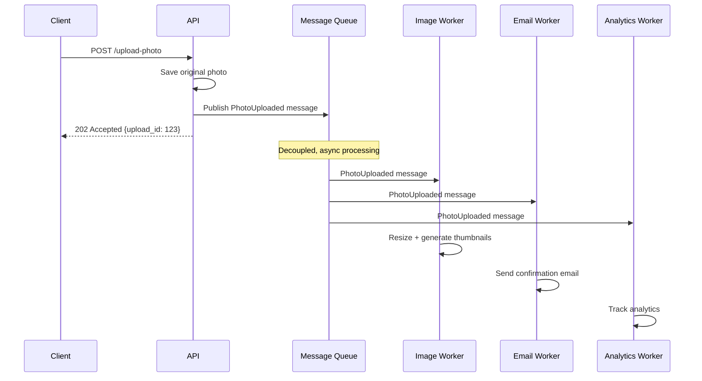

# Message Queues

> Decouple producers and consumers by placing an intermediary buffer between them. Producers send messages; consumers process them at their own pace.

---

## The Problem

Direct synchronous calls create temporal and processing coupling:

```python
# BAD: Synchronous processing chain.
# If send_confirmation takes 2 seconds, the user waits 2 extra seconds.
# If resize_images crashes, the whole upload fails.
# If analytics is slow, everything backs up.

@app.route("/upload-photo", methods=["POST"])
def upload_photo():
    photo = save_photo(request.files["photo"])          # fast
    resized = resize_images(photo)                       # slow (2-5 seconds)
    thumbnails = generate_thumbnails(resized)            # slow
    send_confirmation_email(request.user, photo)         # depends on email service
    analytics.track_upload(request.user, photo)          # not critical
    cdn.invalidate_cache(photo.url)                      # can be async
    return jsonify({"url": photo.url}), 201
```

---

## The Solution

Send the photo URL to a queue and respond immediately. Workers process the slow operations asynchronously.



The client gets a response in ~50ms. Image processing happens in the background.

---

## Queue vs. Topic (Pub/Sub)

### Queue

Each message is consumed by **one** consumer. Used for task distribution.

```
Producer → [msg1, msg2, msg3] queue → Consumer A (gets msg1)
                                    → Consumer B (gets msg2)
                                    → Consumer C (gets msg3)
```

```python
# SQS Queue example
import boto3

sqs = boto3.client("sqs", region_name="us-east-1")
QUEUE_URL = "https://sqs.us-east-1.amazonaws.com/123456789/photo-processing"

# Producer: push a message
def publish_photo_uploaded(upload_id: str, user_id: int, photo_url: str) -> None:
    sqs.send_message(
        QueueUrl=QUEUE_URL,
        MessageBody=json.dumps({
            "type": "photo_uploaded",
            "upload_id": upload_id,
            "user_id": user_id,
            "photo_url": photo_url,
        }),
    )

# Consumer: pull and process messages
def process_photos() -> None:
    while True:
        response = sqs.receive_message(
            QueueUrl=QUEUE_URL,
            MaxNumberOfMessages=10,      # batch of up to 10
            WaitTimeSeconds=20,          # long polling — efficient
        )
        for message in response.get("Messages", []):
            body = json.loads(message["Body"])
            try:
                resize_and_thumbnail(body["photo_url"])
                # Delete on success (otherwise SQS re-delivers)
                sqs.delete_message(
                    QueueUrl=QUEUE_URL,
                    ReceiptHandle=message["ReceiptHandle"],
                )
            except Exception as e:
                logger.error("Failed to process %s: %s", body["upload_id"], e)
                # Don't delete → SQS retries after visibility timeout
```

### Topic (Pub/Sub)

Each message is delivered to **all** subscribers. Used for events that multiple consumers care about.

```
Producer → [OrderPlaced event] topic → Email service (gets copy)
                                     → Inventory service (gets copy)
                                     → Analytics (gets copy)
```

```python
# SNS Topic + SQS Queues fan-out pattern (AWS)
# SNS Topic: "order-events"
# Subscribe: email-sqs-queue, inventory-sqs-queue, analytics-sqs-queue

# Each service has its own SQS queue subscribed to the SNS topic.
# Each service processes its copy independently, at its own pace.

sns = boto3.client("sns")

def publish_order_placed(order_id: int, customer_id: int, total: float) -> None:
    sns.publish(
        TopicArn="arn:aws:sns:us-east-1:123456789:order-events",
        Message=json.dumps({
            "type": "order.placed",
            "order_id": order_id,
            "customer_id": customer_id,
            "total": total,
        }),
        MessageAttributes={
            "event_type": {"DataType": "String", "StringValue": "order.placed"}
        }
    )
```

---

## Delivery Guarantees

| Guarantee | Description | Example System |
|-----------|-------------|----------------|
| **At most once** | Message delivered 0 or 1 times. Can be lost. | UDP, fire-and-forget logs |
| **At least once** | Message delivered 1+ times. May be duplicated. | SQS, RabbitMQ, Kafka (default) |
| **Exactly once** | Message delivered exactly once. | Kafka transactions, SQS FIFO + deduplication |

**Practical rule:** Use **at-least-once** and make consumers **idempotent**.

```python
class IdempotentPhotoProcessor:
    def __init__(self, processed_store):
        self._processed = processed_store   # Redis or DB

    def process(self, message: dict) -> None:
        msg_id = message["upload_id"]

        # Idempotency check — already processed? skip.
        if self._processed.exists(f"processed:{msg_id}"):
            logger.info("Already processed %s, skipping", msg_id)
            return

        resize_and_thumbnail(message["photo_url"])

        # Mark as processed
        self._processed.setex(f"processed:{msg_id}", 86400, "1")  # 24h TTL
```

---

## Dead Letter Queue (DLQ)

Messages that consistently fail processing are moved to a Dead Letter Queue for inspection and manual retry.

```python
# AWS SQS: configure DLQ in queue settings
{
    "RedrivePolicy": {
        "deadLetterTargetArn": "arn:aws:sqs:...:photo-processing-dlq",
        "maxReceiveCount": 3   # after 3 failed processing attempts, move to DLQ
    }
}

# Monitor the DLQ for alerts
def check_dlq_depth() -> None:
    response = sqs.get_queue_attributes(
        QueueUrl=DLQ_URL,
        AttributeNames=["ApproximateNumberOfMessages"]
    )
    depth = int(response["Attributes"]["ApproximateNumberOfMessages"])
    if depth > 0:
        alert_ops(f"DLQ has {depth} unprocessed messages!")
```

---

## Backpressure

When consumers are slower than producers, the queue grows unboundedly.

```python
# Strategy 1: Limit queue depth + reject when full (fail fast)
# SQS doesn't natively limit depth, but your application can check
def publish_if_space_available(message: dict) -> bool:
    depth = get_queue_depth()
    if depth > MAX_QUEUE_DEPTH:
        logger.warning("Queue full (%d), dropping message", depth)
        return False
    sqs.send_message(QueueUrl=QUEUE_URL, MessageBody=json.dumps(message))
    return True

# Strategy 2: Scale consumers when queue grows
# AWS Auto Scaling can scale worker EC2 instances based on queue depth metric
# CloudWatch Alarm: if QueueDepth > 1000 → add 2 workers

# Strategy 3: Bounded in-process queue
from queue import Queue, Full

work_queue: Queue = Queue(maxsize=1000)  # blocks or raises Full when at capacity

def submit_task(task: dict) -> None:
    try:
        work_queue.put_nowait(task)
    except Full:
        raise ServiceUnavailableError("Queue full, try again later")
```

---

## Celery: Task Queue for Python

Celery is the standard Python task queue, using Redis or RabbitMQ as the broker.

```python
# tasks.py
from celery import Celery

app = Celery("tasks", broker="redis://localhost:6379/0",
             backend="redis://localhost:6379/1")

@app.task(bind=True, max_retries=3, default_retry_delay=60)
def process_photo(self, photo_url: str, upload_id: str) -> dict:
    try:
        resized_url = resize_image(photo_url)
        thumbnail_url = generate_thumbnail(photo_url)
        return {"resized": resized_url, "thumbnail": thumbnail_url}
    except Exception as exc:
        raise self.retry(exc=exc)   # retry up to max_retries times

@app.task
def send_welcome_email(user_id: int) -> None:
    user = get_user(user_id)
    email_service.send_welcome(user.email)


# In the web handler (producer):
@app.route("/upload-photo", methods=["POST"])
def upload_photo():
    photo_url = save_photo(request.files["photo"])
    upload_id = str(uuid4())

    # Fire-and-forget (async)
    process_photo.delay(photo_url, upload_id)

    # Or: chained tasks
    chain = process_photo.s(photo_url, upload_id) | send_welcome_email.s()
    chain.delay()

    return jsonify({"upload_id": upload_id, "status": "processing"}), 202


# Worker (start with: celery -A tasks worker --loglevel=info)
```

---

## Kafka: Distributed Event Streaming

For high-throughput, ordered, replayable event streams.

```python
from kafka import KafkaProducer, KafkaConsumer
import json

# Producer
producer = KafkaProducer(
    bootstrap_servers="localhost:9092",
    value_serializer=lambda v: json.dumps(v).encode("utf-8"),
    key_serializer=lambda k: k.encode("utf-8") if k else None,
)

def publish_order_event(order_id: str, event_type: str, data: dict) -> None:
    producer.send(
        topic="order-events",
        key=order_id,              # same order_id always goes to same partition → ordered
        value={"type": event_type, "order_id": order_id, **data},
    )
    producer.flush()

# Consumer
consumer = KafkaConsumer(
    "order-events",
    bootstrap_servers="localhost:9092",
    group_id="inventory-service",   # consumer group — each partition assigned to one member
    auto_offset_reset="earliest",
    value_deserializer=lambda v: json.loads(v.decode("utf-8")),
    enable_auto_commit=False,       # manual commit for exactly-once-like behavior
)

for message in consumer:
    event = message.value
    try:
        handle_event(event)
        consumer.commit()   # only commit after successful processing
    except Exception as e:
        logger.error("Failed to process event: %s", e)
        # Don't commit — Kafka will re-deliver
```

---

## Key Takeaways

- Message queues decouple producers from consumers in time and processing speed.
- Queue = task distribution (one consumer per message). Topic = event broadcast (all consumers get a copy).
- Use at-least-once delivery with idempotent consumers — exactly-once is expensive.
- Dead Letter Queues capture consistently-failing messages for inspection.
- Backpressure must be handled explicitly — unchecked queues grow until memory exhaustion.
- Celery for Python task queues. Kafka for high-throughput, ordered, replayable event streams.
