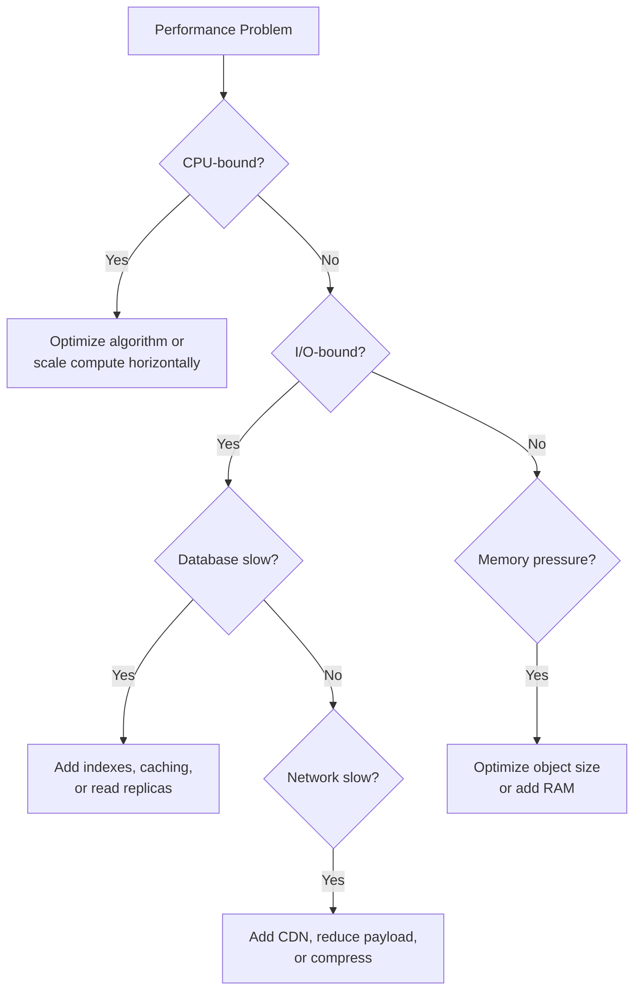

# 03 — System Design

> How to design systems that are fast, reliable, and scalable under real-world conditions.

System design is about making informed trade-offs. Every decision about scaling, caching, or databases involves a trade-off between cost, complexity, and capability.

## Topics

| # | Topic | Core Problem |
|---|-------|--------------|
| 1 | [Scalability](./01-scalability.md) | Handle 10x more users without rewriting everything |
| 2 | [Load Balancing](./02-load-balancing.md) | Distribute traffic across multiple servers |
| 3 | [Caching](./03-caching.md) | Serve repeated data without hitting the database every time |
| 4 | [Database Design](./04-database-design.md) | Store and query data efficiently at scale |
| 5 | [API Design](./05-api-design.md) | Build APIs that are usable, versioned, and performant |
| 6 | [Message Queues](./06-message-queues.md) | Decouple producers and consumers for async processing |

## The Performance Hierarchy

Before adding complexity, understand where your bottleneck is:

Measure before you optimize. Premature optimization is the root of much unnecessary complexity.
