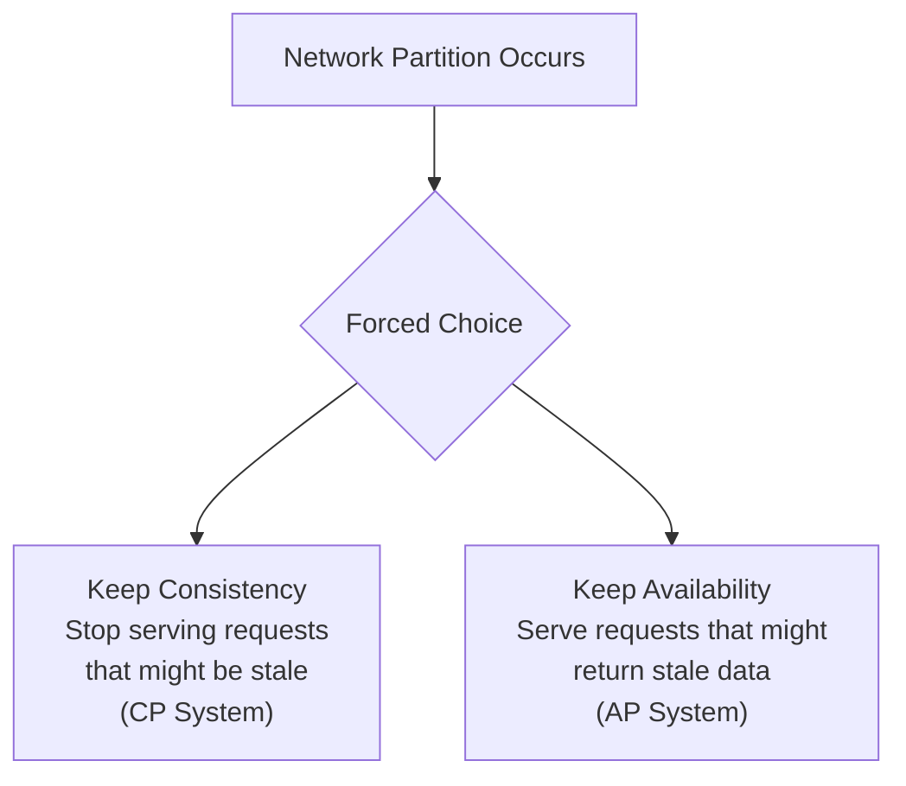
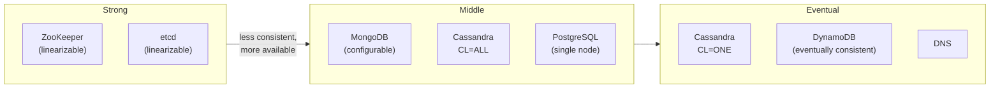
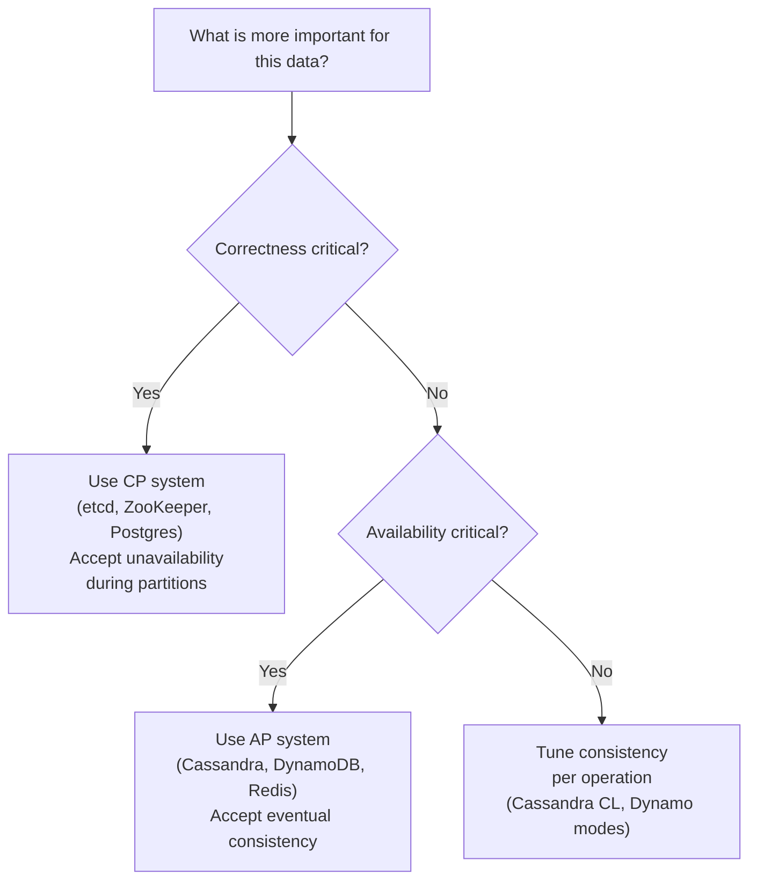

# CAP Theorem

> A distributed data store can provide at most two of the following three guarantees simultaneously: **Consistency**, **Availability**, and **Partition Tolerance**.

Proven by Eric Brewer (2000) and formalized by Gilbert and Lynch (2002).

---

## The Three Properties

### Consistency (C)

Every read receives the most recent write or an error. All nodes see the same data at the same time.

> "If I write `x=5` and immediately read `x`, I get `5` — from any node in the cluster."

### Availability (A)

Every request receives a response (not an error). The system keeps working even if some nodes are down.

> "I always get an answer, even if some nodes are unreachable."

### Partition Tolerance (P)

The system continues to operate even when network partitions occur — some nodes can't communicate with others.

> "The system works even when the network drops messages between nodes."

---

## Why You Can't Have All Three

Network partitions **will happen** in any distributed system. This is not optional. Therefore, **P is not really a choice** — you must tolerate partitions.

Given that P is required, you face a real choice: **CP or AP**.



---

## CP Systems — Consistent under Partitions

When a partition occurs, the system refuses to respond rather than return potentially stale data.

**Examples:** HBase, Zookeeper, etcd, Consul

```python
# CP behavior: return error during partition rather than stale data

class CPDatabaseNode:
    def __init__(self, peers: list["CPDatabaseNode"]):
        self._data: dict[str, str] = {}
        self._peers = peers
        self._connected = True

    def write(self, key: str, value: str) -> bool:
        if not self._connected:
            raise PartitionError("Cannot write during partition")
        # Must replicate to majority before acknowledging
        ack_count = 1   # self
        for peer in self._peers:
            if peer._connected:
                peer._data[key] = value
                ack_count += 1
        majority = (len(self._peers) + 1) // 2 + 1
        if ack_count < majority:
            raise PartitionError("Cannot achieve quorum — refusing write for consistency")
        self._data[key] = value
        return True

    def read(self, key: str) -> str:
        if not self._connected:
            raise PartitionError("Cannot guarantee consistent read during partition")
        return self._data.get(key, "")
```

**Trade-off:** During a network partition, some nodes refuse all requests. The system is **unavailable** but consistent.

**Use when:** Bank transactions, distributed locks, leader election — anywhere correctness is more important than availability.

---

## AP Systems — Available under Partitions

When a partition occurs, the system keeps responding but may return stale data. It accepts divergent writes that must be reconciled later.

**Examples:** Cassandra, DynamoDB (eventually consistent), CouchDB, DNS

```python
# AP behavior: keep serving requests, accept potential stale reads

class APDatabaseNode:
    def __init__(self, node_id: str):
        self._node_id = node_id
        self._data: dict[str, dict] = {}  # key → {value, timestamp, version}

    def write(self, key: str, value: str) -> None:
        # Write locally — always available, even during partition
        import time
        self._data[key] = {
            "value": value,
            "timestamp": time.time(),
            "node_id": self._node_id,
        }
        # Best-effort replication in background — may fail during partition
        self._async_replicate(key)

    def read(self, key: str) -> str | None:
        # Always respond — even if data is stale
        entry = self._data.get(key)
        return entry["value"] if entry else None

    def _async_replicate(self, key: str) -> None:
        # Non-blocking replication — reconcile conflicts later
        ...

    def reconcile(self, key: str, remote_entry: dict) -> None:
        """Last-write-wins conflict resolution."""
        local = self._data.get(key)
        if local is None or remote_entry["timestamp"] > local["timestamp"]:
            self._data[key] = remote_entry
```

**Trade-off:** During partition, nodes can diverge (accept conflicting writes). After the partition heals, conflicts must be resolved. Data may be temporarily stale.

**Use when:** Shopping carts, social media likes, DNS, user preferences — anywhere availability is more important than immediate consistency.

---

## Real Systems are on a Spectrum

The CAP theorem is binary (during a partition), but in practice systems sit on a spectrum:



Many databases let you **tune the trade-off per operation** (Cassandra consistency levels, DynamoDB read/write modes).

---

## PACELC Extension

CAP only describes behavior during partitions. **PACELC** extends it: even when there's no partition (P), there's still a trade-off between latency (L) and consistency (C).

```
PACELC:
If Partition → choose Availability OR Consistency
Else (no partition) → choose Latency OR Consistency
```

| System | Partition | No Partition |
|--------|-----------|--------------|
| DynamoDB | AP | EL (low latency over consistency) |
| Cassandra | AP | EL |
| Spanner | CP | EC (consistency over latency) |
| ZooKeeper | CP | EC |

---

## Practical Decision Guide



**Ask yourself:** "If two nodes disagree, which is worse — showing stale data, or showing an error?"

- Bank balance? Error (CP).
- Product inventory count? Stale (AP) — overbooking is handled separately.
- Shopping cart? Stale (AP) — last write wins or merge strategies.
- Distributed lock? Error (CP) — consistency is critical.

---

## Key Takeaways

- Network partitions are not optional — you must design for P.
- Given P, the real choice is CP (consistency) vs. AP (availability).
- CP: refuse requests rather than return stale data (banks, distributed locks).
- AP: always respond, accept potential stale reads (social media, DNS, carts).
- Modern databases let you tune this trade-off per operation.
- PACELC extends CAP: even without partitions, there's a latency/consistency trade-off.
