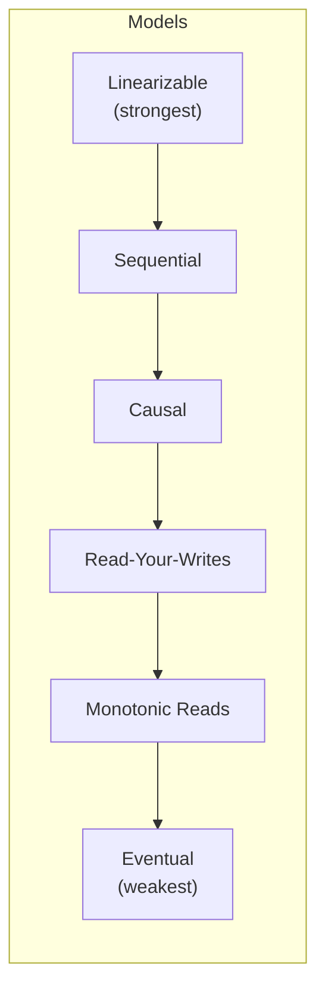

# Consistency Models

> The rules that define what a system guarantees about the order and visibility of reads and writes across replicas.

---

## The Problem

In a distributed system with multiple replicas, writes take time to propagate. A read from Replica A might not yet see a write that was acknowledged by Replica B. Different applications have different tolerances for this lag.

```
Timeline:
t=0: Client writes user.balance = $100 to Primary
t=1: Replica 1 still shows user.balance = $50  ← stale!
t=2: Replica 1 receives update
t=3: Replica 1 shows user.balance = $100       ← consistent

Between t=0 and t=2, what should a read from Replica 1 return?
Different consistency models give different answers.
```

---

## The Consistency Spectrum

From strongest to weakest:

```
Strongest ←─────────────────────────────────────────→ Weakest
   │                                                        │
Strict       Sequential    Causal    Read-Your-    Eventual
Linearizability  Consistency  Consistency  Writes    Consistency
   │                │             │          │           │
Most expensive                                    Most scalable
```

---

## 1. Linearizability (Strict Consistency)

The strongest model. Every operation appears to take effect **instantaneously** at a single point in real time. A read always reflects the latest write.

```python
# Linearizable: reading immediately after a write ALWAYS returns the new value
# from ANY replica, anywhere in the system.

redis = redis.StrictRedis(...)   # Redis is linearizable for single-key ops

redis.set("balance", 100)
# From ANY client, at ANY time after this line:
val = redis.get("balance")   # ALWAYS returns 100 — no exceptions

# Used by: etcd (Raft consensus), ZooKeeper, Redis (single instance)
```

**Cost:** All reads may need to contact a quorum of nodes. High latency. Blocks during partitions.

---

## 2. Sequential Consistency

All operations appear to execute in the same order to all observers, but not necessarily in real-time order.

```
Thread A: write(x, 1), write(y, 1)
Thread B: write(x, 2)

Sequential consistency allows:
Observer 1: x=1, y=1, x=2       ✓ (A then B)
Observer 2: x=2, x=1, y=1       ✓ (B then A)

But NOT:
Observer 1: y=1, x=1, x=2
Observer 2: x=2, x=1            ← different order — violates sequential
```

All observers see the same total order, but it may not match wall-clock time.

---

## 3. Causal Consistency

If operation A causally precedes operation B, everyone observes A before B. Concurrent operations (no causal relationship) may be observed in any order.

```python
# Causal relationship: Alice posts → Bob replies to Alice's post
# Causal consistency guarantees:
#   Everyone who sees Bob's reply ALSO sees Alice's original post.
#   But the overall order of unrelated posts is not guaranteed.

# Implementation: vector clocks track causal dependencies
class VectorClock:
    def __init__(self, node_id: str, all_nodes: list[str]):
        self._node_id = node_id
        self._clock: dict[str, int] = {n: 0 for n in all_nodes}

    def increment(self) -> dict:
        self._clock[self._node_id] += 1
        return self._clock.copy()

    def merge(self, other_clock: dict) -> None:
        for node, time in other_clock.items():
            self._clock[node] = max(self._clock.get(node, 0), time)

    def happened_before(self, other: dict) -> bool:
        """Returns True if self causally precedes other."""
        return (all(self._clock[n] <= other.get(n, 0) for n in self._clock)
                and any(self._clock[n] < other.get(n, 0) for n in self._clock))
```

---

## 4. Read-Your-Writes (Session Consistency)

After a client writes a value, that same client's subsequent reads will always see that write — even if other clients might not yet.

```python
# Real scenario: User updates their profile photo.
# With read-your-writes: they immediately see the new photo.
# Other users might see old photo for a few seconds — acceptable.

class SessionAwareUserService:
    def __init__(self, primary_db, replica_db):
        self._primary = primary_db
        self._replica = replica_db

    def update_profile(self, session: dict, user_id: int, updates: dict) -> None:
        self._primary.execute("UPDATE users SET ... WHERE id=%s", user_id)
        # Track in session: reads for this user should go to primary
        session["read_from_primary"] = {user_id}
        session["primary_read_expiry"] = time.time() + 30   # 30 second window

    def get_user(self, session: dict, user_id: int) -> dict:
        # For recently-updated users, read from primary (not stale replica)
        if (user_id in session.get("read_from_primary", set())
                and time.time() < session.get("primary_read_expiry", 0)):
            return self._primary.execute("SELECT * FROM users WHERE id=%s", user_id).fetchone()
        return self._replica.execute("SELECT * FROM users WHERE id=%s", user_id).fetchone()
```

---

## 5. Monotonic Reads

Once you read a value, you won't read an older value. Reads never go backward.

```python
# WITHOUT monotonic reads: user reloads page and sees older data (confusing!)
# With replica 1 running behind replica 2:
# Read 1: hits replica 2 → sees messages from 10:00 AM
# Read 2: hits replica 1 → sees messages only up to 9:55 AM  ← TIME TRAVEL BUG

class MonotonicReadRepository:
    def __init__(self, replicas: list):
        self._replicas = replicas

    def read_with_minimum_timestamp(self, query: str, min_ts: float) -> tuple[list, float]:
        for replica in self._replicas:
            lag = replica.get_replication_lag()
            if replica.get_data_timestamp() >= min_ts:
                result = replica.execute(query)
                return result, replica.get_data_timestamp()
        # Fall back to primary
        result = self._primary.execute(query)
        return result, self._primary.get_data_timestamp()

# Session stores the last seen timestamp
# Next read only accepted from replicas that have caught up to that timestamp
```

---

## 6. Eventual Consistency

If no new writes occur, all replicas will eventually converge to the same value. No guarantee on when.

```python
# DNS is eventually consistent:
# You update your DNS record.
# Some resolvers see the old IP for up to 48 hours (TTL-dependent).
# Eventually, all resolvers see the new IP.

# Cassandra with ConsistencyLevel.ONE:
from cassandra.cluster import Cluster
from cassandra import ConsistencyLevel

cluster = Cluster(["cassandra1", "cassandra2", "cassandra3"])
session = cluster.connect()

# Write to ONE replica (fast, but stale reads possible on other replicas)
session.execute(
    "UPDATE users SET email=%s WHERE id=%s",
    ("newemail@example.com", 42),
    timeout=5,
)
# Reading immediately from a different node MIGHT return the old email.
# After some time (typically milliseconds to seconds), all nodes converge.
```

---

## Tunable Consistency: Cassandra's Consistency Levels

Cassandra lets you choose per-operation consistency:

```python
from cassandra import ConsistencyLevel

# CL=ONE: write/read from 1 replica — fast, eventually consistent
session.execute(query, consistency_level=ConsistencyLevel.ONE)

# CL=QUORUM: write/read from majority — balance of consistency + availability
session.execute(query, consistency_level=ConsistencyLevel.QUORUM)

# CL=ALL: write/read from all replicas — linearizable, but fails if any node down
session.execute(query, consistency_level=ConsistencyLevel.ALL)

# Strong consistency trick:
# Write with CL=QUORUM + Read with CL=QUORUM → at least one node has the latest write
# (because QUORUM majority always overlaps)
```

```
For replication factor 3:
CL=ONE:    write/read 1 node    → fast, eventual consistency
CL=TWO:    write/read 2 nodes   → stronger
CL=QUORUM: write/read 2 nodes   → strong (quorum = majority)
CL=ALL:    write/read 3 nodes   → strongest, fails if 1 node down
```

---

## Summary Table



| Model | Guarantee | Cost | Example |
|-------|-----------|------|---------|
| **Linearizable** | All reads see latest write globally | Very high | etcd, ZooKeeper |
| **Sequential** | Global total order of ops | High | Some distributed DBs |
| **Causal** | Causally related ops are ordered | Medium | DynamoDB (optional) |
| **Read-Your-Writes** | My writes are visible to me | Low | Most databases with sticky sessions |
| **Monotonic Reads** | Reads never go backward | Low | Amazon S3 (since 2020) |
| **Eventual** | Converges eventually | Very low | Cassandra, DNS, Redis replication |

---

## Key Takeaways

- Consistency models define what callers can rely on from a distributed store.
- Linearizability is the gold standard but most expensive — use for locks, counters, leader election.
- Eventual consistency is fine for most user-facing data where brief staleness is acceptable.
- Read-your-writes is a user experience guarantee — very important for interactive applications.
- Many databases (Cassandra, DynamoDB) let you tune per-operation for the right trade-off.
