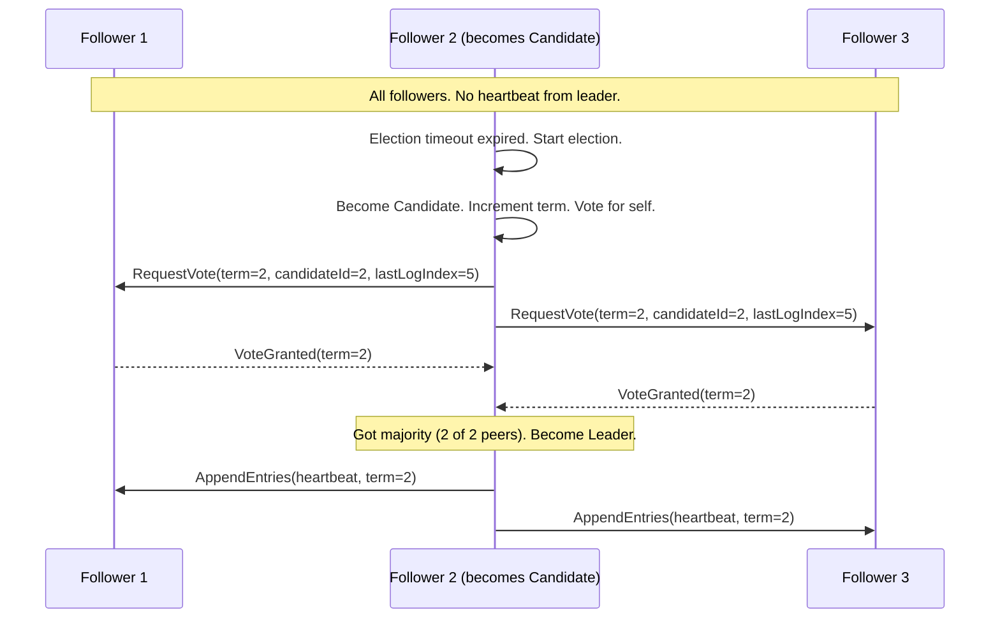
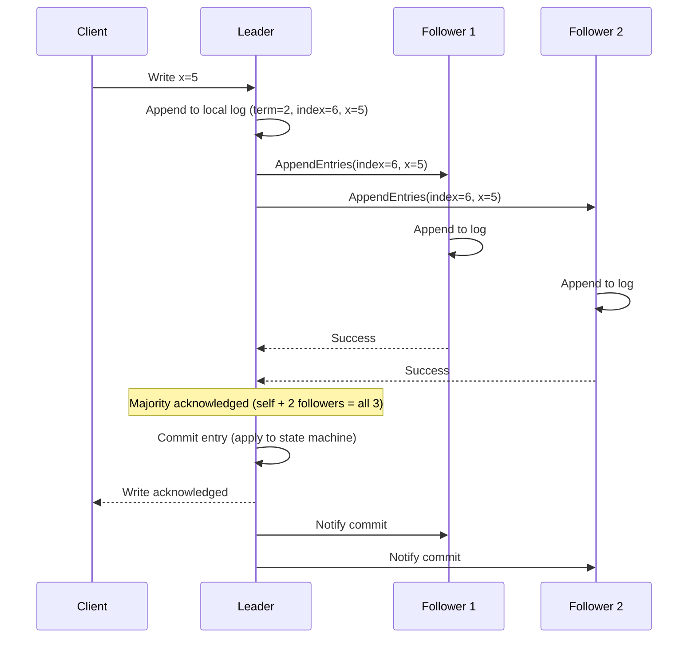

# Consensus Algorithms

> How a cluster of nodes agrees on a single value or a sequence of values, even when some nodes fail or messages are delayed.

---

## The Problem

In a distributed system, multiple nodes need to agree on a single value: who is the leader, what is the current configuration, what was the order of operations. Without consensus, nodes diverge and the system becomes inconsistent.

```
Scenario: 3 database nodes. The primary crashes.
- Node A thinks Node B should be the new primary.
- Node B thinks Node C should be the new primary.
- Node C thinks it should be primary itself.

Without consensus: split-brain — three primaries, three diverging write streams.
With consensus: one algorithm that guarantees all nodes agree on one leader.
```

---

## Paxos — The Classic Algorithm

Paxos (Leslie Lamport, 1989) was the first practical consensus algorithm. It's notoriously difficult to understand and implement, but the intuition is:

### Paxos Phases

**Phase 1: Prepare/Promise**
A **Proposer** picks a proposal number `n` and sends `Prepare(n)` to a majority of **Acceptors**. Each acceptor promises to ignore future proposals with lower numbers, and returns any value it has already accepted.

**Phase 2: Accept/Accepted**  
If the proposer receives promises from a majority, it sends `Accept(n, v)` where `v` is the value. Acceptors accept it if they haven't already promised to a higher number.

```python
# Simplified Paxos intuition (not production-ready)
class PaxosNode:
    def __init__(self, node_id: int, peers: list):
        self.node_id = node_id
        self.peers = peers
        self.promised_n = -1          # highest proposal number promised
        self.accepted_n = -1          # proposal number of accepted value
        self.accepted_value = None    # accepted value

    def prepare(self, n: int) -> dict | None:
        """Phase 1b: respond to Prepare(n)"""
        if n > self.promised_n:
            self.promised_n = n
            return {"ok": True, "accepted_n": self.accepted_n, "value": self.accepted_value}
        return {"ok": False}

    def accept(self, n: int, value) -> bool:
        """Phase 2b: respond to Accept(n, v)"""
        if n >= self.promised_n:
            self.promised_n = n
            self.accepted_n = n
            self.accepted_value = value
            return True
        return False

    def propose(self, value) -> bool:
        """Phase 1a + 2a: act as proposer"""
        n = self._next_proposal_number()

        # Phase 1: Prepare
        promises = []
        for peer in self.peers:
            response = peer.prepare(n)
            if response["ok"]:
                promises.append(response)

        if len(promises) < self._majority():
            return False  # no quorum

        # If any acceptor already has a value, use the highest-numbered one
        already_accepted = [p for p in promises if p["value"] is not None]
        if already_accepted:
            value = max(already_accepted, key=lambda p: p["accepted_n"])["value"]

        # Phase 2: Accept
        accepts = sum(1 for peer in self.peers if peer.accept(n, value))
        return accepts >= self._majority()

    def _majority(self) -> int:
        return len(self.peers) // 2 + 1

    def _next_proposal_number(self) -> int:
        return self.promised_n + 1
```

---

## Raft — The Understandable Consensus Algorithm

Raft (Diego Ongaro, 2013) was designed to be understandable. It is the consensus algorithm behind etcd, CockroachDB, TiKV, and many others.

### Raft Concepts

**Roles:**
- **Leader** — handles all writes. One at a time.
- **Follower** — passive. Accepts entries from the leader.
- **Candidate** — during an election.

**Terms:** Monotonically increasing numbers. Each election starts a new term.

### Leader Election



### Log Replication



### Raft Safety Guarantee

An entry is **committed** only when stored on a majority of nodes. Once committed, it will never be overwritten.

```python
# Simplified Raft node (illustrative, not production)
from dataclasses import dataclass
from enum import Enum

class NodeRole(Enum):
    FOLLOWER = "follower"
    CANDIDATE = "candidate"
    LEADER = "leader"

@dataclass
class LogEntry:
    term: int
    index: int
    command: str

class RaftNode:
    def __init__(self, node_id: str, peers: list):
        self.node_id = node_id
        self.peers = peers
        self.role = NodeRole.FOLLOWER
        self.current_term = 0
        self.voted_for: str | None = None
        self.log: list[LogEntry] = []
        self.commit_index = 0
        self.last_applied = 0

    def start_election(self) -> None:
        self.current_term += 1
        self.role = NodeRole.CANDIDATE
        self.voted_for = self.node_id
        votes = 1   # vote for self

        last_log_index = len(self.log)
        last_log_term = self.log[-1].term if self.log else 0

        for peer in self.peers:
            granted = peer.request_vote(
                term=self.current_term,
                candidate_id=self.node_id,
                last_log_index=last_log_index,
                last_log_term=last_log_term,
            )
            if granted:
                votes += 1

        if votes > (len(self.peers) + 1) // 2:
            self.become_leader()

    def become_leader(self) -> None:
        self.role = NodeRole.LEADER
        print(f"[{self.node_id}] became leader for term {self.current_term}")
        self.send_heartbeats()

    def request_vote(self, term: int, candidate_id: str,
                     last_log_index: int, last_log_term: int) -> bool:
        if term < self.current_term:
            return False   # candidate is behind
        if term > self.current_term:
            self.current_term = term
            self.role = NodeRole.FOLLOWER
            self.voted_for = None

        # Grant vote if we haven't voted yet and candidate's log is up to date
        my_last_log_term = self.log[-1].term if self.log else 0
        my_last_log_index = len(self.log)
        log_up_to_date = (last_log_term > my_last_log_term or
                         (last_log_term == my_last_log_term and
                          last_log_index >= my_last_log_index))

        if (self.voted_for is None or self.voted_for == candidate_id) and log_up_to_date:
            self.voted_for = candidate_id
            return True
        return False
```

---

## Quorum

Consensus requires a **quorum** (majority) to make a decision. For N nodes:

```
Quorum = ⌊N/2⌋ + 1

For 3 nodes: quorum = 2  (can tolerate 1 failure)
For 5 nodes: quorum = 3  (can tolerate 2 failures)
For 7 nodes: quorum = 4  (can tolerate 3 failures)

Formula: can tolerate f failures → need 2f+1 nodes
```

Why majority? Any two majorities overlap in at least one node — the overlapping node carries the "truth" from the previous decision.

---

## Practical Usage: etcd

Most applications don't implement consensus directly — they use etcd or ZooKeeper.

```python
import etcd3

# etcd uses Raft internally — provides linearizable key-value store
client = etcd3.client(host="localhost", port=2379)

# Atomic compare-and-swap (uses Raft consensus internally)
success, _ = client.transaction(
    compare=[client.transactions.value("/leader") == ""],   # if key is empty
    success=[client.transactions.put("/leader", "node1")],  # set to node1
    failure=[],                                              # do nothing if already set
)

if success:
    print("Became leader!")
else:
    leader = client.get("/leader")[0].decode()
    print(f"Current leader is: {leader}")

# Distributed lock using etcd leases
lease = client.lease(ttl=10)   # 10-second TTL
locked, _ = client.transaction(
    compare=[client.transactions.version("/lock") == 0],
    success=[client.transactions.put("/lock", "node1", lease=lease)],
    failure=[],
)
```

---

## Key Takeaways

- Consensus solves leader election, configuration management, and distributed locking.
- Paxos proved consensus was possible; Raft made it understandable and implementable.
- Raft: one leader per term, entries committed only when a majority acknowledges.
- A cluster of N nodes tolerates ⌊N/2⌋ failures — for 3-node cluster, 1 failure is OK.
- Use etcd, ZooKeeper, or Consul in production — don't implement Raft yourself.
- Consensus is expensive (requires multiple network round trips) — use it only where needed (leader election, distributed locks).
