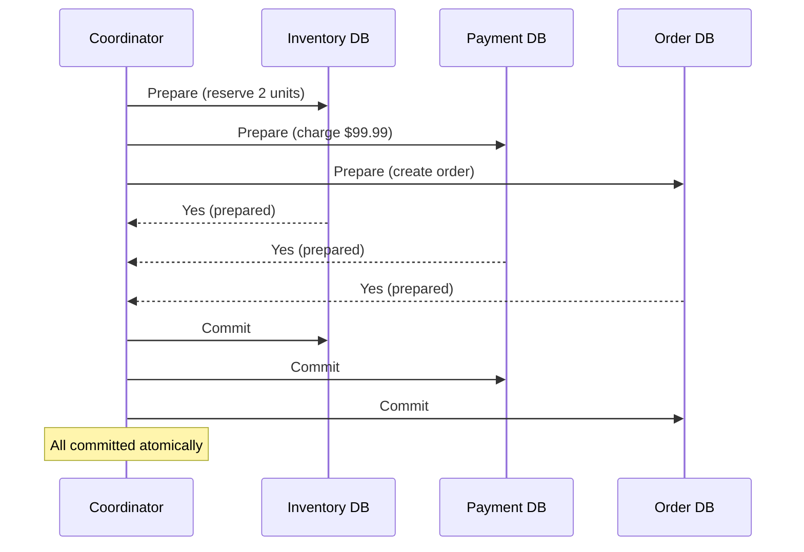
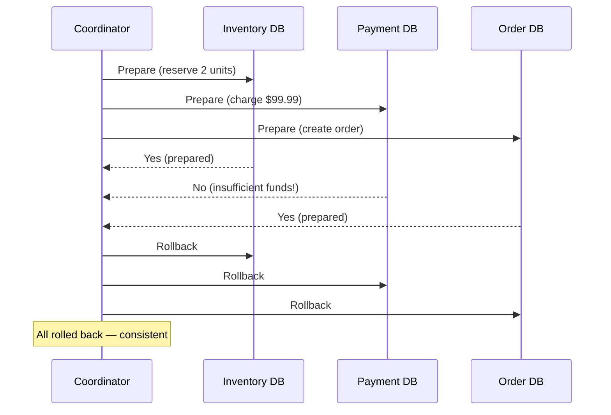
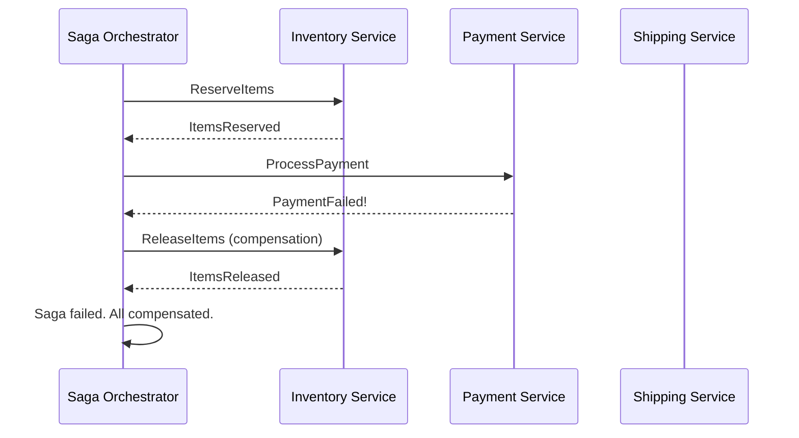

# Distributed Transactions

> How to maintain data consistency when an operation spans multiple services or databases, each with their own data store.

---

## The Problem

A single-service transaction is easy: if anything fails, roll back. But in microservices, each service has its own database. You can't use a single database transaction that spans service boundaries.

```
Order flow across 3 services:
1. Inventory Service: Reserve 2 units of product X
2. Payment Service: Charge $99.99 to customer's card
3. Order Service: Create order record

Problem:
- Step 1 succeeds: inventory reserved
- Step 2 succeeds: customer charged
- Step 3 fails: database error

Result: Customer is charged, inventory is reserved, but no order exists.
System is now in an inconsistent state.
```

---

## Two-Phase Commit (2PC)

The classic distributed transaction protocol. All participants either all commit or all rollback.

### Phase 1: Prepare

The **coordinator** sends `Prepare` to all participants. Each participant writes to a durable log and responds `Yes` (ready to commit) or `No` (cannot commit).

### Phase 2: Commit/Rollback

If ALL responded `Yes`: coordinator sends `Commit`. Otherwise: `Rollback`.



### 2PC Failure Scenario



### 2PC Implementation (Simplified)

```python
from enum import Enum
from abc import ABC, abstractmethod

class TransactionState(Enum):
    PREPARING = "PREPARING"
    COMMITTED = "COMMITTED"
    ABORTED = "ABORTED"

class Participant(ABC):
    @abstractmethod
    def prepare(self, transaction_id: str) -> bool: ...
    @abstractmethod
    def commit(self, transaction_id: str) -> None: ...
    @abstractmethod
    def rollback(self, transaction_id: str) -> None: ...

class TwoPhaseCommitCoordinator:
    def __init__(self, participants: list[Participant]):
        self._participants = participants

    def execute(self, transaction_id: str) -> bool:
        # Phase 1: Prepare
        prepared = []
        for participant in self._participants:
            try:
                if participant.prepare(transaction_id):
                    prepared.append(participant)
                else:
                    # One said No — rollback all prepared ones
                    self._rollback_all(prepared, transaction_id)
                    return False
            except Exception as e:
                self._rollback_all(prepared, transaction_id)
                raise

        # Phase 2: Commit (all said Yes)
        for participant in self._participants:
            participant.commit(transaction_id)   # best-effort commit
        return True

    def _rollback_all(self, participants: list[Participant], txn_id: str) -> None:
        for p in participants:
            try:
                p.rollback(txn_id)
            except Exception:
                pass   # log and handle, but keep rolling back others
```

### 2PC Problems

- **Blocking**: If the coordinator crashes after Phase 1, participants are blocked waiting (they've prepared but can't commit or rollback).
- **Single point of failure**: The coordinator is critical.
- **Performance**: Two round-trips for every transaction.
- **Doesn't work across microservices**: You can't hold database locks across HTTP calls.

---

## Saga Pattern — The Microservices Alternative

A Saga is a sequence of local transactions, each publishing an event. If any step fails, **compensating transactions** undo the previous steps.

```
Happy path:
1. OrderService: CreateOrder       → publishes OrderCreated
2. InventoryService: ReserveItems  → publishes ItemsReserved
3. PaymentService: ProcessPayment  → publishes PaymentProcessed
4. ShippingService: ScheduleShip   → publishes ShipmentScheduled

Failure at step 3 (payment declined):
3. PaymentService: fails           → publishes PaymentFailed
2b. InventoryService: ReleaseItems (compensation) ← runs
1b. OrderService: CancelOrder     (compensation) ← runs
```

### Choreography-Based Saga

Each service listens for events and reacts. No central coordinator.

```python
# Each service is an independent event consumer

# Order Service
class OrderSaga:
    def on_order_placed(self, event: dict) -> None:
        order = create_order(event)
        publish("order.created", {"order_id": order.id, ...})

    def on_payment_failed(self, event: dict) -> None:
        cancel_order(event["order_id"])  # compensation
        publish("order.cancelled", {"order_id": event["order_id"]})

# Inventory Service
class InventorySaga:
    def on_order_created(self, event: dict) -> None:
        try:
            reserve_items(event["items"])
            publish("items.reserved", {"order_id": event["order_id"]})
        except InsufficientStockError:
            publish("items.reservation.failed", {"order_id": event["order_id"]})

    def on_order_cancelled(self, event: dict) -> None:
        release_items(event["order_id"])  # compensation

# Payment Service
class PaymentSaga:
    def on_items_reserved(self, event: dict) -> None:
        try:
            charge_customer(event["customer_id"], event["total"])
            publish("payment.processed", {"order_id": event["order_id"]})
        except PaymentDeclinedError:
            publish("payment.failed", {"order_id": event["order_id"]})
```

**Pros:** Fully decoupled, no coordinator, services are independent.  
**Cons:** Hard to follow the flow, cyclic event chains are complex to debug.

### Orchestration-Based Saga

A central **Saga Orchestrator** tells each service what to do and handles compensation.



```python
from enum import Enum

class SagaState(Enum):
    RESERVING_ITEMS = "RESERVING_ITEMS"
    PROCESSING_PAYMENT = "PROCESSING_PAYMENT"
    SCHEDULING_SHIPPING = "SCHEDULING_SHIPPING"
    COMPENSATING = "COMPENSATING"
    COMPLETED = "COMPLETED"
    FAILED = "FAILED"

class PlaceOrderSagaOrchestrator:
    def __init__(self, inventory_client, payment_client, shipping_client, saga_store):
        self._inventory = inventory_client
        self._payment = payment_client
        self._shipping = shipping_client
        self._store = saga_store

    def execute(self, order_id: str, order: dict) -> bool:
        saga = self._store.create(order_id, SagaState.RESERVING_ITEMS)

        try:
            # Step 1
            self._inventory.reserve_items(order_id, order["items"])
            self._store.update(order_id, SagaState.PROCESSING_PAYMENT)

            # Step 2
            self._payment.process_payment(order_id, order["customer_id"], order["total"])
            self._store.update(order_id, SagaState.SCHEDULING_SHIPPING)

            # Step 3
            self._shipping.schedule_shipment(order_id, order["address"])
            self._store.update(order_id, SagaState.COMPLETED)
            return True

        except InventoryError:
            # Step 1 failed — no compensation needed (nothing was done)
            self._store.update(order_id, SagaState.FAILED)
            return False

        except PaymentError:
            # Step 2 failed — compensate step 1
            self._store.update(order_id, SagaState.COMPENSATING)
            self._inventory.release_items(order_id)
            self._store.update(order_id, SagaState.FAILED)
            return False

        except ShippingError:
            # Step 3 failed — compensate steps 1 and 2
            self._store.update(order_id, SagaState.COMPENSATING)
            self._payment.refund_payment(order_id)
            self._inventory.release_items(order_id)
            self._store.update(order_id, SagaState.FAILED)
            return False
```

---

## Saga vs. 2PC

| | 2PC | Saga |
|-|-----|------|
| **Consistency** | ACID (all or nothing) | Eventual (BASE) |
| **Coordination** | Synchronous, blocking | Async via events |
| **Coupling** | Tight (shared transaction) | Loose (events/commands) |
| **Scalability** | Poor (blocking locks) | Good (async) |
| **Failure handling** | Automatic rollback | Explicit compensating transactions |
| **Best for** | Single database, monolith | Microservices, distributed data |

---

## Outbox Pattern — Reliable Event Publishing

The biggest Saga pitfall: publishing an event and saving local state must happen atomically. If the DB saves but the event isn't published, the Saga breaks.

```python
# BAD: Two separate operations — one can succeed while the other fails
def place_order(order: dict) -> None:
    db.save_order(order)                      # ✓ saves
    event_bus.publish("order.created", order)  # ✗ CRASH here → event lost!

# GOOD: Save event to DB in same transaction (Outbox pattern)
def place_order(order: dict) -> None:
    with db.transaction():
        db.save_order(order)
        db.save_outbox_event({                # save event atomically with order
            "topic": "order.created",
            "payload": json.dumps(order),
            "published": False,
        })
    # Background process reads unpublished outbox events and publishes them
    # This ensures at-least-once delivery
```

---

## Key Takeaways

- 2PC gives ACID across distributed resources but is blocking, fragile, and poor for microservices.
- The Saga pattern gives eventual consistency via a sequence of local transactions + compensating transactions.
- Choreography: decoupled services react to events. Orchestration: central coordinator drives the flow.
- The Outbox Pattern ensures events are reliably published by saving them to the local DB atomically.
- Compensating transactions must be idempotent — they may be called multiple times during recovery.
