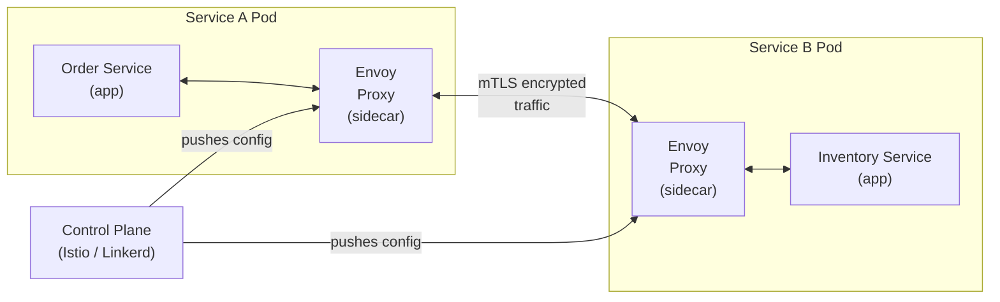
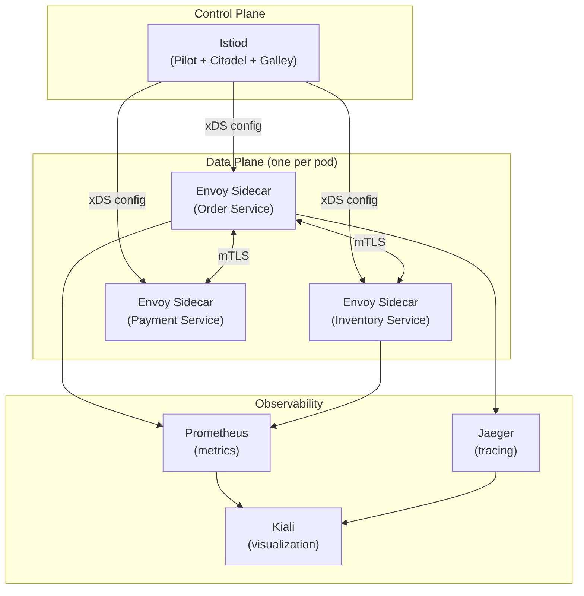

# Service Mesh

> A dedicated infrastructure layer that handles service-to-service communication — providing load balancing, security (mTLS), observability, and traffic management without changing application code.

---

## The Problem

In a microservices system, services need to:
- Discover each other dynamically
- Load balance across instances
- Encrypt traffic between services (zero-trust)
- Handle retries and timeouts
- Collect metrics and traces

Without a service mesh, every service implements this logic itself — or it's scattered across configuration files.

```python
# BAD: Each service implements its own infrastructure concerns
class OrderService:
    def call_inventory(self, product_id: str) -> dict:
        # Service discovery
        hosts = consul.get_service("inventory-service")
        # Load balancing
        host = random.choice(hosts)
        # TLS
        ssl_context = create_ssl_context(cert=client_cert, key=client_key, ca=ca_cert)
        # Retry logic
        for attempt in range(3):
            try:
                # Timeout
                response = requests.get(
                    f"https://{host}/products/{product_id}",
                    ssl=ssl_context,
                    timeout=5,
                )
                return response.json()
            except requests.exceptions.RequestException:
                if attempt == 2:
                    raise
                time.sleep(2 ** attempt)
        # Circuit breaker, distributed tracing... all here too
```

This code is replicated across every service. Changing the retry policy means editing every service.

---

## The Solution: Sidecar Proxy

A service mesh deploys a **sidecar proxy** (e.g., Envoy) alongside every service instance. All traffic in/out goes through the proxy. The application code knows nothing about it.



The sidecar handles:
- **mTLS**: all traffic encrypted, identities verified
- **Load balancing**: across healthy instances
- **Retries**: configurable per route
- **Timeouts**: per service, per route
- **Circuit breaking**: stop sending to failing services
- **Observability**: metrics, traces, logs automatically collected

---

## Istio — The Most Popular Service Mesh

Istio is the most widely adopted service mesh for Kubernetes.

### Traffic Management

```yaml
# VirtualService: route traffic by header, weight, or user
apiVersion: networking.istio.io/v1beta1
kind: VirtualService
metadata:
  name: inventory-service
spec:
  hosts:
  - inventory-service
  http:
  - match:
    - headers:
        x-version:
          exact: v2
    route:
    - destination:
        host: inventory-service
        subset: v2
  - route:                         # default: 90% to v1, 10% to v2 (canary)
    - destination:
        host: inventory-service
        subset: v1
      weight: 90
    - destination:
        host: inventory-service
        subset: v2
      weight: 10
```

### Retry and Timeout Policy

```yaml
apiVersion: networking.istio.io/v1beta1
kind: VirtualService
metadata:
  name: payment-service
spec:
  hosts:
  - payment-service
  http:
  - timeout: 5s              # 5 second overall timeout
    retries:
      attempts: 3            # retry up to 3 times
      perTryTimeout: 2s      # 2 seconds per attempt
      retryOn: 5xx,reset,connect-failure,retriable-4xx
    route:
    - destination:
        host: payment-service
```

### Circuit Breaker

```yaml
apiVersion: networking.istio.io/v1beta1
kind: DestinationRule
metadata:
  name: payment-service
spec:
  host: payment-service
  trafficPolicy:
    outlierDetection:
      consecutive5xxErrors: 5       # after 5 consecutive 5xx errors
      interval: 10s                 # check every 10 seconds
      baseEjectionTime: 30s         # eject unhealthy host for 30 seconds
      maxEjectionPercent: 50        # eject at most 50% of hosts
    connectionPool:
      tcp:
        maxConnections: 100
      http:
        http1MaxPendingRequests: 50
        maxRequestsPerConnection: 10
```

### Mutual TLS (mTLS)

```yaml
# Enforce mTLS for the entire namespace
apiVersion: security.istio.io/v1beta1
kind: PeerAuthentication
metadata:
  name: default
  namespace: production
spec:
  mtls:
    mode: STRICT   # all traffic must be mTLS — no plain-text allowed
```

With STRICT mTLS:
- Every service gets an X.509 certificate from Istio's CA.
- All service-to-service traffic is encrypted.
- Services authenticate each other by certificate.
- No service can impersonate another.

---

## Authorization Policy

```yaml
# Allow Order Service to call Inventory Service — nothing else
apiVersion: security.istio.io/v1beta1
kind: AuthorizationPolicy
metadata:
  name: inventory-authz
  namespace: production
spec:
  selector:
    matchLabels:
      app: inventory-service
  rules:
  - from:
    - source:
        principals: ["cluster.local/ns/production/sa/order-service"]
  - to:
    - operation:
        methods: ["GET"]
        paths: ["/products/*", "/availability/*"]
```

---

## Observability

Istio automatically collects metrics, logs, and traces for all traffic without changing application code.

```python
# In your application: no tracing code needed
# Istio injects tracing headers automatically and reports to Jaeger/Zipkin

# But for distributed trace propagation, forward these headers:
TRACE_HEADERS = [
    "x-request-id",
    "x-b3-traceid",
    "x-b3-spanid",
    "x-b3-parentspanid",
    "x-b3-sampled",
    "x-b3-flags",
]

@app.route("/orders")
def create_order():
    # Forward tracing headers to downstream services
    headers = {h: request.headers[h] for h in TRACE_HEADERS if h in request.headers}
    response = inventory_client.check_availability(product_id, headers=headers)
    ...
```

---

## Service Mesh Architecture



---

## Linkerd — Lightweight Alternative

For simpler use cases, Linkerd is lighter than Istio:
- Easier to install and operate
- Lower resource overhead
- Less feature-rich (no advanced traffic management)
- Uses Rust-based proxy (Linkerd2-proxy) instead of Envoy

```yaml
# Linkerd annotation on a Kubernetes deployment
apiVersion: apps/v1
kind: Deployment
metadata:
  name: order-service
  annotations:
    linkerd.io/inject: enabled    # That's it — Linkerd injects the sidecar
spec:
  ...
```

---

## When to Use / When NOT to Use

**Use when:**
- You have 10+ microservices with complex inter-service communication.
- You need zero-trust security (mTLS) between services.
- You need traffic management (canary deployments, A/B testing, retries).
- You want consistent observability without changing application code.

**Don't use when:**
- You have fewer than ~5 services — the overhead isn't justified.
- Your services are monolithic — a service mesh adds complexity with no benefit.
- Your team doesn't have Kubernetes expertise — service meshes require solid K8s knowledge.

---

## Key Takeaways

- A service mesh moves infrastructure concerns (security, retries, tracing) out of application code into a sidecar proxy.
- Istio + Envoy is the most feature-rich combination; Linkerd is lighter and simpler.
- mTLS in STRICT mode ensures all service-to-service traffic is encrypted and authenticated — the foundation of zero-trust networking.
- The control plane pushes configuration to all sidecars — one change propagates everywhere.
- Service meshes shine at scale but add significant operational complexity — don't add one prematurely.
