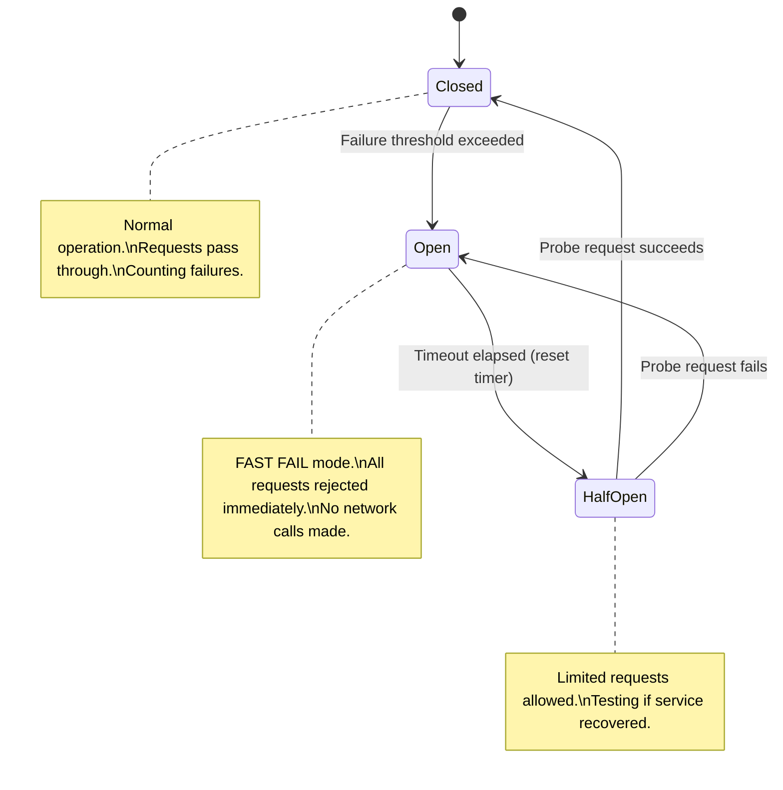
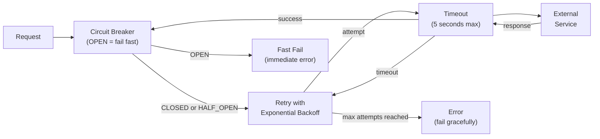

# Circuit Breaker & Resilience Patterns

> Prevent cascading failures by detecting when a dependency is unavailable and stopping requests to it before your entire system degrades.

---

## The Problem: Cascading Failures

In a distributed system, one slow or failing service can bring down the entire chain of dependent services.

```
Scenario:
- PaymentService calls ExternalBankAPI (slow — 30 second timeout)
- OrderService calls PaymentService (waits for 30 seconds)
- User requests pile up, all waiting for OrderService
- OrderService threads/workers exhausted
- OrderService becomes unresponsive
- All services calling OrderService also fail
→ Total system failure from ONE slow external API
```

```python
# BAD: No protection against slow/failing external services
class PaymentService:
    def charge(self, amount: float, token: str) -> bool:
        # If bank_api is slow (30s) or down, this blocks for 30s
        # Multiply by thousands of concurrent requests = resource exhaustion
        response = requests.post(
            "https://slow-bank-api.com/charge",
            json={"amount": amount, "token": token},
            timeout=30,   # 30 SECOND timeout!
        )
        return response.json()["success"]
```

---

## Circuit Breaker Pattern

Like an electrical circuit breaker: when too many failures occur, the breaker "trips" and stops sending requests to the failing service. After a wait period, it allows a few test requests through.

### Three States



### Implementation

```python
import time
import threading
from enum import Enum

class CircuitState(Enum):
    CLOSED    = "CLOSED"     # normal — requests pass through
    OPEN      = "OPEN"       # tripped — requests fail fast
    HALF_OPEN = "HALF_OPEN"  # testing — limited requests allowed

class CircuitBreakerError(Exception):
    """Raised when circuit is OPEN."""
    pass

class CircuitBreaker:
    def __init__(self,
                 failure_threshold: int = 5,
                 recovery_timeout: float = 60.0,
                 half_open_max_calls: int = 3):
        self._failure_threshold = failure_threshold
        self._recovery_timeout = recovery_timeout
        self._half_open_max = half_open_max_calls

        self._state = CircuitState.CLOSED
        self._failure_count = 0
        self._success_count = 0
        self._last_failure_time: float | None = None
        self._half_open_calls = 0
        self._lock = threading.Lock()

    def call(self, fn, *args, **kwargs):
        with self._lock:
            state = self._get_current_state()

        if state == CircuitState.OPEN:
            raise CircuitBreakerError(
                f"Circuit OPEN — refusing call. "
                f"Will retry after {self._time_until_retry():.0f}s"
            )

        if state == CircuitState.HALF_OPEN:
            with self._lock:
                if self._half_open_calls >= self._half_open_max:
                    raise CircuitBreakerError("Circuit HALF_OPEN — max probe calls reached")
                self._half_open_calls += 1

        try:
            result = fn(*args, **kwargs)
            self._on_success()
            return result
        except Exception as e:
            self._on_failure()
            raise

    def _get_current_state(self) -> CircuitState:
        if self._state == CircuitState.OPEN:
            if (self._last_failure_time and
                    time.time() - self._last_failure_time > self._recovery_timeout):
                self._state = CircuitState.HALF_OPEN
                self._half_open_calls = 0
        return self._state

    def _on_success(self) -> None:
        with self._lock:
            if self._state == CircuitState.HALF_OPEN:
                self._success_count += 1
                if self._success_count >= self._half_open_max:
                    # Service recovered — close the circuit
                    self._state = CircuitState.CLOSED
                    self._failure_count = 0
                    self._success_count = 0
                    print("[CircuitBreaker] Circuit CLOSED — service recovered")
            elif self._state == CircuitState.CLOSED:
                self._failure_count = 0   # reset on success

    def _on_failure(self) -> None:
        with self._lock:
            self._failure_count += 1
            self._last_failure_time = time.time()
            if self._state == CircuitState.HALF_OPEN:
                self._state = CircuitState.OPEN
                print("[CircuitBreaker] Circuit re-OPENED — probe failed")
            elif self._failure_count >= self._failure_threshold:
                self._state = CircuitState.OPEN
                print(f"[CircuitBreaker] Circuit OPENED after {self._failure_count} failures")

    def _time_until_retry(self) -> float:
        if self._last_failure_time is None:
            return 0
        return max(0, self._recovery_timeout - (time.time() - self._last_failure_time))

    @property
    def state(self) -> CircuitState:
        with self._lock:
            return self._get_current_state()


# Usage
bank_circuit_breaker = CircuitBreaker(
    failure_threshold=5,
    recovery_timeout=60.0,
)

class PaymentService:
    def charge(self, amount: float, token: str) -> bool:
        try:
            return bank_circuit_breaker.call(
                self._call_bank_api, amount, token
            )
        except CircuitBreakerError:
            # Fast fail — don't wait 30 seconds
            raise PaymentServiceUnavailableError(
                "Payment system temporarily unavailable. Please try again."
            )

    def _call_bank_api(self, amount: float, token: str) -> bool:
        response = requests.post(
            "https://bank-api.com/charge",
            json={"amount": amount, "token": token},
            timeout=5,   # short timeout — circuit breaker handles slow cases
        )
        return response.json()["success"]
```

---

## Retry with Exponential Backoff

Retrying immediately after a failure often makes things worse (hammer on a struggling service). Use exponential backoff with jitter.

```python
import random

def retry_with_backoff(
    fn,
    max_attempts: int = 3,
    base_delay: float = 0.5,
    max_delay: float = 30.0,
    jitter: bool = True,
):
    for attempt in range(max_attempts):
        try:
            return fn()
        except Exception as e:
            if attempt == max_attempts - 1:
                raise   # Last attempt — let it fail

            # Exponential backoff: 0.5s, 1s, 2s, 4s...
            delay = min(base_delay * (2 ** attempt), max_delay)

            if jitter:
                # Add random jitter to prevent thundering herd
                # (all clients retrying at exactly the same time)
                delay = random.uniform(0, delay)

            print(f"Attempt {attempt + 1} failed ({e}). Retrying in {delay:.2f}s...")
            time.sleep(delay)

# Usage
result = retry_with_backoff(
    lambda: payment_api.charge(amount, token),
    max_attempts=3,
    base_delay=0.5,
)
```

---

## Bulkhead Pattern

Isolate failures by giving each downstream service its own pool of resources. A slow database won't consume the thread pool meant for API calls.

```python
from concurrent.futures import ThreadPoolExecutor, TimeoutError
from dataclasses import dataclass

@dataclass
class ServicePool:
    max_workers: int
    queue_size: int
    timeout: float

class BulkheadService:
    """Each external service gets its own thread pool — failures are isolated."""
    def __init__(self):
        self._pools: dict[str, ThreadPoolExecutor] = {
            "database":  ThreadPoolExecutor(max_workers=10),
            "payment":   ThreadPoolExecutor(max_workers=5),
            "email":     ThreadPoolExecutor(max_workers=3),
        }
        self._timeouts = {"database": 5.0, "payment": 10.0, "email": 3.0}

    def execute(self, service_name: str, fn, *args, **kwargs):
        pool = self._pools.get(service_name)
        if pool is None:
            raise ValueError(f"Unknown service: {service_name}")
        timeout = self._timeouts[service_name]
        future = pool.submit(fn, *args, **kwargs)
        try:
            return future.result(timeout=timeout)
        except TimeoutError:
            future.cancel()
            raise ServiceTimeoutError(f"{service_name} timed out after {timeout}s")

# Email service being slow won't affect database threads
service = BulkheadService()
result = service.execute("database", user_repo.find_by_id, user_id)
service.execute("email", email_service.send_welcome, user.email)
```

---

## Timeout

Every network call must have a timeout. Never wait indefinitely.

```python
import httpx

class ResilientHTTPClient:
    def __init__(self, base_url: str, timeout: float = 5.0):
        self._client = httpx.Client(
            base_url=base_url,
            timeout=httpx.Timeout(
                connect=2.0,    # max time to establish connection
                read=timeout,   # max time to receive response
                write=2.0,      # max time to send request
                pool=1.0,       # max time to get a connection from pool
            ),
        )

    def get(self, path: str) -> dict:
        try:
            response = self._client.get(path)
            response.raise_for_status()
            return response.json()
        except httpx.TimeoutException:
            raise ServiceTimeoutError(f"Request to {path} timed out")
        except httpx.HTTPStatusError as e:
            raise ServiceError(f"Service returned {e.response.status_code}")
```

---

## Combining All Patterns

```python
class ResilientPaymentService:
    def __init__(self):
        self._circuit_breaker = CircuitBreaker(
            failure_threshold=5,
            recovery_timeout=30.0,
        )
        self._client = ResilientHTTPClient("https://payment-api.com", timeout=5.0)

    def charge(self, amount: float, token: str) -> bool:
        def do_charge():
            return self._client.post("/charge", {"amount": amount, "token": token})

        try:
            result = self._circuit_breaker.call(
                lambda: retry_with_backoff(do_charge, max_attempts=2, base_delay=0.3)
            )
            return result["success"]
        except CircuitBreakerError:
            # Log and fall back gracefully
            raise PaymentUnavailableError("Payment service is temporarily unavailable")
```



---

## Key Takeaways

- Circuit Breaker prevents cascading failures by failing fast when a dependency is unreliable.
- Three states: Closed (normal) → Open (fast fail) → Half-Open (testing recovery).
- Retry with exponential backoff + jitter avoids hammering a struggling service.
- Bulkhead isolates resource pools so one slow dependency doesn't consume all resources.
- Every external call must have a timeout — never wait indefinitely.
- Libraries: Python `circuitbreaker`, Java Resilience4j, service mesh (Istio/Linkerd) handles these transparently.
