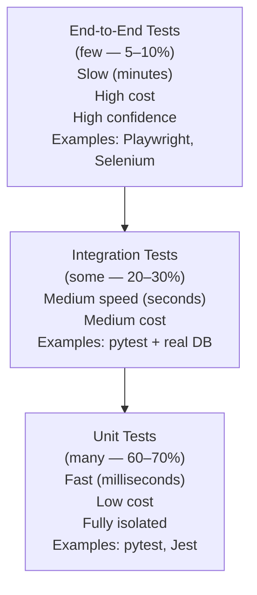

# Testing Fundamentals

> The vocabulary, mental models, and tools you need to build an effective test suite.

---

## The Testing Pyramid

The testing pyramid describes the ideal distribution of test types based on their speed, cost, and coverage.



### Why the Pyramid Shape?

| | Unit | Integration | E2E |
|-|------|-------------|-----|
| **Speed** | Milliseconds | Seconds | Minutes |
| **Cost to run** | Cheap | Medium | Expensive |
| **Failure diagnosis** | Pinpoints the bug | Narrows to a component | Hard to diagnose |
| **Confidence** | Logic-level | Component-level | System-level |
| **Maintenance** | Low | Medium | High |

---

## Test Doubles

A **test double** is any object used in a test in place of a real dependency. There are five types.

### 1. Dummy

Passed around but never actually used. Fills a required parameter.

```python
def test_order_total():
    # We need a customer object, but it's irrelevant to this test
    dummy_customer = Customer(id=0, name="", email="")
    order = Order(customer=dummy_customer, items=[
        OrderItem(price=10.00, quantity=2),
        OrderItem(price=5.00, quantity=1),
    ])
    assert order.total() == 25.00
```

### 2. Stub

Provides predefined answers to calls. Doesn't verify interactions.

```python
class StubWeatherService:
    """Always returns sunny weather — doesn't call the real API."""
    def get_temperature(self, city: str) -> float:
        return 22.5   # hardcoded, regardless of input

def test_outdoor_event_proceeds_in_good_weather():
    weather = StubWeatherService()
    planner = EventPlanner(weather)
    assert planner.should_proceed("London") is True
```

### 3. Fake

A working implementation, but simplified. Not suitable for production.

```python
class InMemoryUserRepository:
    """Fake repository — works correctly but stores data in memory, not a database."""
    def __init__(self):
        self._users: dict[int, dict] = {}
        self._next_id = 1

    def save(self, user: dict) -> dict:
        user = {**user, "id": self._next_id}
        self._users[self._next_id] = user
        self._next_id += 1
        return user

    def find_by_id(self, user_id: int) -> dict | None:
        return self._users.get(user_id)

    def find_by_email(self, email: str) -> dict | None:
        return next((u for u in self._users.values() if u["email"] == email), None)

def test_user_registration():
    repo = InMemoryUserRepository()
    service = UserRegistrationService(repo)
    user = service.register("alice@example.com", "Alice")
    assert repo.find_by_email("alice@example.com") is not None
```

### 4. Mock

Pre-programmed with expectations. Verifies that specific methods were called with specific arguments.

```python
from unittest.mock import Mock, patch

def test_order_sends_confirmation_email():
    email_service = Mock()
    order_service = OrderService(email_service=email_service)

    order_service.place_order(user_id=42, items=["item1"], total=99.99)

    # Verify email_service.send was called with specific arguments
    email_service.send.assert_called_once_with(
        to="user42@example.com",
        subject="Order Confirmed",
        body=unittest.mock.ANY,   # any body is fine
    )

def test_no_email_sent_when_order_fails():
    email_service = Mock()
    order_service = OrderService(email_service=email_service)

    with pytest.raises(InsufficientStockError):
        order_service.place_order(user_id=42, items=["out-of-stock"], total=99.99)

    email_service.send.assert_not_called()
```

### 5. Spy

Like a mock but wraps the real implementation. Records calls while still executing.

```python
class SpyEmailService:
    """Calls the real email service but records all calls."""
    def __init__(self, real_service):
        self._real = real_service
        self.calls: list[dict] = []

    def send(self, to: str, subject: str, body: str) -> None:
        self.calls.append({"to": to, "subject": subject})
        self._real.send(to, subject, body)   # still calls the real service

def test_email_audit():
    spy = SpyEmailService(real_email_service)
    order_service = OrderService(email_service=spy)
    order_service.place_order(...)
    assert len(spy.calls) == 1
    assert spy.calls[0]["to"] == "alice@example.com"
```

---

## Summary: Which Double to Use?

| Double | Has Logic? | Verifies Calls? | Calls Real? | Use When |
|--------|-----------|-----------------|-------------|----------|
| **Dummy** | No | No | No | Parameter required but irrelevant |
| **Stub** | Minimal | No | No | Control return values |
| **Fake** | Yes | No | No | Need realistic behavior without real infrastructure |
| **Mock** | No | Yes | No | Verify interactions (was a method called?) |
| **Spy** | No | Yes | Yes | Audit calls while using real implementation |

---

## Test Isolation

Each test must be independent. Test A should never depend on test B running first.

```python
# BAD: tests share state through a module-level variable
_user_count = 0

def test_first():
    global _user_count
    _user_count = 5
    assert get_users() == 5

def test_second():
    # Depends on test_first running first!
    assert _user_count == 5

# GOOD: each test sets up its own state
@pytest.fixture
def user_repo():
    """Fresh in-memory repository for each test."""
    return InMemoryUserRepository()

def test_create_user(user_repo):
    user_repo.save({"name": "Alice", "email": "a@b.com"})
    assert len(user_repo.all()) == 1

def test_empty_repo(user_repo):
    assert len(user_repo.all()) == 0
```

---

## Test Naming

A test name is documentation. When a test fails, the name tells you what broke.

```python
# BAD: tells you nothing
def test_user():
    ...

def test_order_2():
    ...

# GOOD: describes what behavior is being tested and under what condition
def test_user_registration_fails_when_email_already_exists():
    ...

def test_order_total_includes_tax_for_us_customers():
    ...

def test_cart_checkout_succeeds_with_valid_payment_token():
    ...

# Pattern: test_{subject}_{action}_{expected_outcome}[_when_{condition}]
```

---

## Key Takeaways

- The testing pyramid: many unit tests, some integration tests, few E2E tests.
- Test doubles replace dependencies to make tests fast and isolated.
- Use Fakes for realistic in-memory implementations, Mocks to verify interactions.
- Test isolation is non-negotiable — tests must not depend on each other's state.
- Test names are documentation — they should describe behavior, not implementation.
